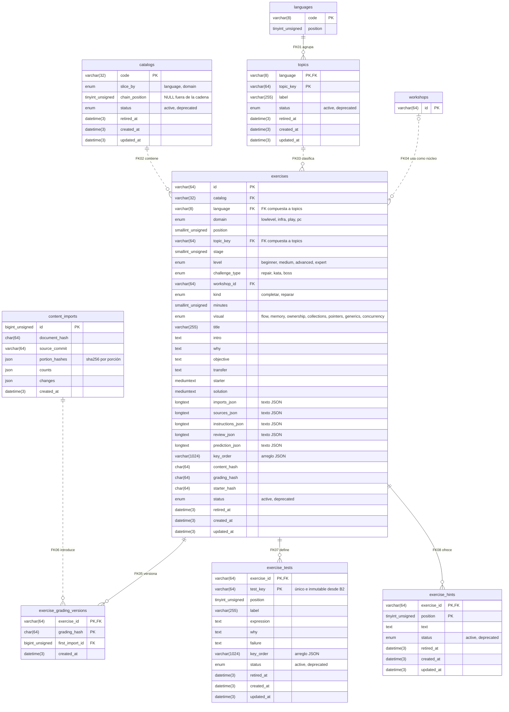
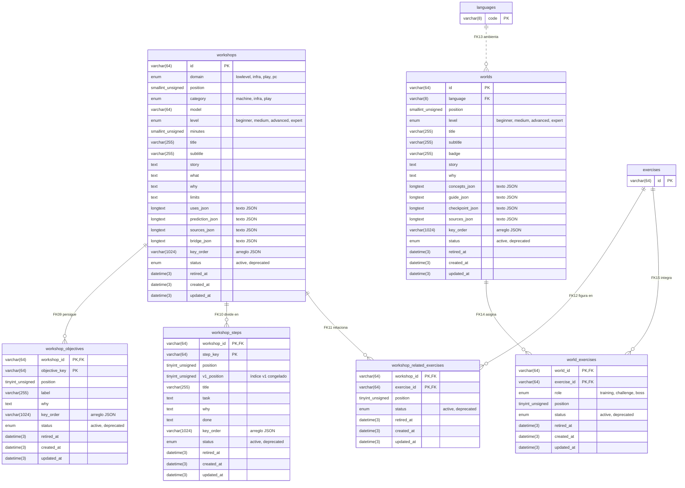
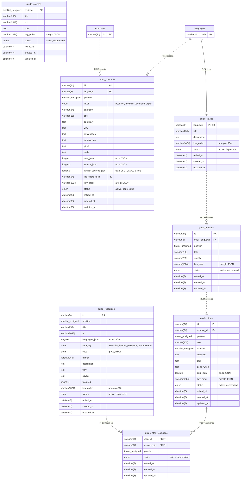
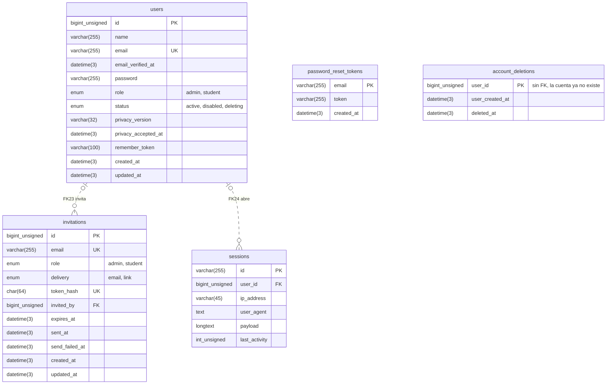
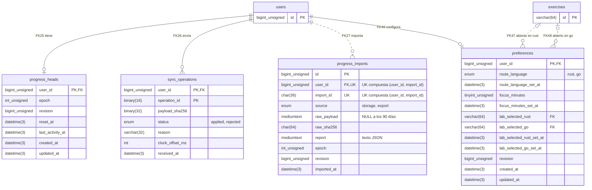
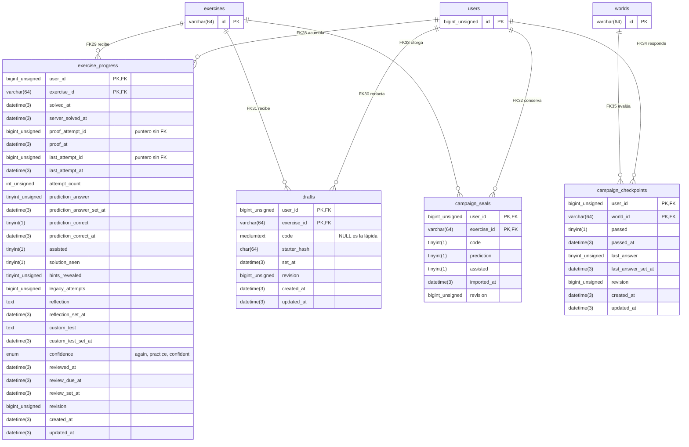
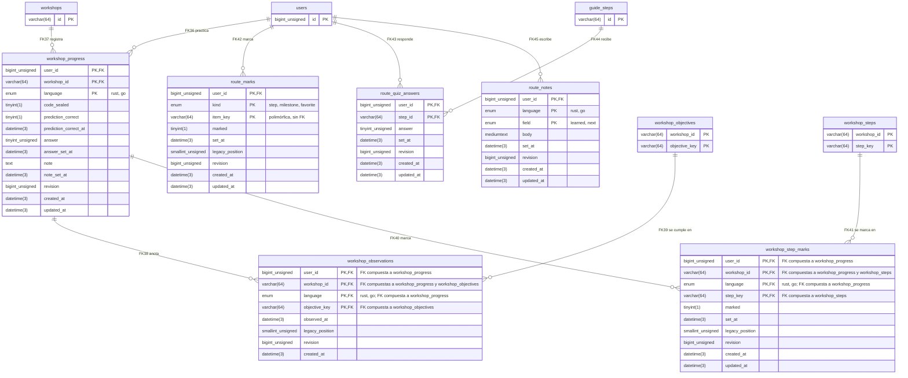
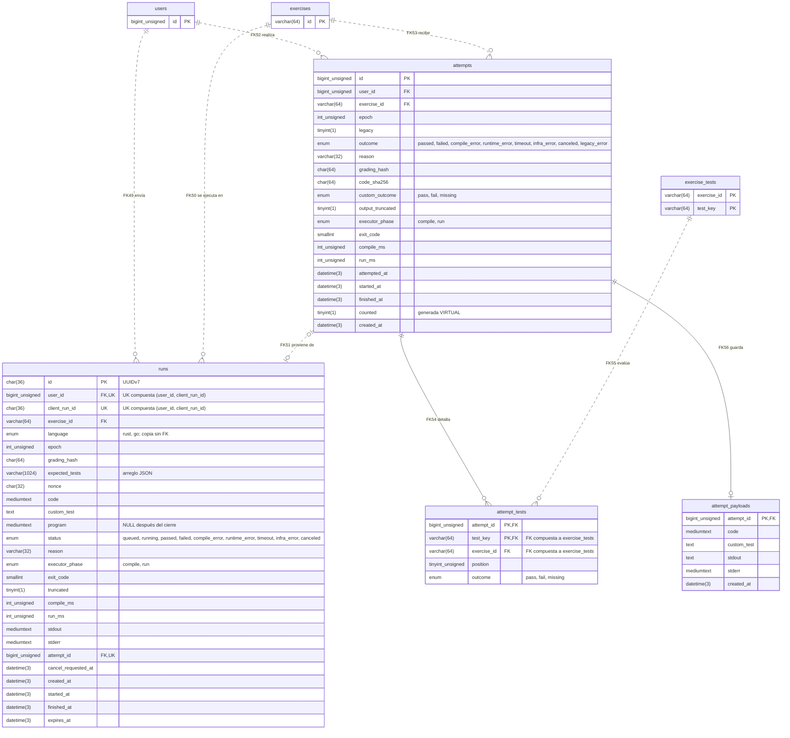
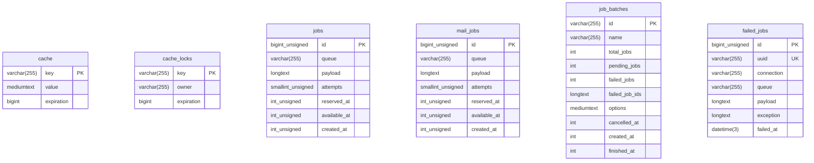

# ADR 0006 — Modelo de datos y API para muchos usuarios

- Estado: propuesta. Es la base de las specs de Spec Kit; las preguntas de §13 se cierran en el paso «clarify» de la spec de cada subplan.
- Fecha: 2026-10-04
- Relacionado: enmienda el ADR 0004 (deja la premisa de un solo usuario, el TOTP y el paquete Sanctum) y el ADR 0005 (cuotas por usuario y tope global); conserva el ADR 0003.
- Enmiendas del 2026-10-05: el clarify de C2 ([spec 001](../../specs/001-c2-contenido-mysql/spec.md), sección Clarifications) cambió lo siguiente, en línea. Los validadores no llevan `APP_BUILD`: son el hash de los bytes servidos (§1, §3.1, D11, §5.1, §10). Los bytes de cada porción los fija el generador, y el import se auto-chequea en cada corrida (D10, D11). El import se excluye con `GET_LOCK` en lugar de `Isolatable`, y su transacción intenta una vez, con un único reintento externo (D12, D35, §8). El chequeo de transacciones largas pasa de C2 a C3, con `db-grants` (D35, §10, §12). Hasta C3 el contenido responde sin sesión (§7, §10). La entrega es un controlador con un servicio, no un middleware: decisión del plan de C2, a ratificar con este ADR (D11, §10).
- Resultados de la implementación de C2 (2026-10-05):
  - D07 se midió en `mysql:9.7` 9.7.2 (`api/tests/Content/OnlineDdlTest.php`): ampliar un ENUM con un CHECK sobre DATETIME en la tabla da el error 1845, y agregar una columna a esa tabla es INSTANT. Por la regla de D07, los CHECK que tocan DATETIME no van en las tablas que crecen y el invariante queda en el escritor, con su prueba; B2 lo planifica así.
  - FR-034 no se cumple con `depends_on` y `service_completed_successfully`: `docker compose up --build` detiene el `php` anterior antes de esperar a `migrate`. Se despliega con `api/scripts/deploy.sh` (construye, corre `migrate` con la imagen nueva y recién entonces reemplaza `php`), y `api/scripts/deploy-check.sh` lo prueba (D35).
  - D12 se refuerza: además de verificar el candado antes de abrir la transacción, el import lo verifica como primera sentencia dentro de ella. Fuera de una transacción, Laravel reconecta en silencio, y una conexión nueva no tiene ni el candado ni el aislamiento `READ COMMITTED`.
  - La revisión adversarial de C2 sumó dos reglas del import: una etapa nueva no puede tomar el `v1Index` de una etapa retirada (D14), y el ID de un ejercicio tiene la misma forma al importarse que al servirse (FR-015).
  - Queda pendiente para un subplan posterior que toque `bootstrap/app.php` (C3 suma el middleware de sesión): los errores que genera el framework bajo `/api`, como el 404 de ruta y el 405, salen en inglés y sin `code` (FR-024 rige para los errores de la entrega).

Propuesta del 2026-10-04 que integra los análisis de los cinco dominios: contenido, identidad y acceso, progreso, ejecuciones y transversal. Las contradicciones entre dominios se resuelven en §3.1. Contrasté contra el repositorio y la documentación oficial lo siguiente:

- toda línea citada de `nginx.conf`, `compose.yaml`, `api/config/*`, `api/app/Models/User.php`, migraciones de C1, ADR 0003/0004/0005, hoja de ruta, `lab.js`, `app.js`, los motores de campaña y Sistemas, `levels.ts`, `tools/content/exercises.ts`, `curriculum.json` y los fixtures de progreso;
- Laravel 13 y Fortify vía Context7 (`sanctum.md`, `authentication.md`, `csrf.md`, acciones y configuración de Fortify) y el código de laravel/framework 13.x (`MySqlGrammar::compileUpsert`, `DatabaseSessionHandler`, `StartSession`, `Encrypter`, `EnsureEmailIsVerified`, `RequirePassword` y `SessionGuard`);
- el manual de MySQL (`lock_wait_timeout`, DDL en línea de claves foráneas, bloqueos de metadatos extendidos por FK), los bugs #117450 y #121124, RFC 10017 y la gramática de Mermaid.

Los tamaños, capacidades y detalles internos de Laravel que no pude verificar vienen de los análisis de dominio y quedan marcados como estimación o con su fuente original.

## 1. Resumen

| Dominio | Tablas | Subplan | Idea central |
|---|---|---|---|
| Contenido | 21 | C2 (E1 suma Esenciales) | Global, sin `user_id`. Claves naturales `ascii_bin`. Columnas para lo simple, tablas hijas para pruebas, pistas y todo lo que se referencia, y texto JSON con `key_order` para lo anidado. Nunca se borra: se retira. |
| Identidad y acceso | 5 | C3 | `users` con `role` (admin, student) y `status`. `invitations` de un solo uso. `password_reset_tokens` para la recuperación por email. `sessions` en MySQL. `account_deletions`, el libro mínimo para reaplicar supresiones después de restaurar un respaldo. |
| Progreso y sincronización | 14 | D1 (B2 crea 2, completas) | PK que empieza por `user_id`. Reglas por campo en upserts, con el reloj corregido por el servidor. Época y revisión por usuario. UUID de operación por usuario. Importación v1 combinable, con confirmación. |
| Ejecuciones y evidencia | 4 | B2 | `runs` operativo (se poda a 14 días), `attempts` permanente, inmutable y liviano, `attempt_tests` y `attempt_payloads` (código y salidas, con retención propia). Época en cada run. Cuotas por usuario y cola `runs` propia. |
| Operación | 6 | C1; C3 suma `mail_jobs` | `cache`, `cache_locks`, `jobs`, `mail_jobs`, `job_batches`, `failed_jobs`. |

- **Autenticación:** sesión de Laravel con cookie HttpOnly y CSRF (el modelo SPA de Sanctum), montada sin el paquete Sanctum. JWT y tokens de Sanctum quedan descartados (§4.9). Login con email y contraseña, recuperación por email, alta por invitación y registro abierto detrás de `REGISTRATION_OPEN=false`. El bloqueo por cuenta sólo alcanza a dispositivos desconocidos. No hay 2FA; la falta de segundo factor del admin es un riesgo señalado.
- **Contenido:** 17 porciones por recurso, con los bytes exactos que fija el generador. El ETag de cada porción sale del hash de esos bytes (`portions` de `curriculum.meta.json`, que guarda el import), sin el build de la API; la versión del contenido viaja en `Content-Version` y en `GET /api/session`. Los cuerpos salen de una caché que deja el import, y el import se auto-chequea en cada corrida.
- **Integridad:** CASCADE desde `users`, RESTRICT hacia el contenido y SET NULL sólo hacia el autor de una invitación. Borrar una cuenta es una supresión física (Ley 25.326): un job borra por lotes, CASCADE queda como red de seguridad y `account_deletions` permite reaplicarla después de restaurar.
- **Concurrencia:** una fila `progress_heads` por usuario serializa sincronización, importación, borrado, admisión y cierre de ejecuciones. Los escritores usan READ COMMITTED. No hay candados globales. Todo pedido que muta declara la cuenta para la que se armó.
- **Escala:** un servidor, con sesiones, caché y colas en MySQL. El camino de crecimiento, con sus disparadores, está en §9: Redis, más PHP-FPM, más ejecutores y rollups de estadísticas.
- **Orden:** C2 → C3 → B2 → D1 → C5 (nuevo, estadísticas), dentro de la hoja de ruta.

## 2. Requisitos y supuestos

### 2.1 Requisitos vigentes (decisiones del usuario del 2026-10-04)

| # | Requisito | Dónde se cumple |
|---|---|---|
| R1 | Un usuario hoy y miles mañana, con infraestructura mínima y el camino de crecimiento escrito | D01, D08, D38, §9 |
| R2 | Alta por invitación (email o link); registro abierto implementable y apagado | D18, §4.1, §4.4 |
| R3 | Email y contraseña con recuperación por email; sin 2FA, login social ni passkeys | §4.2, §4.3, riesgo en §4.10 |
| R4 | Roles admin y estudiante; cada estudiante ve y modifica sólo lo suyo | D19, D36, §4.5 |
| R5 | Sin auditoría de logins (el usuario lo confirmó: «no») | D20 |
| R6 | La API la consume sólo este front, del mismo origen; sin versionado público | D16, §8 |
| R7 | Contenido por recurso con ETag, armado desde las tablas | D11, §7 |
| R8 | Columnas, tablas hijas y texto JSON en LONGTEXT; Resource y prueba de contrato sensible al orden | D10, §5.1 |
| R9 | Progreso local primero: cola con UUID, `/api/sync`, `/api/progress` e importación v1 la primera vez | D22–D25, D39, S9 |
| R10 | Esenciales como catálogo nuevo, primero de una cadena | D13, S1 |
| R11 | Reevaluar JWT frente a la sesión | §4.9 |
| R12 | Mailer como configuración; Mailpit sólo con permiso; aceptar la invitación verifica el email | D21, §4.8 |

Siguen vigentes:

- Laravel 13 + MySQL 9.7 + Nginx en el mismo origen (ADR 0004).
- Contenido en Git, importado y nunca borrado (ADR 0004:104-105, 141-142).
- Ejecutor propio asincrónico (ADR 0005).
- Fusión por campo (ADR 0004:165-202).
- Formato v1 compatible (ADR 0003:152-156).

Quedan superados:

- el token único, el alta por consola y los límites pensados para un usuario (ADR 0004:54-58; ADR 0005:141);
- el TOTP del ADR 0004:56 y del análisis previo de sesión.

### 2.2 Supuestos (a confirmar)

**S1. Cadena de catálogos.** Esto es lo que muestra hoy el contenido (`build/curriculum.json` contado con `node`):

- Etiquetas de nivel: Esenciales, Inicial, Intermedio, Avanzado y Experto. Hoy el código tiene las cuatro últimas (`src/shared/config/levels.ts:2, 6-11`); Esenciales se suma al principio de la cadena con E1.
- **Núcleos:** medium 12, advanced 24, expert 12, beginner 2.
- **Talleres:** medium 6, advanced 12, expert 6, beginner 1.
- **Quests:** 3 por nivel y por lenguaje.
- **Lab:** sí tiene `level`, en las etapas 16 a 20 (rust-76…100 y go-76…100). Son 25 por lenguaje: beginner 5, medium 10, advanced 5, expert 5.
- **Campaña:** 2 por nivel. **Atlas:** beginner 8, medium 12, advanced 8, expert 4.

Sistemas es casi todo intermedio, avanzado y experto, y eso calza con la frase del usuario: «tenemos intermedios, avanzados y otro más; esenciales sería el primero de toda esa cadena».

- **Lectura principal:** Esenciales → Inicial → Intermedio → Avanzado → Experto. Esenciales es el único catálogo con `chain_position = 1`. Lo demás sigue el orden de `LEVEL_IDS`, y lab, quests y cores quedan con `chain_position` NULL porque abarcan varios niveles.
- **Lectura alternativa:** una cadena de catálogos, esenciales → lab → quests → cores, con `chain_position` 1 a 4.
- **Tercera lectura:** «intermedios, avanzados y otro más» son catálogos futuros, igual que Esenciales: essentials = 1, intermedios = 2, y así.
- Una sola columna sirve para las tres lecturas. Si la cadena termina siendo el eje `level`, el orden sale de `LEVEL_IDS` o de una posición, nunca del índice de un ENUM (D05).
- **Sin decidir:** si Inicial (beginner) sigue después de Esenciales o Esenciales lo reemplaza, y qué código lleva el catálogo (§13).

**S2. Carga.** «Miles» significa hasta unas 5.000 cuentas, y unos 1.000 activos en el pico. Con 4 slots, el ejecutor atiende a unos 130 alumnos ejecutando a la vez al 70 % de uso. Es una estimación del análisis de ejecuciones: 2,5 s por run y un run cada 2 min por alumno.

**S3. Plantilla del harness.** Viaja como contenido (ADR 0005:113-114), pero hoy no está entre las 7 claves de `curriculum.json`. La suma B2, que compone los programas con ella: el import la guarda por lenguaje y la publica como recurso con ETag de versión, para que A4 arme la vista previa con el mismo texto. Su tabla y su recurso se diseñan en B2; si su hash entra en `grading_hash` es una pregunta abierta (§13).

**S4. Hitos del recorrido.** Siguen en `app.js:29-68`. `route_marks.item_key` no tiene FK.

**S5. Admin que estudia.** Toda cuenta tiene progreso propio, el admin incluido, y las estadísticas excluyen a los admins por defecto. Se recomienda que quien administra use una cuenta de admin separada de la que usa para estudiar: la sesión de estudio queda abierta en computadoras de aula y no debería tener poder sobre las demás cuentas.

**S6. `last_login_at`.** Lo tomo como auditoría de logins y lo dejo fuera (R5). La «última actividad» del admin sale de `progress_heads.last_activity_at`.

**S7. Sin proveedor de correo.** En el despliegue público (`MAIL_REQUIRED=true`), si el mailer es `log` o `array`, la app entra en «modo sólo link»: no envía nada, el admin copia los links de invitación, y los links de recuperación para terceros salen sólo por consola.

**S8. Contenido con sesión.** El contenido sigue exigiendo sesión (ADR 0004:60-61).

**S9. «La primera vez» de R9.** Lo leo como la primera vez en cada navegador: una cuenta puede importar varias copias v1 (casa, escuela o un JSON exportado de otra PC), que se combinan con las reglas legadas y piden confirmación (D24). Si la intención es una sola importación por cuenta, alcanza con volver a una PK `(user_id)` en `progress_imports` (§13.17).

## 3. Decisiones

### 3.1 Contradicciones resueltas entre dominios

| Tema | En conflicto | Elección y motivo |
|---|---|---|
| Montaje de la sesión | Identidad: sin el paquete Sanctum. Transversal: Sanctum con `Referrer-Policy: same-origin` | **Sin el paquete Sanctum** (D16). No hay clientes con token (R6), así que Sanctum no agrega nada y es una pieza más. Para conservarlo, cada pedido tendría que llevar `Referer` u `Origin` (sanctum.md): un GET del mismo origen no lleva `Origin` y `nginx.conf:33` manda `no-referrer`, así que el cliente tendría que fijar `referrerPolicy: 'same-origin'` en cada `fetch`. Enmienda el ADR 0004 §1 (pregunta abierta). |
| `last_login_at` | Transversal: sí. Identidad: no | **No** (R5 y la respuesta del usuario). |
| Colación de email | `utf8mb4_0900_as_ci` frente a la de la conexión más un CHECK de normalización | **`utf8mb4_0900_as_ci` sin CHECK.** La colación de la conexión iguala `papá.com.ar` y `papa.com.ar`, que son dominios distintos. LOWER de MySQL y `mb_strtolower` pueden diferir en casos raros. |
| Estado de cuenta | `status` (identidad) frente a `disabled_at` (transversal, ejecuciones) | **`status` ENUM('active','disabled','deleting')**: cubre la purga en curso sin duplicar columnas. El código de error es `account_disabled`. |
| Login de una cuenta deshabilitada | 403 propio frente a error genérico | **403 `account_disabled` sólo con la contraseña correcta**, decidido antes de iniciar la sesión (§4.2). Sólo lo ve quien la conoce; `deleting` falla como credencial inválida. |
| Invitaciones | Borrar al aceptar (identidad) frente a conservar la historia (transversal) | **Borrar al aceptar o revocar** (minimización), conservando `delivery`, `sent_at` y `send_failed_at` para que el admin vea si el correo salió. Los logs registran cada aceptación con el id del invitador. |
| Bloqueo por cuenta | Progresivo (identidad) frente a ninguno (transversal) | **Progresivo con tope de 15 min, sólo para dispositivos sin cookie de dispositivo**, más un tope de 100 fallos consecutivos que exige recuperación. Sin segundo factor, un ataque repartido entre IPs sólo se frena por cuenta (OWASP; NIST SP 800-63B-4 §3.2.2). La cookie de dispositivo evita que un atacante deje afuera al admin, el motivo por el que ADR 0004:57-58 había descartado el bloqueo. |
| `runs.id` | UUIDv7 (ejecuciones) frente a BIGINT (transversal) | **UUIDv7 `CHAR(36)`.** Es público y la tabla se poda, así que el tamaño de la PK pesa poco. `attempts.id` es BIGINT en ambos análisis. |
| Colación del código | `utf8mb4_bin` (contenido) frente a `utf8mb4_0900_bin` | **`utf8mb4_0900_bin`** (NO PAD: compara byte a byte). |
| Precisión temporal | DATETIME (contenido) frente a DATETIME(3) | **DATETIME(3) en todas las columnas nuevas**, por los relojes LWW. |
| ETag del contenido | sha256 del cuerpo (contenido) frente a versión (transversal) | **Por porción: el hash de los bytes que fija el generador y guarda el import, sin build**, comparado antes de consultar; la versión viaja aparte, en `Content-Version`. Un 304 no arma nada y un import sólo invalida las porciones que cambiaron. |
| TIMESTAMP de C1 | Conservar (identidad) frente a convertir (transversal) | **Convertir en C3** mientras las tablas están vacías, por el límite de 2038. |
| FK de `sessions.user_id` | Sin FK por ser camino caliente (identidad) frente a CASCADE (transversal) | **CASCADE**, como limpieza del driver `database`: una sola regla para todo `user_id`. La revocación no depende de esa FK (D16). |
| Rol | VARCHAR + CHECK (identidad) frente a ENUM (resto) | **ENUM** para todos los conjuntos cerrados (D05). |
| Serialización por usuario | `users FOR UPDATE` (ejecuciones) frente a `progress_heads` (progreso, transversal) | **`progress_heads`, creada en B2.** El estado se lee con `users FOR SHARE`. Así no hay candados exclusivos sobre `users` en el camino caliente, y los escritores usan READ COMMITTED (D08). |
| Importación v1 | Varias por cuenta, combinables (progreso) frente a una segunda con confirmación (transversal) | **Varias por cuenta, con confirmación** cuando ya hubo una importación o un «Borrar todo», o cuando otra cuenta importó el mismo crudo (D24). Las reglas legadas impiden que una importación pise datos v2, y una sola por cuenta perdería el v1 de un segundo navegador. |
| Retenciones | `sync_operations` 14 o 90 días; `runs` 14 o 30 | **14 y 14.** La corrección no depende de esos registros. Los payloads de intentos tienen su propia retención (D30). |
| Throttle general | 300/min para todo (identidad) frente a nada en los GET de contenido | **Sin throttle de Laravel en GET de contenido, `GET /api/progress` ni el polling de runs**: cada hit sumaría una escritura en `cache` a la que ya hace la sesión. Nginx `limit_req` por IP cubre esos casos y la caché de cuerpos abarata el contenido. |
| Lenguaje en tablas de usuario | Tabla `languages` (contenido) frente a ENUM (progreso, ejecuciones) | **ENUM('rust','go')** en tablas de usuario. `languages` queda para el contenido (D32). |
| Prueba propia legada | `''` (progreso) frente a NULL con `custom_outcome` (ejecuciones) | **NULL con `custom_outcome`**: también es sin pérdida y evita un CHECK. |
| Invitaciones en lote | Endpoint aparte frente a un array en el POST | **Array de 1 a 100 emails** en `POST /api/admin/invitations`, con un tope de 300 correos por día por admin; los links no cuentan. |
| Arranque del front | `GET /api/me` + `/api/auth/features` frente a `GET /api/session` | **`GET /api/session`**: usuario o null, features, `contentVersion`, `appBuild` y catálogos. |
| Primer admin | `taller:invite` frente a `user:create-admin` | **`taller:invite --role=admin`**, que imprime un link. Ninguna contraseña pasa por la consola. |
| UUID y hashes binarios | BINARY (progreso) frente a CHAR | **CHAR hex**, salvo en `sync_operations`, que es la tabla de volumen. |
| Exportación | `/api/progress/export` frente a `/api/me/export` | **Una sola, `POST /api/me/export`**, sólo para el titular: incluye la cuenta, el progreso, los intentos y los crudos importados. |
| Cola de la purga | `privacy` frente a `default` | **`default`**, sin una cola extra. |
| Worker de correo | Worker general con egreso frente a uno aislado | **`worker-mail` aislado**: red propia compartida sólo con `mysql`, más la red de egreso; usuario de MySQL restringido y tabla `mail_jobs` (D21). |
| Paginación del admin | Keyset frente a offset | **Offset con totales** (miles de filas; la UI necesita «página X de Y»). |
| Errores de invitación | Siempre el mismo frente a 404 y 410 | **410 sólo para la vencida** (la fila existe); usada, revocada y desconocida dan 404. |
| CHECK sobre DATETIME en tablas grandes | Sí (progreso) frente a no (ejecuciones) | **Sujetos a la prueba de esquema** de los bugs #117450 y #121124 (D07). |
| FK de `attempts` a `exercise_grading_versions` | Recomendada por contenido | **No**, ni de los punteros de `exercise_progress` a `attempts`: costarían índices en las tablas que más se escriben. Los garantiza el escritor (D29). |

### 3.2 Decisiones

**D01. Un esquema, cinco dominios.**
- El contenido es global y no tiene `user_id`.
- Todo dato de un alumno lleva `user_id` primero en la PK o en un índice, y siempre sale de la sesión.
- *Razón:* InnoDB agrupa cada tabla por la PK, así que las filas de un usuario quedan contiguas. Snapshot, delta, reset y purga son recorridos de rango, y el progreso se puede repartir por usuario más adelante.
- *Descartado:* esquemas o tablas por usuario.

**D02. Identificadores.**
- **Contenido:** claves naturales inmutables `VARCHAR(64) ascii_bin`.
- **Entidades del servidor:** `BIGINT UNSIGNED AUTO_INCREMENT` en `users`, `invitations`, `progress_imports` y `attempts`.
- **Runs:** `runs.id` es un UUIDv7 `CHAR(36)`. Su orden de texto es el temporal, así que la poda recorre la PK.
- **UUID del cliente:** sólo como clave de idempotencia, en `CHAR(36)` (`BINARY(16)` en `sync_operations`) y con `user_id` delante del UNIQUE.
- **Tokens:** nunca son ID; se guarda su sha256.
- *Razón:* la PK se repite en cada índice secundario. En la tabla que crece sin poda conviene una clave de 8 bytes.
- *Descartado:* UUID como PK en todo; `BINARY(16)` en general.

**D03. Colaciones.**
- `ascii_bin` para IDs, hashes, códigos e IP.
- La de la conexión, `utf8mb4_es_0900_ai_ci` (`api/config/database.php:61`), para la prosa.
- `utf8mb4_0900_bin` para código, salidas, texto JSON y las claves de `cache` y `cache_locks`. Hoy esas claves usan la colación de la conexión (`create_cache_table.php:15,21`), que no distingue acentos: dos claves del limiter que difieren en un acento compartirían contador.
- `utf8mb4_0900_as_ci` para emails.
- *Razón:* las colaciones `_bin` clásicas son PAD SPACE. El código y el JSON necesitan igualdad binaria, y los cambios se detectan en PHP, nunca comparando textos en SQL.
- *Descartado:* `utf8mb4_bin`.

**D04. Tiempo.**
- DATETIME(3) en UTC en toda columna nueva.
- La conexión fija `'timezone' => '+00:00'` (hoy no la fija: `database.php:47-69`).
- PHP manda las horas como bindings con formato `Y-m-d H:i:s.v`, tomadas del reloj del servidor.
- *Razón:* TIMESTAMP termina en 2038 y convierte según la zona de la sesión; los relojes LWW necesitan milisegundos.
- *Descartado:* TIMESTAMP; epoch BIGINT.

**D05. Tipos de conjuntos.**
- ENUM para conjuntos cerrados que no participan de FK; los valores nuevos van siempre al final.
- VARCHAR validado por un enum de PHP para vocabularios que crecen, como `runs.reason`.
- Una tabla cuando el conjunto tiene atributos o es destino de FK: `languages` y `catalogs`.
- Un orden de progresión (niveles, cadena de catálogos) nunca sale del índice de un ENUM: sale de una constante (`LEVEL_IDS`, `levels.ts:2`) o de una columna de posición.
- *Razón:* el ENUM ocupa 1 byte y el modo estricto lo valida (`database.php:64`).
- *Descartado:* VARCHAR + CHECK en todo, porque cada valor nuevo obliga a reemplazar el CHECK.

**D06. Borrar una cuenta: supresión física con CASCADE (decisión pedida).**
- Todo `user_id` tiene FK a `users(id)` ON DELETE CASCADE. Las hijas de taller llegan por `workshop_progress`.
- **Pedido de supresión,** en una transacción corta: pone la cuenta en `deleting`, borra sus sesiones, rota `remember_token`, borra las invitaciones pendientes que creó (si es admin) y las de su email, y su token de recuperación. Después del COMMIT encola `PurgeUserData`.
- **El job** es idempotente, `ShouldBeUnique` por usuario y con backoff. Cancela los runs activos y después borra por lotes, en este orden: `runs`, `exercise_progress`, `attempts` (`attempt_tests` y `attempt_payloads` caen en cascada) y `sync_operations`. La transacción final toma `progress_heads … FOR UPDATE`, borra la fila de `users` (CASCADE se lleva el resto) e inserta la fila de `account_deletions` (D37).
- **Barrido:** una tarea programada vuelve a despachar el job para las cuentas que llevan más de 15 minutos en `deleting` y lo avisa en los logs.
- **Ninguna FK RESTRICT bloquea la supresión:** todas apuntan al contenido, que nunca se borra. `invitations.invited_by` es SET NULL, y los punteros de `exercise_progress` a `attempts` no tienen FK (D29).
- **Profundidad:** la cascada más profunda tiene 2 niveles (`users` → `workshop_progress` → hijas; `users` → `attempts` → `attempt_tests`, `attempt_payloads` y `runs`). El límite de MySQL 9.7 es 15 (refman 9.7, create-table-foreign-keys).
- **Por qué los lotes:** desde la 9.6 la capa SQL maneja las FK y cada cascada genera eventos de fila en el binlog (misma página). Un DELETE único de una cuenta con miles de intentos sería una transacción enorme.
- *Razón:* Ley 25.326, art. 16. El código y las reflexiones pueden contener datos personales, así que anonimizar no sería real. Las estadísticas se calculan en vivo y dejan de contar al usuario.
- *Descartado:* anonimizar los intentos; RESTRICT desde `users`; SoftDeletes.

**D07. CHECK.**
- Sólo invariantes de una fila, con nombre `<tabla>_<regla>_check`, declarados en línea en el CREATE TABLE de la tabla (D35), porque el Blueprint de Laravel 13 no tiene CHECK.
- Nunca sobre columnas con acción referencial (refman, create-table-check-constraints).
- Nunca se agregan a una tabla que crece y ya tiene datos, ni con ADD COLUMN ni con ADD CONSTRAINT. El bug #117450, «CHECK Constraints and Online DDLs» (verificado en 8.0, 8.4 y 9.2), rechaza INSTANT al agregar una columna con CHECK y obliga a COPY, y un ADD CONSTRAINT valida todas las filas.
- En las tablas que crecen con usuarios o con el tiempo (`runs`, `attempts`, `exercise_progress`, `drafts`, `sync_operations`), los CHECK que tocan DATETIME se crean sólo si una prueba de esquema contra `mysql:9.7` demuestra que no impiden INSTANT. La prueba fija `ALGORITHM` y `LOCK` para que falle en vez de copiar, y cubre cuatro casos: ampliar un ENUM al final; ADD COLUMN en una tabla con un CHECK sobre DATETIME; ADD COLUMN con CHECK; ADD FOREIGN KEY sobre una tabla con filas. Si los dos primeros fallan en 9.7, el invariante queda en el escritor y su prueba.
- *Razón:* el bug #121124, «Unrelated CHECK on DATETIME prevents INSTANT/INPLACE ENUM extension», sigue abierto, reproducido en 8.0.42–8.0.46 y sin datos para 9.7. Su causa (DATETIME frente a DATETIME2 al detectar columnas cambiadas) podría alcanzar otros ALTER.
- *Descartado:* CHECK completos en todas las tablas.
- *Medido en C2:* con un CHECK sobre DATETIME en la tabla, ampliar un ENUM no es INSTANT en 9.7.2 (error 1845). En las tablas que crecen, esos invariantes quedan en el escritor.

**D08. Serialización por usuario, orden de bloqueo y aislamiento.**
- La fila `progress_heads(user_id)` es el candado del usuario. Lo toman la sincronización, la importación, el borrado del progreso, la admisión y el cierre de runs, y la transacción final de la supresión, con `INSERT … AS n ON DUPLICATE KEY UPDATE` y después `SELECT … FOR UPDATE`.
- **Orden único:** `progress_heads → users (FOR SHARE, sólo para leer el estado) → runs → attempts → attempt_tests → attempt_payloads → exercise_progress`. La transacción final de la purga toma `progress_heads` antes del `DELETE FROM users`, cuya cascada recorre después las hijas.
- Los cambios exclusivos sobre `users` (estado, rol, contraseña, `remember_token`) van en transacciones propias y cortas, que nunca toman `progress_heads`. Las cancelaciones derivadas corren después, una transacción de cierre por run. Así nadie espera `progress_heads` con `users` bloqueado.
- **Aislamiento:** los escritores (sincronización, importación, borrado, admisión, cierre y purga) usan READ COMMITTED por transacción. Cada sentencia ve lo último confirmado, así las cuotas se cuentan después de tomar el candado, y un `DELETE … WHERE user_id = ?` no toma gap locks sobre el hueco del usuario vecino (en READ COMMITTED los gap locks quedan para los chequeos de FK y de duplicados; refman, innodb-transaction-isolation-levels). Las lecturas en snapshot (contenido, `GET /api/progress`) siguen en REPEATABLE READ.
- El tope global de la cola es blando: se lee sin candado global y los pedidos concurrentes pueden pasarlo por poco.
- *Razón:* usuarios distintos no comparten candados, y el orden fijo evita ciclos.
- *Descartado:* `users FOR UPDATE` en la admisión, que choca con los chequeos de FK de todas las hijas; `Cache::lock`; SERIALIZABLE.

**D09. Upserts.**
- `INSERT … AS n ON DUPLICATE KEY UPDATE` con bindings posicionales.
- **Orden de las asignaciones:** MySQL las evalúa de izquierda a derecha y cada una ve el valor ya actualizado (refman, update; el ODKU se comporta como un UPDATE). En cada grupo LWW se asignan primero los valores, comparando `n.<x>_set_at` con el reloj todavía viejo, y al final el reloj. Una bandera se asigna después de su fecha.
- **Empate:** con relojes iguales gana la operación que llega después (`>=`). El servidor aplica en un orden único bajo el candado del usuario y los clientes convergen al leer. Frente a un reloj NULL legado gana el valor con reloj.
- La conexión `mysql` fija `'use_upsert_alias' => true`: sin esa opción, `DB::table()->upsert` compila el `VALUES()` deprecado (`MySqlGrammar::compileUpsert`, laravel/framework 13.x). Una prueba exige `as laravel_upsert_alias` en el SQL generado.
- Las tablas que se escriben con upsert tienen sólo la PRIMARY: nada de UNIQUE sobre `position` ni sobre `chain_position`.
- *Razón:* el upsert se dispara con cualquier índice único (refman, insert-on-duplicate); `VALUES()` está deprecado (ADR 0004:198-202).
- *Descartado:* `Model::upsert`.

**D10. Contenido según R8.**
- Columnas para lo escalar (`visual` incluido) y tablas hijas para pruebas, pistas y todo lo que el progreso referencia.
- Texto JSON en LONGTEXT `utf8mb4_0900_bin` con `JSON_VALID` para lo anidado.
- Cada fila guarda `key_order`, copiado del documento. Un codec por tipo de registro mapea clave ↔ almacenamiento en las dos direcciones, para el importador y para la lectura que arma la porción (puede llamarse `*Resource`, pero la respuesta es el texto exacto: nunca pasa por `JsonResource`).
- **Bytes exactos:** el generador fija la serialización (`JSON.stringify` compacto, con el orden de claves publicado) y calcula el hash de cada porción y de cada ejercicio sobre esos bytes. PHP produce los mismos bytes con un único encoder y nunca recalcula esos hashes.
- **Prueba de contrato:** compara el sha256 del cuerpo de cada porción con su `portions` del meta y el de cada ejercicio con su `contentHash`. Los calcula el generador, así que son una implementación independiente de la de PHP.
- **Auto-chequeo:** en cada corrida, también sin cambios, el import arma las 17 porciones desde las tablas con el mismo código que usa la API y exige que su sha256 sea el de `portions` del meta antes del COMMIT. Es la defensa ante un cambio de código que altere un byte, y reemplaza a `APP_BUILD` como invalidador.
- *Razón:* hay 7 órdenes de claves de ejercicio y 4 de taller, y el oráculo es sensible al orden (`tools/content/dump-globals.ts`). MySQL reordena las claves de una columna JSON nativa.
- *Descartado:* un payload por registro; columnas JSON nativas; constantes de orden en PHP.

**D11. Entrega del contenido.**
- 17 porciones sin envoltura `data`. Cada respuesta, también un 304, lleva:
  - `ETag: "<32 hex>"`: los primeros 32 hex del hash de los bytes de la porción, que calcula el generador (`portions`) y guarda el import en `content_imports.portion_hashes`. `GET /api/exercises/{id}` usa los primeros 32 hex del `content_hash` del ejercicio, el sha256 de sus bytes publicados.
  - `Content-Version: <32 hex>`: los primeros 32 hex de `document_hash`.
- El controlador (con el servicio `ContentDelivery`) lee el último `content_imports` (una lectura por PK; el de un ejercicio suma su fila por PK, porque retirado responde 410 antes que 304), compara `If-None-Match` (también si llega débil) y responde 304 sin armar nada.
- Si no coincide, el cuerpo sale de la caché de cuerpos (store `database`, clave `content-body:<porción>:<sha256>`, sin build, con 30 días de vida como respaldo). Si falta, se arma en una transacción REPEATABLE READ de sólo lectura que empieza leyendo `content_imports`, para que todas las consultas vean un mismo snapshot, y el ETag y `Content-Version` salen de esa misma fila; el cuerpo se guarda después de cerrarla. Antes de servir o guardar un cuerpo armado se verifica que su sha256 sea el del último import; si no coincide (un `php` anterior que sigue atendiendo después de un import nuevo), se deja en el log y responde 503 `maintenance` con `Retry-After`.
- Un 304 cuesta, además, la lectura y la escritura de la fila de `sessions` que hace todo pedido con sesión: `DatabaseSessionHandler::write` actualiza payload, `last_activity`, usuario, IP y agente en cada pedido (laravel/framework 13.x).
- `Cache-Control: private, no-cache`, sin `Vary: Cookie`. Sin throttle de Laravel. Responde 503 `content_not_imported` si no hay import.
- `APP_BUILD` no interviene en C2: ni en los validadores ni en la clave de la caché. C3 puede sumar un `appBuild` opaco a `GET /api/session` si el front lo necesita.
- El protocolo de arranque del front está en §7.
- *Razón:* `cache.headers` hashea el cuerpo después de armarlo, y cada 304 costaría el render completo. Con un ETag único por versión, cualquier import invalidaría las 17 porciones (1,07 MB por alumno, la suma compacta) aunque cambiara una. Con el commit de la imagen en el validador, cada despliegue invalidaría todo y arrastraría `Content-Version` (D23, D25). Sin libertad de PHP sobre los bytes (los fija el generador) y con el auto-chequeo del import (D10), un cambio de código que altere un byte bloquea el despliegue en lugar de servir contenido distinto con el mismo validador. Nginx debilita el ETag al comprimir (`nginx.conf:16-18`).
- *Descartado:* el ETag calculado sobre el cuerpo en cada pedido; un ETag único por versión; `APP_BUILD` o una versión del serializador en el validador; `GET /api/content` (reemplazado por R7).

**D12. Import incremental.**
- `content:import` toma `GET_LOCK(CONCAT(DATABASE(), ':content-import'), 0)` en lugar de ser Isolatable: un Isolatable ocupado sale con 0 y su candado dura una hora, y el de MySQL se libera solo si muere la conexión. Si está ocupado, sale con código distinto de cero; antes de abrir la transacción verifica `IS_USED_LOCK(...) = CONNECTION_ID()`. Valida, arma las filas y calcula la diferencia, fila por fila y con `key_order`, **antes** de abrir la transacción; los hashes de las 17 porciones y de cada ejercicio los trae `curriculum.meta.json`, porque los calcula el generador. Si no cambió nada, no escribe tablas ni registra un import: sólo se auto-chequea y renueva la caché de cuerpos.
- La transacción usa `DB::transaction(…, attempts: 1)`; el único reintento es externo, alrededor del paso `migrate` del despliegue (las migraciones y el import: 3 intentos, pausas de 5 y 15 s, sólo ante los errores 1205 y 1213), y cada intento queda en 5 s o menos (D35):
  - inserta `content_imports` con `portion_hashes`, sólo si cambió una tabla, el `document_hash` o el hash de alguna porción respecto del último registro (un `source_commit` distinto no cuenta);
  - escribe sólo lo nuevo, cambiado o reactivado;
  - retira lo ausente (`deprecated`, `retired_at`, `position` NULL);
  - agrega las versiones de corrección nuevas;
  - auto-chequea (D10) y confirma.
- Después del COMMIT guarda en la caché de cuerpos los 17 cuerpos que armó para el auto-chequeo (`put`, también sin cambios) y borra las claves de los hashes reemplazados.
- Nunca usa DELETE ni TRUNCATE y nunca toca tablas de usuarios. `--dry-run` informa los cambios.
- *Razón:* acorta los candados exclusivos que chocan con los inserts de progreso (ADR 0004:137-146).
- *Descartado:* upsert de todas las filas en cada deploy.

**D13. Cadena de catálogos.**
- `catalogs` (code, `slice_by`, `chain_position`) reemplaza al ENUM `catalog`, así que Esenciales entra como una fila.
- `GET /api/session` publica los catálogos activos con su `chain_position`: el front no conoce de memoria códigos ni orden.
- No hay tablas de prerrequisitos ni de desbloqueo: una progresión lineal se expresa con una posición, y un desbloqueo futuro se deriva de ella y del progreso (S1).
- **Trampa de E1:** `tools/content` numera las etapas a través de lab → quests → núcleos. Si Esenciales entra antes, cambian los 274 `stage` y sus `content_hash`, así que hay que numerarlo al final o aparte.

**D14. Claves estables.**
- `workshop_steps.step_key` sale de un codemod (`e1..eN`) y queda inmutable. Desde D1 el contenido publica el id de cada etapa y las operaciones v2 lo usan; la posición sólo se traduce al importar v1, con `v1_position`.
- `v1_position` congela el índice v1, que viaja en `curriculum.meta.json` hasta D1.
- **Precondición de B2:** `test_key` único e inmutable por ejercicio. `tools/content` deja de exigir `t{índice+1}` (`tools/content/exercises.ts:98-99`, `qa/content-check.ts:138`) y el importador rechaza reutilizar un `test_key` retirado. Los IDs actuales `t1…tN` siguen valiendo.
- *Razón:* v1 marca las etapas por posición (ADR 0003:143-144), y el progreso v1 puede llegar meses después. B2 empieza a grabar `attempt_tests`: si quitar una prueba renumerara las siguientes, la historia y las estadísticas mezclarían pruebas distintas bajo una misma clave.

**D15. Contenido retirado.**
- Las FK RESTRICT conservan el progreso viejo.
- `GET /api/exercises/{id}` responde 410 con `{message, code: content_retired, id, title, retiredAt}`.
- «Cambió, volvé a verificarlo» se calcula al leer, comparando el `grading_hash` del intento con el vigente (ADR 0004:193-194).
- Ningún import actualiza filas de usuarios.

**D16. Sesión de Laravel sin el paquete Sanctum.**
- El grupo `api` suma `EncryptCookies`, `AddQueuedCookiesToResponse`, `StartSession`, `PreventRequestForgery` y `AuthenticateSession`, y las rutas usan el guard `web`. Las rutas que no usan sesión, como el health check, quedan fuera del middleware de sesión.
- **La revocación no depende del driver:** `EnsureUserIsActive` (estado, en cada pedido), `AuthenticateSession` (el hash de la contraseña guardado en la sesión) y la rotación de `remember_token`. El DELETE en `sessions` y su FK CASCADE son limpieza del driver `database`, no una garantía de seguridad.
- *Razón:* no hay clientes con token (R6), así que Sanctum no agrega nada; la comparación con JWT está en §4.9.
- *Descartado:* JWT; tokens de Sanctum; `statefulApi()` (queda como alternativa en §4.9).

**D17. Fortify sin vistas.**
- `Fortify::ignoreRoutes()` con una superficie explícita bajo `/api/auth`. El motivo es el contrato: un forgot uniforme (202) y respuestas a medida. La opción `prefix` de Fortify cumpliría `RoutesTest` (`api/tests/Feature/RoutesTest.php:5-13`), pero no esas respuestas: su `forgot-password` responde 422 cuando el email no existe.
- Features `resetPasswords` y `updatePasswords`; `registration` y `emailVerification` sólo con el interruptor; sin 2FA ni passkeys.
- `ResetPassword::createUrlUsing()` arma el link desde `config('app.url')`, con `#restablecer=<token>&email=<email>` en el fragmento: el broker busca por email porque guarda el token con bcrypt. Sin vistas, Fortify espera una ruta `password.reset` que acá no existe. `VerifyEmail::createUrlUsing()` hace lo mismo con la verificación.
- El login pasa por `Fortify::authenticateThrough` con un paso propio en lugar de `AttemptToAuthenticate` (§4.2).
- No se publican sus migraciones.
- *Descartado:* controladores propios para todo.

**D18. Invitaciones.**
- Una por email, con token de 256 bits guardado como sha256 y rol inicial. Vence a los 7 días; la de un admin, a las 48 h.
- Aceptar crea la cuenta verificada y borra la fila; revocar la borra; reenviar rota el token.
- Deshabilitar, degradar o suprimir a un admin borra, en la misma transacción, las invitaciones pendientes que creó.
- El token viaja en el fragmento del link y en el cuerpo de un POST, nunca en la ruta (`nginx.conf:8` registra la línea del pedido).
- Cada aceptación queda en los logs con el id del invitador, porque la fila desaparece.
- *Descartado:* URLs firmadas, porque no se revocan; links de curso multiuso (pregunta abierta).

**D19. Roles y autorización.**
- `users.role`, un Gate `admin` y policies por modelo.
- Los endpoints del estudiante nunca reciben `user_id`, y lo ajeno responde 404.
- Una guardia impide quedarse sin admins activos.
- `password.confirm` dura 900 s y rige en toda acción sensible: cambiar rol o estado, suprimir una cuenta, crear, renovar o reenviar una invitación de admin, disparar una recuperación para otro, exportar, borrar el progreso y suprimir la propia cuenta.
- Los links de recuperación para terceros y los cambios de email salen sólo por consola. Por HTTP, una sesión de admin robada no puede tomar otra cuenta.
- Promover a admin rota `remember_token`.
- *Descartado:* tabla de roles o permisos finos.

**D20. Sin auditoría de logins.**
- No hay tabla de eventos ni `last_login_at`.
- Los logs estructurados a stderr registran `user_id`, un HMAC del email con una clave propia (un sha256 sin clave se revierte con un diccionario de emails) e IP. Nunca registran contraseñas, tokens, links ni IDs de sesión.
- Las acciones de admin se registran con actor, destino y acción: invitar, reenviar, revocar, cambiar rol o estado, suprimir y disparar recuperaciones. No son logins, así que caben en R5.
- Nginx registra la ruta sin query string en `/api/`: hoy guarda la línea completa del pedido (`nginx.conf:8`).

**D21. Correo.**
- `MAIL_MAILER` es configuración.
- Toda notificación es `ShouldQueue` y `ShouldBeEncrypted`, se arma con datos primitivos (email, nombre y URL) en lugar de modelos que se vuelven a leer de `users`, y va a la conexión de cola `mail` (tabla `mail_jobs`).
- La atiende `worker-mail`:
  - redes: una interna propia compartida sólo con `mysql`, más `egress`; no comparte red con `php` ni con los demás workers;
  - usuario de MySQL `taller_mail`, con permisos sólo sobre `mail_jobs`, `failed_jobs` y las columnas `sent_at` y `send_failed_at` de `invitations`;
  - `CACHE_STORE=array`, y las credenciales del mailer sólo en ese servicio, fuera del ancla `x-laravel-env`;
  - tiene APP_KEY, porque descifra los jobs: es el riesgo residual (§12).
- La guarda de envío se ata a `MAIL_REQUIRED` (true en el despliegue público), no a `APP_ENV`: `compose.yaml:10` fija `production` también en la máquina local. Con `MAIL_REQUIRED=true` y mailer `log` o `array` (`api/config/mail.php:17`), la app entra en modo sólo link.
- Mailpit en desarrollo, sólo con permiso del usuario, como perfil `dev` de Compose.
- *Razón:* las redes `web` y `app` son `internal` (`compose.yaml:177-181`), así que hoy ningún contenedor llega a un SMTP. El usuario `taller` recibe todos los privilegios sobre la base (`MYSQL_USER` de la imagen oficial, `compose.yaml:123-127`), y un worker con salida a Internet no debería tenerlos.

**D22. Tablas de progreso.**
- Una tabla por área, con PK natural que empieza por `user_id`.
- Las reglas son upserts: LWW con un reloj por campo (orden y empate según D09), LEAST y GREATEST protegidos con COALESCE, OR y lápidas.
- **Reloj efectivo:** el servidor corrige el desfase de cada lote, `set_at = min(at + (ahora − sentAt), ahora)`, calculado en PHP con la hora del servidor. Un dispositivo con el reloj adelantado no gana «para siempre» (ADR 0004:273-274).
- En lo importado, NULL significa «anterior a todo».
- Qué decide el servidor y qué el cliente: D39.
- *Descartado:* leer, fusionar en PHP y escribir; un JSON por registro (ADR 0004:249-252).

**D23. Sincronización.**
- `POST /api/sync` lleva `{epoch, sentAt, knownRevision, knownContentVersion, format, operations[]}` y la cuenta esperada (D36), y toma el candado del usuario.
- Una operación es `duplicate` si llega su UUID con el mismo hash, y `uuid_reused` si llega con otro.
- La respuesta trae un resultado por operación y el **delta** desde `knownRevision`. Trae la foto completa si `knownRevision` es 0 o falta, o si `knownContentVersion` no es la vigente: un import puede cambiar `grading_hash` o retirar contenido sin mover la revisión del usuario.
- Las operaciones referencian el contenido por clave estable (IDs, `step_key`), nunca por posición.
- Cada respuesta a una pregunta lleva la `contentVersion` con que se contestó. Si no es la vigente, el servidor guarda la respuesta por LWW pero no la bandera monótona, con resultado `stale_content`, y el cliente vuelve a evaluar con el contenido nuevo.
- El cliente sella las operaciones con `Date.now()` más el desfase que le indica `serverTime`, y avisa si supera 2 minutos.
- *Razón:* con autoguardado, devolver el estado completo en cada lote (ADR 0004:213-215) multiplica el tráfico.

**D24. Importación v1 combinable.**
- **Pedido:** `POST /api/progress/import` lleva `{importId, epoch, source, raw, normalized, confirm}`. `normalized` es la salida de los parsers v1 congelados que ya corren en el navegador, así que la normalización no se reescribe en PHP; `raw` se guarda opaco.
- **Validación y semántica:** el servidor rechaza campos desconocidos y valida tipos, rangos, IDs y tamaños. Aplica con la semántica legada (NULL anterior a todo; punteros con `COALESCE(viejo, nuevo)`), así que una importación nunca pisa datos v2.
- **Varias por cuenta:** un alumno puede traer el v1 de casa y el de la escuela, o un JSON exportado de otra PC (`README.md:162-168`). Es idempotente por `importId` y por `raw_sha256` del mismo usuario, que devuelven el informe guardado. «La primera vez» es una marca por navegador dentro del espacio de la cuenta.
- **Confirmación:** responde 409 `import_needs_confirmation` cuando la cuenta ya importó, cuando hizo «Borrar todo» o cuando otra cuenta importó el mismo crudo, sin decir cuál. El cliente pregunta y reenvía con `confirm`.
- **Época:** exige la vigente (409 `epoch_mismatch`).
- **Intentos legados:** uno por `result` v1, con `code_sha256`. Se omiten los que ya existen en el servidor, porque desde A4 el `result` v1 guarda el id de su intento, y los que coinciden en ejercicio y código con un intento del servidor de ±10 min, para cuando `runs` ya se podó. Entre legados se deduplican por (ejercicio, `attempted_at`, `code_sha256`).
- **Valores que v1 acepta y el servidor no puede guardar:**
  - fechas fuera del rango de DATETIME(3): `lab.js:95-106` sólo acota a `Number.MAX_SAFE_INTEGER`; se omiten y se informan con su ruta;
  - surrogates sueltos que dejan los recortes de v1 (`lab.js:78-93`, `app.js:108`): pasan a U+FFFD con aviso;
  - el crudo admite hasta 10 MiB, el límite de `app.js:723-724`.
- **En el cliente:** nunca se importa en forma automática. Se muestra un resumen (resueltos, fecha del último resultado) y se pregunta «¿Este progreso es tuyo?». Las cuatro claves v1 son globales del navegador (`app.js:11`, `lab.js:9`, `create-campaign-engine.ts:41`, `create-systems-engine.ts:41`): después de un 201 o un 200 pasan, con sus respaldos, a `taller-v1-importado:<userId>`, y no se le ofrecen a otra cuenta del mismo navegador.
- **Criterio de aceptación** (ADR 0004:220-222): `isLosslessNormalization(crudo, proyección)` en las cuatro claves, igualdad con un normalizado que genera TypeScript como oráculo independiente, e idempotencia. Corre sobre el fixture de master y los dos exports de `qa/fixtures`.
- **Proyección v1:** vive en las pruebas y sigue tres reglas. Hay una fila por registro v1, aunque esté vacío. Los arreglos van en orden de `legacy_position` y después de `created_at`, porque `isLosslessNormalization` rechaza reordenar (`is-lossless-normalization.ts:3-22`). Los sellos salen crudos de `campaign_seals`, sin derivar.

**D25. Caché del progreso por cuenta.**
- El ETag es `W/"u<id>.e<época>.r<revisión>.c<contentVersion>"` con `private, no-store`. El cliente manda `If-None-Match` a mano y recibe 304 si nada cambió.
- La caché y la cola del navegador viven en un espacio por cuenta (`taller-v2:<userId>:…`).
- Al salir, el cliente envía la cola. Si la envía, limpia el espacio; si no, le pregunta al alumno.
- Al arrancar, borra los espacios de otras cuentas que ya estén sincronizados y vence a los 30 días los que no. En el login, la opción «computadora compartida» no guarda nada en el navegador: la cola vive en memoria y el alumno lo sabe.

**D26. Ejecuciones.**
- Cuatro registros:
  - `runs`: operativo, se modifica hasta su estado terminal y se poda;
  - `attempts`: permanente, inmutable y liviano;
  - `attempt_tests`: el veredicto de cada prueba;
  - `attempt_payloads`: código, prueba propia y salidas recortadas, con retención propia (D38).
- Todo run terminal deja exactamente un intento, en la misma transacción.
- La relación vive en `runs.attempt_id` (UNIQUE, CASCADE), así que podar no escribe en `attempts`.
- **Época:** la admisión copia `progress_heads.epoch` en `runs.epoch`; el cierre la copia en `attempts.epoch` y actualiza `exercise_progress` sólo si coincide con la vigente. Un run que termina después de «Borrar todo» queda como historia, como hoy `lab.js:1219-1220` aborta la ejecución en curso al reiniciar.
- **Punteros:** `last` y `proof` se comparan por `(attempted_at, id)`. La importación nunca los reemplaza.
- El cierre borra `runs.program`, que se puede recomponer.
- *Razón:* ADR 0005:106-107 y ADR 0004:175-176.

**D27. Admisión y equidad.**
- Primero, fuera del candado, valida y compone el programa en un snapshot.
- Después, en una transacción corta en READ COMMITTED, toma `progress_heads`, lee el estado, aplica idempotencia, cuotas y tope global, inserta el run y encola el job.
- **Cuota por usuario:** 1 activo, 10 por minuto, 300 cada 24 h y 30 min de slot cada 24 h.
- **Tope global:** 32 en cola (después, 503) y tantos workers como slots del ejecutor. Es blando (D08).
- **Cola:** la conexión `runs` usa `retry_after` de 140 s y `after_commit` en false. El job se inserta en `jobs` dentro de la transacción de admisión: run y job se confirman juntos y los workers no lo ven antes del COMMIT. El job usa `tries = 1`.
- *Razón:* `queue.php:43-44` trae `retry_after` en 90 y el ejecutor espera más de 90 s (ADR 0005:284-286). Con `after_commit` en true, una caída entre el COMMIT y el encolado dejaría un run en cola sin job, que el barrido cerraría como un fallo que no ocurrió.

**D28. B2 crea completas las tablas que comparte con D1.**
- B2 crea `progress_heads` y `exercise_progress` con todas sus columnas, incluidas las de D1 (nulables o con DEFAULT), sus CHECK y sus índices, mientras están vacías. D1 no altera esas tablas.
- El cierre de B2 sube la revisión del usuario y fija `last_activity_at` desde el principio, así que ninguna fila queda con revisión 0.
- *Razón:* la hoja de ruta pone B2 antes que D1 (`docs/plans/2026-10-04-backend-hoja-de-ruta.md:53`), y agregar después columnas con CHECK a una tabla con datos obliga a COPY (D07).

**D29. Sin FK de `attempts` a `exercise_grading_versions` ni de los punteros de `exercise_progress` a `attempts`.**
- `exercise_grading_versions` es append-only y el cierre copia el hash que se leyó en el mismo snapshot que las pruebas, así que la versión siempre existe. Es un conjunto de hashes válidos por ejercicio, no una línea de tiempo: una secuencia A→B→A no registra que A volvió a regir.
- `proof_attempt_id` y `last_attempt_id` no tienen FK: los intentos sólo se borran en la purga, que borra antes `exercise_progress`, y cada FK costaría un índice que se actualiza en cada cierre.
- El cierre y la importación escriben esos punteros con un `INSERT … SELECT` unido por `attempts.user_id`, y las lecturas unen por `user_id` y `exercise_id`. Una prueba de esquema busca punteros cruzados entre usuarios.

**D30. Retenciones.**

| Dato | Plazo |
|---|---|
| `runs` | 14 días; `program` se borra en el cierre |
| `attempt_payloads` | El del proof y el del último intento de cada ejercicio, mientras exista la cuenta; los demás, 90 días |
| `sync_operations` | 14 días |
| `progress_imports.raw_payload` | 90 días; quedan `raw_sha256` y el informe |
| `failed_jobs` | 7 días |
| `sessions` vencidas | Se podan por lotes cada 15 min |
| Invitaciones vencidas | 30 días después de vencer |
| Tokens de recuperación | 60 min |
| `account_deletions` | 35 días, lo mismo que los respaldos |
| Intentos (metadatos) y progreso | Mientras exista la cuenta |
| Binlog | 7 días |
| Respaldos | 35 días como máximo |
| Logs | A definir (§13) |

**D31. Estadísticas.**
- Son sólo del admin y viven en el subplan nuevo C5. El alumno calcula su avance, su XP por día y sus repasos en el cliente, como hoy.
- Se calculan en vivo con `Cache::remember` de 10 min en el store `database`, y las consultas llevan `MAX_EXECUTION_TIME`.
- El admin ve métricas: resueltos, intentos, ayuda, checkpoints y actividad. Nunca ve borradores, reflexiones, notas ni código: ningún endpoint de admin los devuelve y no hay exportación de admin (D33).
- Los agregados excluyen a los admins y separan lo ejecutado en el servidor (`exercise_progress.server_solved_at`, intentos no legados) de lo importado. «Ejecutado en el servidor» no es «verificado»: el código del alumno corre en el mismo proceso que el harness (ADR 0005:123-125).

**D32. Lenguaje en tablas de usuario: ENUM('rust','go').**
- *Razón:* sumar un lenguaje ya exige contenido, harness e imágenes del ejecutor; un MODIFY del ENUM al final es marginal. En cambio, una FK a `languages` agregaría un índice por tabla.
- En `workshop_progress`, `workshop_observations` y `workshop_step_marks`, `language` forma parte de FK compuestas. La prueba de esquema amplía ahí el ENUM con `ALGORITHM=INSTANT`; si falla o rompe la FK, esas tres tablas usan `VARCHAR(8) ascii` con FK a `languages`.

**D33. Una sola exportación.**
- `POST /api/me/export` (art. 14), con CSRF: un GET se dispararía con una navegación desde otro sitio. Es sólo para el titular.
- Entrega en streaming la cuenta, el snapshot v2, los intentos con su payload conservado y los crudos importados.
- Lee cada tabla en transacciones cortas, así nunca sostiene una transacción larga que frene un DDL (D35).

**D34. Infraestructura mínima.**
- Servicios nuevos con la imagen existente: `worker-mail` (red propia con `mysql`, más `egress`) y `scheduler` (`schedule:work`, que además procesa la cola `default` cada minuto con `queue:work --stop-when-empty`). En B2 se suman `executor` y `worker-runs`. Un worker propio para `default` entra con el disparador de §9.
- Servicios de operación con la imagen `mysql:9.7`, ya fijada, en el perfil `ops`: `backup` y `db-grants`, que aplica con root, después de `migrate`, un SQL idempotente de usuarios y permisos.
- Logs con rotación.

**D35. Migraciones.**
- Una tabla por archivo, creada con un único `CREATE TABLE` (columnas, PK, índices, FK y CHECK en línea) por `DB::statement`. Es un DDL atómico y toma los bloqueos de metadatos una sola vez. Con `Schema::create`, Laravel agrega cada FK con un ALTER aparte, y un fallo intermedio deja la tabla a medias y la migración sin registrar.
- **Espera de bloqueos de metadatos:** todo DDL, incluso INSTANT, necesita un bloqueo exclusivo breve; mientras espera a las transacciones abiertas, frena las lecturas y escrituras nuevas (refman, alter-table). El bloqueo se extiende a las tablas ligadas por FK (refman, create-table-foreign-keys): `users` tiene 16 hijas directas y `exercises`, 12. Y `lock_wait_timeout` vale 31.536.000 s, un año, por defecto (refman, server-system-variables).
- Por eso el servicio `migrate` fija `lock_wait_timeout=5` e `innodb_lock_wait_timeout=5` (por `ATTR_INIT_COMMAND`, sólo en su entorno) y reintenta con espera creciente: un único reintento externo, alrededor de las migraciones y el import juntos (3 intentos, pausas de 5 y 15 s, sólo ante 1205 y 1213), sin otra capa de reintentos dentro de la transacción del import (D12).
- **Chequeo previo (C3):** antes de migrar, un chequeo aborta el deploy si hay transacciones abiertas hace más de 30 s. Pasa de C2 a C3: en C2 no hay tablas de usuarios con tráfico que proteger, y `information_schema.INNODB_TRX` exige el privilegio `PROCESS`, que el usuario `taller` no tiene. Recomendación del DBA para C3: consultar `performance_schema.events_transactions_current` con un `GRANT SELECT` sobre esa tabla que aplique `db-grants` (un script initdb en volúmenes nuevos y un comando único de root en los existentes), y fallar cerrado si falta el permiso.
- `->instant()` y `->lock('none')` eligen el algoritmo y el bloqueo de DML; no acotan esa espera.
- En producción, expand/contract y respaldo previo; `down()` sólo sirve en desarrollo. La vuelta atrás por subplan está en §10.

**D36. Cuenta esperada en todo pedido que muta.**
- Todo pedido autenticado que no es GET lleva `X-Taller-User: <id>`. Un middleware común lo compara con `Auth::id()` y responde 409 `account_mismatch` antes de tocar datos.
- *Razón:* la cookie de sesión y `XSRF-TOKEN` son del navegador, no de la pestaña. Después de que B inicia sesión, una pestaña abierta de A viaja con la sesión de B, y reintentar tras un 419 o un 401 reejecutaría como B lo que empezó A: un run, una importación o un «Borrar todo». La época no separa cuentas, porque arranca en 1 para todos.
- Antes de reintentar, el cliente compara `GET /api/session` con la cuenta en memoria. Si cambió, descarta el estado en memoria, carga el espacio de la cuenta nueva y no reintenta.

**D37. Libro de supresiones y restauración.**
- `account_deletions` guarda `user_id`, el `created_at` de la cuenta y la fecha de supresión, sin datos personales. La escribe la transacción final de la purga y se poda a los 35 días.
- Después de cada volcado se copia aparte, junto al respaldo.
- **Restaurar:** volcado → binlog hasta el punto elegido, si se quiere → `taller:reapply-deletions` con la copia más reciente del libro → recién entonces se abre el tráfico. `user_created_at` evita borrar una cuenta nueva que haya recibido un id reutilizado.
- El volcado registra su posición de binlog (`--source-data=2`), así el binlog de 7 días permite recuperar a un punto en el tiempo desde cualquiera de los volcados diarios de la semana.
- La prueba de restauración mensual ejercita las dos cosas.

**D38. Evidencia liviana y payload aparte.**
- `attempts` guarda metadatos y `code_sha256`. El código, la prueba propia y las salidas recortadas van a `attempt_payloads`, en relación 1:1.
- **Retención del payload:** se conservan el del proof y el del último intento de cada ejercicio mientras exista la cuenta; los demás, 90 días. Un intento sin payload se muestra como «código no conservado».
- **Estimación, a medir:** con S2 y una hora de práctica por día son unos 30.000 intentos diarios. A unos 3 KB de payload, salen unos 90 MB/día, o 33 GB/año sin retención. Con la retención, el payload queda en unos 8 GB móviles más 1,6 MB por alumno (274 ejercicios × 2 payloads × 3 KB).
- **Mediciones antes de B2:** distribución de `LENGTH` del código y las salidas en la auditoría B3 y en el fixture. En staging, `DATA_LENGTH` e `INDEX_LENGTH` de `information_schema.TABLES` cada semana, con alerta de disco al 70 %.
- C5 evalúa con 5.000 alumnos sintéticos y dos años de intentos si `attempts` necesita un índice cubriente por alumno.

**D39. Frontera de autoridad.**
- El servidor es autoridad sólo de lo que sale de `runs`: `solved_at`, `server_solved_at`, `proof_*`, `last_*`, `attempt_count` y los intentos.
- Lo demás lo decide el cliente, como hoy: la corrección de predicciones, checkpoints y quiz (`lab.js:973`, `app.js:419`, `create-campaign-engine.ts:139`, `create-systems-engine.ts:151`), las fechas de repaso (`lab.js:715`, `lab.js:1081-1083`), la XP (`rules.ts:15-16`) y los sellos derivados (`progress.ts:150-170`). La respuesta correcta viaja en el contenido publicado (el campo `answer` de cada predicción en `curriculum.json`), así que decidirla en el servidor no agrega integridad.
- El servidor valida forma y rangos y aplica la regla de fusión. Toda regla que quede escrita en los dos lenguajes tiene casos en el fixture compartido (ADR 0004:216-219).

## 4. Identidad, acceso y seguridad

### 4.1 Alta por invitación

1. **Crear.** `POST /api/admin/invitations {emails[1..100], role, delivery}`.
   - Cada email va en su propia transacción corta.
   - Si ya hay una cuenta con ese email, el resultado es `user_exists`. Si hay una invitación vigente, `invitation_pending`. Si hay una vencida, la renueva con el rol del pedido, rotando token y vencimiento. Si no hay nada, la crea.
   - El UNIQUE de `email` resuelve la carrera entre dos admins.
   - Crear o renovar una invitación de admin exige `password.confirm`.
   - Responde 200 con un resultado por email (`created`, `renewed`, `user_exists`, `invitation_pending` o `rate_limited`). Sólo con `delivery=link` trae el link, una sola vez: `https://<APP_URL>/#invitacion=<token>`.
   - Con `delivery=email`, encola el correo después del COMMIT; en modo sólo link (D21) responde 503 `mail_unavailable`. Cada admin envía como mucho 300 correos por día; los links no cuentan.
2. **Consultar.** `POST /api/auth/invitations/lookup {token}` devuelve `{email, role, expiresAt}`. Responde 410 `invitation_expired` si venció, y 404 `invitation_not_found` en cualquier otro caso. La SPA borra el fragmento con `history.replaceState`.
3. **Aceptar.** `POST /api/auth/invitations/accept {token, name, password, password_confirmation, privacyVersion}`.
   - Hashea la contraseña antes de abrir la transacción.
   - En la transacción: `SELECT … WHERE token_hash = ? FOR UPDATE`, chequeo de vencimiento, INSERT en `users` (rol de la invitación, `status` active, `email_verified_at` = ahora, versión del aviso) y DELETE de la invitación.
   - Si ya existe una cuenta sin verificar con ese email (sólo es posible con el registro abierto) y la invitación llegó por email, la reemplaza: la entrega prueba que el email es de quien acepta. Si llegó por link, responde 409 `email_taken`.
   - Después inicia la sesión, regenera el ID y responde 201. No dispara la verificación de email, porque la cuenta ya nace verificada.
   - El UNIQUE de `users.email` es la última guarda (409 `email_taken`).
4. **Reenviar** rota `token_hash` y `expires_at`, así que el link anterior deja de valer. Si la invitación es de admin, exige `password.confirm`. Devuelve el link sólo con `delivery=link`. **Revocar** borra la fila.
5. **Primer admin.** `php artisan taller:invite <email> --role=admin` imprime el link. Sirve sólo para el arranque y para recuperar el acceso.
6. **Aviso.** La UI de admin muestra siempre las invitaciones de admin pendientes, porque en modo sólo link nadie recibe un correo que avise.

### 4.2 Login y sesión

- **Pipeline** con `Fortify::authenticateThrough`. Un paso propio reemplaza a `AttemptToAuthenticate`, que inicia la sesión antes de pasar al paso siguiente (`guard->attempt()` o `guard->login()` con el `remember` del pedido; Fortify, acciones). El paso propio hace, en orden:
  1. canonicaliza el email: trim y minúsculas, igual que al guardarlo;
  2. throttle por email canónico+red y por red;
  3. bloqueo por cuenta, con clave por email canónico exista o no la cuenta, salvo cookie de dispositivo válida para esa cuenta;
  4. busca la cuenta y verifica la contraseña dentro de un Timebox, con un hash ficticio del mismo costo si la cuenta no existe, para que el tiempo no revele si el email existe;
  5. chequea el estado: `deleting` falla como credencial inválida; `disabled` con la contraseña correcta responde 403 `account_disabled` sin iniciar sesión;
  6. inicia la sesión con `remember` sólo si es estudiante y lo pidió, emite o renueva la cookie de dispositivo y limpia los contadores;
  7. `PrepareAuthenticatedSession` regenera la sesión.

  El hash ficticio y el Timebox de 200 ms vienen del análisis de identidad, que lo toma de `SessionGuard`.
- **Respuestas:** el fallo es siempre 422 `auth_failed`. Con la contraseña correcta y `disabled`, 403 `account_disabled`. Al pasarse de un límite, 429 con `Retry-After`.
- **Duración:**
  - `SESSION_LIFETIME` pasa de 120 a 30 min (`api/config/session.php:35`), con un máximo de 8 h por middleware.
  - «Recordarme» es opcional, de 30 días y sólo para estudiantes, con `setRememberDuration(43200)`: `SessionGuard` trae 576.000 min, unos 400 días (laravel/framework 13.x, `Auth/SessionGuard.php`). A un admin nunca se le emite.
  - `SESSION_ENCRYPT=true` (hoy false, `session.php:50`).
- **Cookie de sesión:** HttpOnly, `SameSite=Lax` y `Secure` desde C4 (`session.php:172` no tiene default). En C4 se llama `__Host-taller-session`.
- **Cookie de dispositivo** (patrón de OWASP):
  - cifrada y firmada con APP_KEY, ligada a la cuenta, HttpOnly, de 180 días;
  - sólo exime del bloqueo por cuenta, con un throttle propio de 5 fallos por minuto; después de 10 fallos seguidos deja de eximir;
  - es estado del cliente, sin tabla, así que no es auditoría de logins (R5).
- **CSRF:** `PreventRequestForgery` mira primero `Sec-Fetch-Site`. Según `csrf.md`, ese encabezado sólo llega por HTTPS, así que hasta C4 protege el token `XSRF-TOKEN` → `X-XSRF-TOKEN`. No se activa `originOnly`.
- **Rotación del ID:** al entrar, al aceptar, al cambiar o restablecer la contraseña y al reconfirmarla. Salir invalida la sesión y rota `remember_token`.
- **Sesiones en MySQL:**
  - `'lottery' => [0, 100]`: con el `[2, 100]` actual (`session.php:117`), 2 de cada 100 pedidos web corren un `DELETE FROM sessions WHERE last_activity <= ?` sin LIMIT (laravel/framework 13.x, `StartSession::collectGarbage` y `DatabaseSessionHandler::gc`);
  - una tarea del scheduler poda por lotes: `DELETE … WHERE last_activity <= ? ORDER BY last_activity LIMIT 1000`, en bucle;
  - `GET /api/session` es pública y crea una sesión de invitado por cliente nuevo, así que Nginx la limita por IP (§4.6).
- **Contrato del front:**
  - `Accept: application/json` y `X-XSRF-TOKEN` en cada pedido, y `X-Taller-User` en los que mutan (D36);
  - 419 → `GET /api/session`, comparar la cuenta y reintentar sólo si es la misma;
  - 401 `unauthenticated` → login;
  - 409 `account_mismatch` → cargar el espacio de la cuenta actual;
  - 423 → reconfirmar la contraseña;
  - 429 → respetar `Retry-After`.

### 4.3 Recuperación de contraseña

- **`POST /api/auth/forgot-password`** valida el formato, encola un job cifrado en la cola `default` y responde siempre 202 con el mismo mensaje. La única excepción es 503 `mail_unavailable` en modo sólo link, que no depende de la cuenta.
- **El job** llama al broker y no envía nada a cuentas inexistentes ni a las que no estén `active`. Arma el link con `ResetPassword::createUrlUsing()` desde `config('app.url')`, nunca desde `Host`, con token y email en el fragmento, y encola el correo con datos primitivos. Como el scheduler procesa `default` cada minuto, el correo puede tardar hasta un minuto.
- **Límites del broker:** el token vence a los 60 min y no se emite otro antes de 60 s (`api/config/auth.php:99-100`).
- **`POST /api/auth/reset-password`** usa `NewPasswordController` con una respuesta de fallo propia: el mismo 422 para token inválido y para usuario inexistente.
- **Al restablecer:** contraseña nueva, `remember_token` nuevo, borrado de todas las sesiones, limpieza del bloqueo por cuenta y aviso por email. No inicia sesión.
- **Para otra cuenta:** `POST /api/admin/users/{user}/password-reset` exige `password.confirm`, sólo vale para estudiantes y no funciona en modo sólo link: dispara el correo al titular y nunca devuelve el link. El link para un admin, o en modo sólo link, sale sólo por consola: `taller:password-reset-link`.

### 4.4 Registro abierto

- `config('taller.registration_open')`, que sale de `REGISTRATION_OPEN` y vale `false` por defecto, habilita `Features::registration()` y `Features::emailVerification()`.
- Las rutas existen siempre y responden 404 con el interruptor apagado. Así siguen funcionando aunque más adelante se cacheen rutas.
- `User` implementa `MustVerifyEmail`. Sin eso, el middleware `verified` deja pasar a todo usuario con sesión: `EnsureEmailIsVerified` sólo frena a instancias de `MustVerifyEmail` sin verificar (laravel/framework 13.x, `Auth/Middleware/EnsureEmailIsVerified.php`), y hoy `api/app/Models/User.php:5` tiene la interfaz comentada.
- El middleware `verified` rige siempre. Los invitados ya llegan verificados, y la migración completa `email_verified_at` en las filas previas.
- El registro no toca las invitaciones pendientes: un desconocido no puede anular la invitación de otro.
- **Verificación:** el link lleva sus datos firmados en el fragmento (`#verificar=…`), y la SPA los confirma con un POST con sesión. No hay un GET firmado a la API que quede en el log de Nginx.
- **Límites:** 5 registros por hora y red (/48 en IPv6), un tope global por hora, 3 correos de verificación por hora y cuenta, y cuotas de ejecución reducidas hasta verificar.
- **Poda:** sólo las cuentas creadas por el registro abierto, nunca verificadas y sin progreso, a los 7 días.

### 4.5 Roles y autorización

- **Gate `admin`** sobre el grupo `/api/admin/*`.
- **Policies:** `UserPolicy`, `InvitationPolicy`, `RunPolicy::view` y `AttemptPolicy::view`, las dos últimas con `denyAsNotFound`.
- **Habilidades del admin:** `viewRunMetadata` y `viewStats`, sin un `before()` que autorice todo.
- **Datos propios:**
  - los FormRequest nunca aceptan `user_id`;
  - las altas pasan por la relación (`$user->runs()->create(…)`);
  - las búsquedas pasan por el dueño (`$request->user()->runs()->findOrFail($id)`), así que lo ajeno da 404.
- **Asignación en masa:** `role` y `status` no son asignables.
- **Reconfirmación:** `password.confirm` en las acciones de D19.
- **Guardia del último admin:**
  - `SELECT id FROM users WHERE role='admin' AND status='active' FOR UPDATE`, por el índice `(role, status)`, y después la fila objetivo;
  - responde 409 `last_admin` si el sistema quedaría sin admins activos, y 422 si un admin intenta deshabilitarse o degradarse a sí mismo.
- **Efectos de los cambios de cuenta:**
  - deshabilitar, degradar o suprimir a un admin borra sus invitaciones pendientes en la misma transacción;
  - deshabilitar cualquier cuenta borra su token de recuperación;
  - promover a admin rota `remember_token`.
- **Middleware `EnsureUserIsActive`** en toda ruta con sesión. Cubre los pedidos en vuelo y el reingreso por la cookie de recuerdo.
- **Pruebas:**
  - recorrido de rutas: todo `/api` exige sesión salvo una lista blanca;
  - matriz de IDOR y prueba de asignación en masa;
  - matriz de `password.confirm` en `/api/admin/*` y de `account_mismatch` en cada ruta que muta;
  - ninguna respuesta de `/api/admin/*` contiene `code`, `reflection`, `note`, `body`, `custom_test` ni `raw_payload`.

### 4.6 Límites

**Nginx:**
- `limit_req` por IP sobre `/api/`, con ráfaga holgada porque un aula comparte la IP de un NAT, y una zona propia para `GET /api/session`.
- `client_max_body_size` por location: `/api/sync` 2m, `/api/progress/import` 24m (crudo y normalizado, de hasta 10 MiB cada uno) y `/api/runs` 192k. Hoy no se fija y rige 1 MiB (`nginx.conf:40-52`). PHP sube `post_max_size` a 24M; hoy rige el default, 8M.
- Todos los límites «por red» dependen de la IP real. C4 fija de dónde sale: `REMOTE_ADDR` de Nginx, y `trustProxies` sólo con la IP exacta del proxy que tenga delante.

**Laravel**, sobre el store `database`, donde «red» es la IPv4 o el /64 de IPv6:

| Ruta | Límite |
|---|---|
| Login | 5/min por email canónico+red y 60/min por red; con cookie de dispositivo, 5 fallos/min por cookie |
| Forgot | 5/min y 20/h por red; 3/h por email, en silencio |
| Reset | 10/min por red y 5/min por email |
| Invitaciones (consultar y aceptar) | 10/min por red |
| Registro | 5/h por red (/48 en IPv6) y un tope global por hora |
| Verificación de email | 3 correos/h por cuenta |
| Confirmar contraseña | 5/min por usuario |
| Invitar | 100 emails por lote y 300 correos por día por admin |
| Sync | 60/min por usuario |
| Importación | 3/h por usuario |
| Borrar el progreso | 3 por día por usuario |
| Exportación | 3 por día por usuario |
| `POST /api/runs` | 30/min por usuario, más las cuotas de D27 |
| Admin | 120/min por usuario |

Al pasarse responden 429 con `Retry-After`.

**Bloqueo progresivo por cuenta:** cuenta los fallos consecutivos de dispositivos sin cookie. Desde el 10.º, la cuenta queda bloqueada 1 min para ellos, y el plazo se duplica con cada fallo nuevo hasta un tope de 15. Después de 100 fallos consecutivos (el máximo de NIST SP 800-63B-4 §3.2.2), los dispositivos desconocidos no entran hasta que se restablezca la contraseña. Lo limpian un login correcto o un restablecimiento. La clave es el email canónico, exista o no la cuenta, así que el 429 no revela qué emails existen.

### 4.7 Contraseñas

- De 15 a 64 caracteres y como mucho 72 bytes, sin reglas de composición.
- Se normalizan a NFC antes de fijarlas y de verificarlas, y los 72 bytes se cuentan después de normalizar. `Normalizer::normalize` ya está disponible por `symfony/polyfill-intl-normalizer` (`api/composer.lock:4514`); si se usa directo, se declara en `composer.json`. Con tildes o eñes, el máximo efectivo baja de 64 caracteres por el tope de bcrypt.
- Se contrastan con una lista de bloqueo local más el nombre y el email del usuario.
- bcrypt de 12 rondas.
- *Fuente:* NIST SP 800-63B-4 para factor único, citado por el análisis de identidad. La lista es local porque `php` no tiene salida a Internet para consultar HIBP.

### 4.8 Correo

- Configuración por entorno: `MAIL_MAILER`, `MAIL_URL`, `MAIL_FROM_*` y `MAIL_REQUIRED`. El proveedor queda en §13.
- **`worker-mail`:** misma imagen, conexión de cola `mail` (tabla `mail_jobs`), una red interna compartida sólo con `mysql` y la red `egress`. `php` sigue sin salida. Su usuario de MySQL y sus credenciales están en D21.
- **Notificaciones:** invitación, recuperación, cambio de contraseña, cuenta borrada y asignación de rol admin. Todas con datos primitivos, reintentos y backoff.
- **Guarda de arranque:** con `MAIL_REQUIRED=true` y mailer `log` o `array`, `GET /api/session` informa `features.passwordReset=false` y el admin sólo ve «copiar link». Así ningún token termina en los logs, que van a stderr (`compose.yaml:14`). En la máquina local, `MAIL_REQUIRED=false` deja el mailer `log` para probar los correos de punta a punta.
- **Desarrollo:** Mailpit (`axllent/mailpit`) es una imagen nueva. Antes de descargarla se pide permiso con nombre, origen, digest y tamaño, y entra como perfil `dev` de Compose.
- **Pruebas:** `MAIL_MAILER=array` (`api/phpunit.xml:46`).

### 4.9 Evaluación de JWT (R11) y recomendación

| Criterio | A. Sesión de Laravel (cookie HttpOnly + CSRF) | B. JWT en cookie HttpOnly | C. JWT bearer + refresh | D. Tokens de Sanctum |
|---|---|---|---|---|
| XSS | El JS nunca lee la credencial. Un XSS actúa sólo mientras la pestaña está abierta | Igual que A | El JS lee el token y un XSS se lo lleva | Igual que C |
| CSRF | `PreventRequestForgery` y `SameSite=Lax` | Necesita lo mismo | El bearer es inmune, pero un refresh en cookie vuelve a necesitarlo | Inmune |
| Robo | Cookie cifrada con APP_KEY. Vale hasta 30 min de inactividad, 8 h o hasta que se revoque. La cookie de recuerdo de los estudiantes (30 días) pesa como un refresh: se rota al salir y al cambiar la contraseña | Vale hasta `exp` | El access token hasta `exp`; un refresh robado da acceso prolongado | Hasta que se revoque |
| Revocación al deshabilitar | Inmediata: `EnsureUserIsActive` en cada pedido, `AuthenticateSession` y `remember_token` rotado, con cualquier driver | Exige una lista de bloqueo, que es estado compartido | La del access token tarda lo que su TTL | Inmediata, borrando su fila |
| Escala | Una lectura y una escritura de `sessions` por pedido. Pasar a Redis exige bloqueo de sesión en el logout y en las rutas sensibles (§9) | La lista de revocación y la lectura de `users` vuelven a ser estado | Necesita un almacén de refresh compartido | Una lectura por pedido más `last_used_at` |
| Fortify | Nativo | Incompatible (usa el guard con estado) | Incompatible | Exige un login propio |
| Veredicto | **Elegida** | Descartada | Descartada | Descartada |

Fuentes:
- **Laravel 13 `sanctum.md`:** «You should not use API tokens to authenticate your own first-party SPA». La SPA de Sanctum «uses Laravel's built-in cookie based session authentication» y protege contra la filtración de credenciales por XSS.
- **Laravel 13 `csrf.md`:** describe `PreventRequestForgery`.
- **Laravel 13 `authentication.md`:** `Auth::logoutOtherDevices()` exige la contraseña actual y funciona con el middleware `auth.session`.
- **OWASP:** las hojas de JWT (la invalidación exige lista de bloqueo) y de sesiones (no guardar tokens en `localStorage`), citadas por los análisis de identidad y transversal.
- **ADR 0004:244-246:** descarta el bearer en el navegador.
- **Superficie de XSS:** las vistas legacy tienen 29 líneas con `innerHTML` o `insertAdjacentHTML` (`app.js`, `lab.js`, `campaign.js`, `systems.js`, `lab-explorers.js`, `quest-explorers.js`), y la CSP permite `'unsafe-inline'` hasta C4 (`nginx.conf:34`).
- **RFC 10017 (BCP 212), «OAuth 2.0 for Browser-Based Applications»:** recomienda una sesión por cookie para aplicaciones de navegador que manejan datos personales.

**Recomendación: A, sin el paquete Sanctum.**
- No hay clientes con token (R6), así que Sanctum no agrega nada: con la misma seguridad hay una pieza menos. La documentación de Fortify sugiere combinarlo con Sanctum en una SPA; acá se aparta por ese motivo.
- Sanctum sólo autentica por cookie cuando el pedido trae `Referer` u `Origin` de un dominio declarado, y su documentación avisa que hay que mandar uno de los dos. Un GET del mismo origen no lleva `Origin`, y `nginx.conf:33` manda `Referrer-Policy: no-referrer`.
- Para conservar Sanctum alcanzaría con dos cosas:
  - `Sanctum::currentRequestHost()` en la lista de dominios con estado, que evita declarar `SANCTUM_STATEFUL_DOMAINS` por entorno;
  - `referrerPolicy: 'same-origin'` en cada `fetch` del cliente, sin tocar `nginx.conf:33`.
- Con cualquiera de los dos montajes hace falta una prueba de aceptación en un navegador real (Playwright), porque Pest no manda `Referer`, `Origin` ni `Sec-Fetch-Site`.

### 4.10 Riesgo señalado: la cuenta admin no tiene segundo factor

Quien obtenga la contraseña del admin controla usuarios, invitaciones y borrados de todos.

Mitigaciones dentro del alcance:
- contraseña de 15 caracteres o más, normalizada y contrastada con la lista de bloqueo;
- sin «recordarme» y con un máximo de 8 h;
- `password.confirm` cada 15 min en las acciones de admin (D19);
- los links de recuperación para otras cuentas y los cambios de email salen sólo por consola;
- las invitaciones de admin vencen a las 48 h y la UI las muestra mientras están pendientes;
- aviso por email al asignar el rol admin;
- bloqueo progresivo para dispositivos desconocidos; la cookie de dispositivo impide que un atacante deje afuera al admin;
- una cuenta de admin separada de la de estudio (S5).

El 2FA queda fuera del alcance (R3). Si se suma después, entra con columnas nulas, sin romper el esquema.

## 5. Esquema por dominio

**Notación de esta sección:**
- **Colaciones:** `ascii` = `CHARACTER SET ascii COLLATE ascii_bin`; `bin` = `CHARACTER SET utf8mb4 COLLATE utf8mb4_0900_bin`; `as_ci` = `CHARACTER SET utf8mb4 COLLATE utf8mb4_0900_as_ci`. Un texto sin sufijo usa `utf8mb4_es_0900_ai_ci`, la colación de la conexión.
- **ENUM:** valores ASCII declarados con `CHARACTER SET ascii COLLATE ascii_bin`.
- **Nulos:** toda columna es NOT NULL salvo las marcadas NULL.
- **FK:** todas llevan `ON UPDATE RESTRICT` y un número (FK01…FK56) que reaparece en el DER.
- **Creación:** cada tabla nueva es un único `CREATE TABLE` con sus índices, FK y CHECK en línea (D35).
- **CHECK estándar del contenido:**
  - `<t>_lifecycle_check`: `(status = 'active') = (retired_at IS NULL)`;
  - `<t>_position_check`: `(status = 'active') = (position IS NOT NULL)`;
  - `<t>_json_check`: `JSON_VALID` de las columnas JSON y de `key_order`.
- **Ciclo de vida del contenido:** `status` ENUM('active','deprecated') DEFAULT 'active', `retired_at` DATETIME(3) NULL, `created_at` y `updated_at` DATETIME(3).

### 5.1 Contenido (C2)

Sólo escribe `content:import`, con upsert por PK. Las tablas tienen únicamente la PRIMARY como índice único, y se leen con Eloquent de sólo lectura y relaciones ordenadas.

#### `languages` (2 filas)
| Columna | Tipo | Notas |
|---|---|---|
| code | VARCHAR(8) ascii | rust, go |
| position | TINYINT UNSIGNED | Orden de los mapas por lenguaje (`code`, `related`, `tracks`); lo valida el importador |

PK `(code)`. No lleva CHECK porque es destino de FK.

#### `catalogs` (3 filas; Esenciales en E1)
| Columna | Tipo | Notas |
|---|---|---|
| code | VARCHAR(32) ascii | lab, quests, cores; essentials en E1 (código a confirmar) |
| slice_by | ENUM('language','domain') | Parámetro que exige el endpoint (422 si falta o sobra) |
| chain_position | TINYINT UNSIGNED NULL | 1 = primero; NULL = fuera de la cadena (S1). `GET /api/session` lo publica |
| status, retired_at, created_at, updated_at | ciclo de vida | |

PK `(code)`.

CHECK:
- lifecycle;
- `catalogs_chain_position_check`: `chain_position IS NULL OR chain_position >= 1`;
- `catalogs_chain_lifecycle_check`: `status = 'active' OR chain_position IS NULL`.

El importador valida que la cadena sea única y contigua.

#### `content_imports`
| Columna | Tipo | Notas |
|---|---|---|
| id | BIGINT UNSIGNED AUTO_INCREMENT | |
| document_hash | CHAR(64) ascii | sha256 de `curriculum.json`; fuente de `contentVersion` |
| source_commit | VARCHAR(64) ascii NULL | `CONTENT_SOURCE_COMMIT` de la imagen |
| portion_hashes | JSON | sha256 de los bytes de cada una de las 17 porciones, tal como los calcula el generador (`portions` de `curriculum.meta.json`; PHP no los recalcula y los usa como oráculo del auto-chequeo); base del ETag por porción (JSON nativo: el orden no importa) |
| counts | JSON | Filas activas por tabla |
| changes | JSON | Informe de `--dry-run` persistido |
| created_at | DATETIME(3) | |

PK `(id)`. Sin UNIQUE en `document_hash`, porque la secuencia A→B→A es válida.

CHECK:
- `content_imports_document_hash_check`: `REGEXP '^[0-9a-f]{64}$'`;
- `content_imports_source_commit_check`: NULL, o 40 o 64 caracteres hex.

Sólo registra imports exitosos que cambian algo (alguna tabla, el `document_hash` o el hash de alguna porción), y no guarda el documento.

#### `topics` (98)
| Columna | Tipo | Notas |
|---|---|---|
| language | VARCHAR(8) ascii | |
| topic_key | VARCHAR(64) ascii | topicId (los 8 `play-*` se repiten por lenguaje) |
| label | VARCHAR(255) | Etiqueta publicada |
| status, retired_at, created_at, updated_at | ciclo de vida | Queda deprecated si ningún ejercicio activo lo usa |

PK `(language, topic_key)`. FK01 `language` → `languages(code)` RESTRICT. CHECK lifecycle.

#### `workshops` (25)
| Columna | Tipo | Notas |
|---|---|---|
| id | VARCHAR(64) ascii | |
| domain | ENUM('lowlevel','infra','play','pc') | |
| position | SMALLINT UNSIGNED NULL | Índice en `workshops.<domain>` |
| category | ENUM('machine','infra','play') | |
| model | VARCHAR(64) ascii | Modelo de `systems.js` |
| level | ENUM('beginner','medium','advanced','expert') | |
| minutes | SMALLINT UNSIGNED | |
| title, subtitle | VARCHAR(255) | |
| story, what, why, limits | TEXT | |
| uses_json, prediction_json, sources_json, bridge_json | LONGTEXT bin | Texto JSON |
| key_order | VARCHAR(1024) ascii | Arreglo JSON de las claves publicadas |
| status, retired_at, created_at, updated_at | ciclo de vida | |

PK `(id)`. Índice `(domain, status, position)`. CHECK lifecycle, position, `workshops_minutes_check` (`minutes >= 1`) y json.

#### `exercises` (274)
| Columna | Tipo | Notas |
|---|---|---|
| id | VARCHAR(64) ascii | Único entre catálogos |
| catalog | VARCHAR(32) ascii | |
| language | VARCHAR(8) ascii | Parte de la FK a `topics` |
| domain | ENUM('lowlevel','infra','play','pc') NULL | Sólo en núcleos |
| position | SMALLINT UNSIGNED NULL | Índice en su porción (en cores, la lista intercalada rust/go) |
| topic_key | VARCHAR(64) ascii | |
| stage | SMALLINT UNSIGNED | Contada a través de lab → quests → núcleos |
| level | ENUM('beginner','medium','advanced','expert') NULL | Opcional sólo en lab (etapas 16-20) |
| challenge_type | ENUM('repair','kata','boss') NULL | Quests e infra |
| workshop_id | VARCHAR(64) ascii NULL | Taller dueño del núcleo |
| kind | ENUM('completar','reparar') | |
| minutes | SMALLINT UNSIGNED | |
| visual | ENUM('flow','memory','ownership','collections','pointers','generics','concurrency') | |
| title | VARCHAR(255) | |
| intro, why, objective, transfer | TEXT | |
| starter, solution | MEDIUMTEXT bin | |
| imports_json, sources_json, instructions_json, review_json, prediction_json | LONGTEXT bin | Texto JSON |
| key_order | VARCHAR(1024) ascii | Uno de los 7 órdenes de hoy |
| content_hash, grading_hash, starter_hash | CHAR(64) ascii | Del meta de `tools/content` (ADR 0004:108-112) |
| status, retired_at, created_at, updated_at | ciclo de vida | |

PK `(id)`. Índices `(catalog, language, status, position)`, `(catalog, domain, status, position)`, `(language, topic_key)` y `(workshop_id, language)`.

FK:
- FK02 `catalog` → `catalogs(code)` RESTRICT;
- FK03 `(language, topic_key)` → `topics(language, topic_key)` RESTRICT;
- FK04 `workshop_id` → `workshops(id)` RESTRICT.

CHECK:
- lifecycle, position y json;
- `exercises_numbers_check`: `stage >= 1 AND minutes >= 1`;
- `exercises_hashes_check`: REGEXP de los tres hashes.

Las reglas que dependen del catálogo (`domain` sólo en cores, `level`, `challenge_type`, `workshop_id`) las validan `tools/content` y el importador.

#### `exercise_grading_versions` (274 al inicio; append-only)
| Columna | Tipo | Notas |
|---|---|---|
| exercise_id | VARCHAR(64) ascii | |
| grading_hash | CHAR(64) ascii | |
| first_import_id | BIGINT UNSIGNED | Import que trajo la versión por primera vez |
| created_at | DATETIME(3) | Primera vez que rigió |

PK `(exercise_id, grading_hash)`. Índice `(first_import_id)`.

FK:
- FK05 `exercise_id` → `exercises(id)` RESTRICT;
- FK06 `first_import_id` → `content_imports(id)` RESTRICT.

Sólo admite INSERT. Es el conjunto de hashes válidos de cada ejercicio, no una línea de tiempo (D29).

#### `exercise_tests` (822)
| Columna | Tipo | Notas |
|---|---|---|
| exercise_id | VARCHAR(64) ascii | |
| test_key | VARCHAR(64) ascii | t1, t2…; único e inmutable por ejercicio desde B2, nunca se reutiliza (D14) |
| position | TINYINT UNSIGNED NULL | |
| label | VARCHAR(255) | |
| expression | TEXT bin | Código de la prueba (B2 arma el programa con esto) |
| why, failure | TEXT | |
| key_order | VARCHAR(1024) ascii | |
| status, retired_at, created_at, updated_at | ciclo de vida | Una prueba que desaparece queda deprecated |

PK `(exercise_id, test_key)`. FK07 `exercise_id` → `exercises(id)` RESTRICT. CHECK lifecycle, position y json. Es destino de FK55.

#### `exercise_hints` (822)
| Columna | Tipo | Notas |
|---|---|---|
| exercise_id | VARCHAR(64) ascii | |
| position | TINYINT UNSIGNED | Identidad de la pista (el progreso sólo cuenta cuántas se vieron) |
| text | TEXT | |
| status, retired_at, created_at, updated_at | ciclo de vida | |

PK `(exercise_id, position)`. FK08 `exercise_id` → `exercises(id)` RESTRICT. CHECK lifecycle.

#### `workshop_objectives` (75)
| Columna | Tipo | Notas |
|---|---|---|
| workshop_id | VARCHAR(64) ascii | |
| objective_key | VARCHAR(64) ascii | Se repite entre talleres (`hit`, `translate`) |
| position | TINYINT UNSIGNED NULL | |
| label | VARCHAR(255) | |
| why | TEXT | |
| key_order | VARCHAR(1024) ascii | |
| status, retired_at, created_at, updated_at | ciclo de vida | |

PK `(workshop_id, objective_key)`. FK09 `workshop_id` → `workshops(id)` RESTRICT. CHECK lifecycle, position y json.

#### `workshop_steps` (100)
| Columna | Tipo | Notas |
|---|---|---|
| workshop_id | VARCHAR(64) ascii | |
| step_key | VARCHAR(64) ascii | Clave estable (codemod `e1..eN`), inmutable |
| position | TINYINT UNSIGNED NULL | Índice publicado |
| v1_position | TINYINT UNSIGNED NULL | Índice v1 congelado; NULL en las etapas nuevas |
| title | VARCHAR(255) | |
| task, why, done | TEXT | |
| key_order | VARCHAR(1024) ascii | No publica `id` hasta D1 |
| status, retired_at, created_at, updated_at | ciclo de vida | |

PK `(workshop_id, step_key)`. FK10 `workshop_id` → `workshops(id)` RESTRICT. CHECK lifecycle, position y json. El importador rechaza cambiar o repetir `v1_position`.

#### `workshop_related_exercises` (118)
| Columna | Tipo | Notas |
|---|---|---|
| workshop_id | VARCHAR(64) ascii | |
| exercise_id | VARCHAR(64) ascii | El lenguaje sale de `exercises.language` |
| position | TINYINT UNSIGNED NULL | Índice dentro de `related.<lenguaje>` |
| status, retired_at, created_at, updated_at | ciclo de vida | |

PK `(workshop_id, exercise_id)`. Índice `(exercise_id)`.

FK:
- FK11 `workshop_id` → `workshops(id)` RESTRICT;
- FK12 `exercise_id` → `exercises(id)` RESTRICT.

CHECK lifecycle y position.

#### `worlds` (8)
| Columna | Tipo | Notas |
|---|---|---|
| id | VARCHAR(64) ascii | |
| language | VARCHAR(8) ascii | Sale del grupo `campaign.<lenguaje>` |
| position | SMALLINT UNSIGNED NULL | |
| level | ENUM('beginner','medium','advanced','expert') | |
| title, subtitle, badge | VARCHAR(255) | |
| story, why | TEXT | |
| concepts_json, guide_json, checkpoint_json, sources_json | LONGTEXT bin | Texto JSON |
| key_order | VARCHAR(1024) ascii | |
| status, retired_at, created_at, updated_at | ciclo de vida | |

PK `(id)`. Índice `(language, status, position)`. FK13 `language` → `languages(code)` RESTRICT. CHECK lifecycle, position y json.

#### `world_exercises` (48)
| Columna | Tipo | Notas |
|---|---|---|
| world_id | VARCHAR(64) ascii | |
| exercise_id | VARCHAR(64) ascii | |
| role | ENUM('training','challenge','boss') | |
| position | TINYINT UNSIGNED NULL | Índice en `trainingIds` o en `challengeIds` |
| status, retired_at, created_at, updated_at | ciclo de vida | |

PK `(world_id, exercise_id)`. Índice `(exercise_id)`.

FK:
- FK14 `world_id` → `worlds(id)` RESTRICT;
- FK15 `exercise_id` → `exercises(id)` RESTRICT.

CHECK lifecycle y position. El importador exige un solo `boss`, último en `challengeIds`.

#### `atlas_concepts` (32)
| Columna | Tipo | Notas |
|---|---|---|
| id | VARCHAR(64) ascii | |
| language | VARCHAR(8) ascii | |
| position | SMALLINT UNSIGNED NULL | |
| level | ENUM('beginner','medium','advanced','expert') | |
| category | VARCHAR(64) | Etiqueta en español |
| title | VARCHAR(255) | |
| summary, why, explanation, comparison, pitfall | TEXT | |
| code | TEXT bin | |
| quiz_json, source_json | LONGTEXT bin | Texto JSON |
| further_sources_json | LONGTEXT bin NULL | NULL = clave ausente (la tienen 2 de 32) |
| lab_exercise_id | VARCHAR(64) ascii | `labId` |
| key_order | VARCHAR(1024) ascii | |
| status, retired_at, created_at, updated_at | ciclo de vida | |

PK `(id)`. Índices `(language, status, position)` y `(lab_exercise_id)`.

FK:
- FK16 `language` → `languages(code)` RESTRICT;
- FK17 `lab_exercise_id` → `exercises(id)` RESTRICT.

CHECK lifecycle, position y json.

#### `guide_resources` (15)
| Columna | Tipo | Notas |
|---|---|---|
| id | VARCHAR(64) ascii | Comparte espacio de nombres con los ejercicios (`rust-100`) |
| position | SMALLINT UNSIGNED NULL | |
| title | VARCHAR(255) | |
| url | VARCHAR(2048) bin | |
| languages_json | LONGTEXT bin | rust, go o both |
| category | ENUM('ejercicios','lectura','proyectos','herramientas') | |
| cost | ENUM('gratis','mixto') | |
| format | VARCHAR(255) | |
| description, why, caveat | TEXT | |
| featured | TINYINT(1) | Se publica como booleano |
| key_order | VARCHAR(1024) ascii | |
| status, retired_at, created_at, updated_at | ciclo de vida | |

PK `(id)`. Índice `(status, position)`. CHECK lifecycle, position, `guide_resources_featured_check` (`featured IN (0,1)`) y json.

#### `guide_sources` (9)
| Columna | Tipo | Notas |
|---|---|---|
| position | SMALLINT UNSIGNED | Clave |
| title | VARCHAR(255) | |
| url | VARCHAR(2048) bin | |
| note | TEXT | |
| key_order | VARCHAR(1024) ascii | |
| status, retired_at, created_at, updated_at | ciclo de vida | |

PK `(position)`. CHECK lifecycle y json. Nada la referencia.

#### `guide_tracks` (2)
| Columna | Tipo | Notas |
|---|---|---|
| language | VARCHAR(8) ascii | Clave del mapa `tracks` |
| title | VARCHAR(255) | |
| description | TEXT | |
| key_order | VARCHAR(1024) ascii | |
| status, retired_at, created_at, updated_at | ciclo de vida | |

PK `(language)`. FK18 `language` → `languages(code)` RESTRICT. CHECK lifecycle y json.

#### `guide_modules` (8)
| Columna | Tipo | Notas |
|---|---|---|
| id | VARCHAR(64) ascii | Único en toda la guía |
| track_language | VARCHAR(8) ascii | |
| position | TINYINT UNSIGNED NULL | |
| title, subtitle | VARCHAR(255) | |
| key_order | VARCHAR(1024) ascii | |
| status, retired_at, created_at, updated_at | ciclo de vida | |

PK `(id)`. Índice `(track_language, status, position)`. FK19 `track_language` → `guide_tracks(language)` RESTRICT. CHECK lifecycle, position y json.

#### `guide_steps` (24)
| Columna | Tipo | Notas |
|---|---|---|
| id | VARCHAR(64) ascii | Lo usan `completed` y `quizAnswers` |
| module_id | VARCHAR(64) ascii | |
| position | TINYINT UNSIGNED NULL | |
| title | VARCHAR(255) | |
| minutes | SMALLINT UNSIGNED | |
| objective, task, done_when | TEXT | |
| quiz_json | LONGTEXT bin | Texto JSON |
| key_order | VARCHAR(1024) ascii | |
| status, retired_at, created_at, updated_at | ciclo de vida | |

PK `(id)`. Índice `(module_id, status, position)`. FK20 `module_id` → `guide_modules(id)` RESTRICT. CHECK lifecycle, position, `guide_steps_minutes_check` y json.

#### `guide_step_resources` (56)
| Columna | Tipo | Notas |
|---|---|---|
| step_id | VARCHAR(64) ascii | |
| resource_id | VARCHAR(64) ascii | |
| position | TINYINT UNSIGNED NULL | Índice en `resourceIds` |
| status, retired_at, created_at, updated_at | ciclo de vida | |

PK `(step_id, resource_id)`. Índice `(resource_id)`.

FK:
- FK21 `step_id` → `guide_steps(id)` RESTRICT;
- FK22 `resource_id` → `guide_resources(id)` RESTRICT.

CHECK lifecycle y position.

### 5.2 Identidad y acceso (C3)

#### `users`
| Columna | Tipo | Notas |
|---|---|---|
| id | BIGINT UNSIGNED AUTO_INCREMENT | C1 |
| name | VARCHAR(255) | De 1 a 80 caracteres en la app; siempre se muestra escapado |
| email | VARCHAR(255) as_ci | La app la guarda con trim y en minúsculas; sólo se cambia por consola |
| email_verified_at | DATETIME(3) NULL | Se completa al aceptar una invitación o al verificar con el registro abierto |
| password | VARCHAR(255) | Hash bcrypt (cast `hashed`), oculto |
| role | ENUM('admin','student') DEFAULT 'student' | No es asignable en masa |
| status | ENUM('active','disabled','deleting') DEFAULT 'active' | Sólo `active` entra |
| privacy_version | VARCHAR(32) ascii NULL | Versión aceptada del aviso (Ley 25.326, arts. 5 y 6) |
| privacy_accepted_at | DATETIME(3) NULL | |
| remember_token | VARCHAR(100) NULL | Sólo estudiantes; se rota al salir, al cambiar la contraseña y al promover a admin |
| created_at, updated_at | DATETIME(3) | C1 las tenía como TIMESTAMP |

PK `(id)`. UK `(email)`. Índice `(role, status)`, que usan la guardia del último admin y los filtros. CHECK `users_privacy_check`: `(privacy_version IS NULL) = (privacy_accepted_at IS NULL)`. Es una tabla chica, así que el COPY que imponen los bugs #117450 y #121124 es aceptable, con la espera de bloqueos acotada (D35). No lleva `last_login_at` ni columnas de 2FA.

#### `invitations`
| Columna | Tipo | Notas |
|---|---|---|
| id | BIGINT UNSIGNED AUTO_INCREMENT | Sólo la usan las rutas de admin; nunca viaja en el link |
| email | VARCHAR(255) as_ci | Una invitación pendiente por email |
| role | ENUM('admin','student') DEFAULT 'student' | Rol inicial |
| delivery | ENUM('email','link') | |
| token_hash | CHAR(64) ascii | sha256 hex de 32 bytes aleatorios |
| invited_by | BIGINT UNSIGNED NULL | NULL si la creó la consola |
| expires_at | DATETIME(3) | Creación o reenvío más 7 días; 48 h si es de admin |
| sent_at | DATETIME(3) NULL | Entregada al mailer; la escribe `worker-mail` |
| send_failed_at | DATETIME(3) NULL | La escribe `failed()` del job de correo |
| created_at, updated_at | DATETIME(3) | |

PK `(id)`. UK `(email)` y `(token_hash)`. Índices `(invited_by)` y `(expires_at)`, este último para la poda. FK23 `invited_by` → `users(id)` SET NULL.

CHECK:
- `invitations_token_hash_check`: `REGEXP '^[0-9a-f]{64}$'`;
- `invitations_expiry_check`: `expires_at > created_at`.

Aceptar o revocar borra la fila. Deshabilitar, degradar o suprimir al admin que la creó también la borra, así que SET NULL queda como red de seguridad.

#### `password_reset_tokens`
| Columna | Tipo | Notas |
|---|---|---|
| email | VARCHAR(255) as_ci | |
| token | VARCHAR(255) | Hash bcrypt del token (broker de Laravel) |
| created_at | DATETIME(3) NULL | Vence a los 60 min (`auth.php:99`) |

PK `(email)`. Sin FK, porque se busca por email. La poda `auth:clear-resets`, y deshabilitar la cuenta borra su fila.

#### `sessions`
| Columna | Tipo | Notas |
|---|---|---|
| id | VARCHAR(255) ascii | |
| user_id | BIGINT UNSIGNED NULL | NULL = sesión de invitado |
| ip_address | VARCHAR(45) ascii NULL | Dato personal transitorio; no se expone |
| user_agent | TEXT NULL | |
| payload | LONGTEXT | Cifrado con `SESSION_ENCRYPT=true` |
| last_activity | INT UNSIGNED | Epoch; en C1 era INT con signo (`create_users_table.php:36`) |

PK `(id)`. Índices `(user_id)` y `(last_activity)`. FK24 `user_id` → `users(id)` CASCADE, como limpieza: la revocación no depende de ella (D16). La poda corre en el scheduler (§4.2).

#### `account_deletions`
| Columna | Tipo | Notas |
|---|---|---|
| user_id | BIGINT UNSIGNED | Id de la cuenta suprimida |
| user_created_at | DATETIME(3) | `created_at` de la cuenta; distingue un id reutilizado después de restaurar |
| deleted_at | DATETIME(3) | Fin de la purga; base de la poda |

PK `(user_id)`. Índice `(deleted_at)`. Sin FK, porque la cuenta ya no existe, y sin datos personales. La escribe la transacción final de `PurgeUserData`, se poda a los 35 días y se copia junto a cada respaldo (D37).

### 5.3 Progreso y sincronización (D1; B2 crea dos tablas, completas)

Las columnas `revision` BIGINT UNSIGNED DEFAULT 0, `created_at` y `updated_at` DATETIME(3) se llaman «revisión y fechas» en las tablas de abajo. Un `*_set_at` NULL es un reloj legado; los demás son relojes efectivos que calcula el servidor (D22).

#### `progress_heads` (una por usuario; la crea B2)
| Columna | Tipo | Notas |
|---|---|---|
| user_id | BIGINT UNSIGNED | Sale de la sesión |
| epoch | INT UNSIGNED DEFAULT 1 | Sube con «Borrar todo»; la admisión la copia en `runs.epoch` |
| revision | BIGINT UNSIGNED DEFAULT 0 | Contador del usuario (delta y ETag); el cierre de B2 ya lo sube |
| reset_at | DATETIME(3) NULL | Último «Borrar todo»; la importación pide confirmación si no es NULL |
| last_activity_at | DATETIME(3) NULL | Última actividad que ve el admin |
| created_at, updated_at | DATETIME(3) | |

PK `(user_id)`. FK25 `user_id` → `users(id)` CASCADE. Se crea en el primer uso y es el candado por usuario (D08).

#### `sync_operations`
| Columna | Tipo | Notas |
|---|---|---|
| user_id | BIGINT UNSIGNED | |
| operation_id | BINARY(16) | UUID v4 del cliente |
| payload_sha256 | BINARY(32) | Detecta un UUID reutilizado con otro contenido |
| status | ENUM('applied','rejected') | |
| reason | VARCHAR(32) ascii NULL | `unknown_reference`, `invalid` u `out_of_range` al rechazar; `stale_content` en una aplicada sin su bandera |
| clock_offset_ms | INT | Corrección de reloj aplicada al lote (ahora − `sentAt`); diagnostica dispositivos desfasados |
| received_at | DATETIME(3) | Base de la poda |

PK `(user_id, operation_id)`. Índice `(received_at)`. FK26 `user_id` → `users(id)` CASCADE. CHECK `sync_operations_status_check`: `status = 'applied' OR reason IS NOT NULL`. Se poda a los 14 días, con DELETE por lotes de 5.000.

#### `progress_imports`
| Columna | Tipo | Notas |
|---|---|---|
| id | BIGINT UNSIGNED AUTO_INCREMENT | |
| user_id | BIGINT UNSIGNED | Varias por cuenta |
| import_id | CHAR(36) ascii | UUID v4; un reintento devuelve el informe guardado |
| source | ENUM('storage','export') | |
| raw_payload | MEDIUMTEXT bin NULL | El v1 crudo y opaco, de hasta 10 MiB; NULL a los 90 días |
| raw_sha256 | CHAR(64) ascii | Idempotencia por usuario y detección del mismo crudo en otra cuenta |
| report | MEDIUMTEXT bin | Texto JSON: filas, omisiones con su ruta y conflictos |
| epoch | INT UNSIGNED | |
| revision | BIGINT UNSIGNED | |
| imported_at | DATETIME(3) | |

PK `(id)`. UK `(user_id, import_id)`. Índice `(raw_sha256, user_id)`. FK27 `user_id` → `users(id)` CASCADE.

CHECK:
- `progress_imports_import_id_check`: REGEXP de UUID en minúsculas;
- `progress_imports_report_check`: `JSON_VALID(report)`.

#### `exercise_progress` (como mucho 274 por usuario, más Esenciales; la crea B2)
| Columna | Tipo | Notas |
|---|---|---|
| user_id | BIGINT UNSIGNED | |
| exercise_id | VARCHAR(64) ascii | |
| solved_at | DATETIME(3) NULL | Sólo baja: gana la fecha más temprana |
| server_solved_at | DATETIME(3) NULL | Primer `passed` no legado de la época; sólo lo escribe el cierre |
| proof_attempt_id | BIGINT UNSIGNED NULL | Último intento aprobado, por `(attempted_at, id)`; sin FK (D29) |
| proof_at | DATETIME(3) NULL | |
| last_attempt_id | BIGINT UNSIGNED NULL | Último intento no cancelado, por `(attempted_at, id)`; sin FK (D29) |
| last_attempt_at | DATETIME(3) NULL | |
| attempt_count | INT UNSIGNED DEFAULT 0 | Intentos contados de la época vigente: `SUM(attempts.counted)` con la misma `epoch` |
| prediction_answer | TINYINT UNSIGNED NULL | LWW |
| prediction_answer_set_at | DATETIME(3) NULL | |
| prediction_correct | TINYINT(1) DEFAULT 0 | Sólo crece; lo declara el cliente con la versión de contenido vigente (D23) |
| prediction_correct_at | DATETIME(3) NULL | NULL con bandera 1 = legado |
| assisted, solution_seen | TINYINT(1) DEFAULT 0 | OR |
| hints_revealed | TINYINT UNSIGNED NULL | Máximo, con tope en las pistas del ejercicio |
| legacy_attempts | BIGINT UNSIGNED NULL | Contador v1 importado |
| reflection | TEXT NULL | LWW; `''` es un valor |
| reflection_set_at | DATETIME(3) NULL | |
| custom_test | TEXT bin NULL | LWW |
| custom_test_set_at | DATETIME(3) NULL | |
| confidence | ENUM('again','practice','confident') NULL | Grupo de repaso, LWW |
| reviewed_at, review_due_at | DATETIME(3) NULL | Las calcula el cliente (`lab.js:715`, `lab.js:1081-1083`) |
| review_set_at | DATETIME(3) NULL | Reloj del grupo de repaso |
| revision | BIGINT UNSIGNED DEFAULT 0 | |
| created_at, updated_at | DATETIME(3) | |

PK `(user_id, exercise_id)`. Índices `(exercise_id, solved_at)` (cubre la FK y las estadísticas) y `(user_id, revision)` (el delta).

FK:
- FK28 `user_id` → `users(id)` CASCADE;
- FK29 `exercise_id` → `exercises(id)` RESTRICT.

CHECK:
- `exercise_progress_flags_check`: banderas en `(0,1)`;
- sujetos a D07: `prediction_correct = 1 OR prediction_correct_at IS NULL`, y `<x>_set_at IS NULL OR <x> IS NOT NULL` para la respuesta, la reflexión y la prueba propia.

Escritores:
- el cierre de B2 escribe `solved_at`, `server_solved_at`, `proof_*`, `last_*` y `attempt_count`, sólo si la época del run es la vigente;
- `/api/sync` escribe el resto;
- la importación escribe todo con la semántica legada, y nunca reemplaza un puntero.

#### `drafts`
| Columna | Tipo | Notas |
|---|---|---|
| user_id | BIGINT UNSIGNED | |
| exercise_id | VARCHAR(64) ascii | |
| code | MEDIUMTEXT bin NULL | NULL = lápida de «restaurar inicio» (ADR 0004:180) |
| starter_hash | CHAR(64) ascii NULL | Starter sobre el que se editó; NULL = legado |
| set_at | DATETIME(3) NULL | Reloj LWW |
| revision, created_at, updated_at | revisión y fechas | |

PK `(user_id, exercise_id)`. Índices `(user_id, revision)` y `(exercise_id)`.

FK:
- FK30 `user_id` → `users(id)` CASCADE;
- FK31 `exercise_id` → `exercises(id)` RESTRICT.

CHECK `drafts_tombstone_check`: `code IS NOT NULL OR set_at IS NOT NULL` (sujeto a D07).

#### `campaign_seals` (portador v1; sólo lo escribe la importación)
| Columna | Tipo | Notas |
|---|---|---|
| user_id | BIGINT UNSIGNED | |
| exercise_id | VARCHAR(64) ascii | |
| code, prediction, assisted | TINYINT(1) | Tal como vienen de v1, incluso todo en false |
| imported_at | DATETIME(3) | |
| revision | BIGINT UNSIGNED | |

PK `(user_id, exercise_id)`. Índice `(exercise_id)`.

FK:
- FK32 `user_id` → `users(id)` CASCADE;
- FK33 `exercise_id` → `exercises(id)` RESTRICT.

CHECK de banderas. En v2, el cliente deriva el sello: lo guardado OR lo que sale de `exercise_progress`, con la regla de `progress.ts:150-170`.

#### `campaign_checkpoints`
| Columna | Tipo | Notas |
|---|---|---|
| user_id | BIGINT UNSIGNED | |
| world_id | VARCHAR(64) ascii | |
| passed | TINYINT(1) DEFAULT 0 | OR; lo declara el cliente con la versión de contenido vigente |
| passed_at | DATETIME(3) NULL | NULL con `passed` = 1 significa legado |
| last_answer | TINYINT UNSIGNED NULL | LWW |
| last_answer_set_at | DATETIME(3) NULL | |
| revision, created_at, updated_at | revisión y fechas | |

PK `(user_id, world_id)`. Índice `(world_id, passed)`.

FK:
- FK34 `user_id` → `users(id)` CASCADE;
- FK35 `world_id` → `worlds(id)` RESTRICT.

CHECK `passed IN (0,1)` y `passed = 1 OR passed_at IS NULL`. La tabla es chica: como mucho 8 filas por usuario.

#### `workshop_progress`
| Columna | Tipo | Notas |
|---|---|---|
| user_id | BIGINT UNSIGNED | |
| workshop_id | VARCHAR(64) ascii | |
| language | ENUM('rust','go') | |
| code_sealed | TINYINT(1) DEFAULT 0 | Portador v1 |
| prediction_correct | TINYINT(1) DEFAULT 0 | OR; lo declara el cliente con la versión de contenido vigente |
| prediction_correct_at | DATETIME(3) NULL | |
| answer | TINYINT UNSIGNED NULL | LWW |
| answer_set_at | DATETIME(3) NULL | |
| note | TEXT NULL | LWW; la proyección v1 da `''` cuando es NULL |
| note_set_at | DATETIME(3) NULL | |
| revision, created_at, updated_at | revisión y fechas | |

PK `(user_id, workshop_id, language)`. Índice `(workshop_id)`.

FK:
- FK36 `user_id` → `users(id)` CASCADE;
- FK37 `workshop_id` → `workshops(id)` RESTRICT.

CHECK:
- banderas;
- `prediction_correct = 1 OR prediction_correct_at IS NULL`;
- `answer_set_at IS NULL OR answer IS NOT NULL`;
- `note_set_at IS NULL OR note IS NOT NULL`.

#### `workshop_observations`
| Columna | Tipo | Notas |
|---|---|---|
| user_id | BIGINT UNSIGNED | |
| workshop_id | VARCHAR(64) ascii | |
| language | ENUM('rust','go') | |
| objective_key | VARCHAR(64) ascii | |
| observed_at | DATETIME(3) NULL | Primera observación; NULL = legado |
| legacy_position | SMALLINT UNSIGNED NULL | Índice en `observed` de v1 |
| revision | BIGINT UNSIGNED | |
| created_at | DATETIME(3) | |

PK `(user_id, workshop_id, language, objective_key)`. Índice `(workshop_id, objective_key)`.

FK:
- FK38 `(user_id, workshop_id, language)` → `workshop_progress(user_id, workshop_id, language)` CASCADE;
- FK39 `(workshop_id, objective_key)` → `workshop_objectives(workshop_id, objective_key)` RESTRICT.

#### `workshop_step_marks`
| Columna | Tipo | Notas |
|---|---|---|
| user_id | BIGINT UNSIGNED | |
| workshop_id | VARCHAR(64) ascii | |
| language | ENUM('rust','go') | |
| step_key | VARCHAR(64) ascii | El cliente manda la clave estable; la posición sólo se traduce al importar v1 (`v1_position`) |
| marked | TINYINT(1) | 0 = lápida |
| set_at | DATETIME(3) NULL | |
| legacy_position | SMALLINT UNSIGNED NULL | Índice en `steps` de v1 |
| revision, created_at, updated_at | revisión y fechas | |

PK `(user_id, workshop_id, language, step_key)`. Índice `(workshop_id, step_key)`.

FK:
- FK40 `(user_id, workshop_id, language)` → `workshop_progress(user_id, workshop_id, language)` CASCADE;
- FK41 `(workshop_id, step_key)` → `workshop_steps(workshop_id, step_key)` RESTRICT.

CHECK `marked IN (0,1)` y `marked = 1 OR set_at IS NOT NULL`.

#### `route_marks`
| Columna | Tipo | Notas |
|---|---|---|
| user_id | BIGINT UNSIGNED | |
| kind | ENUM('step','milestone','favorite') | |
| item_key | VARCHAR(64) ascii | Paso, hito (`app.js:29-68`) o recurso. Polimórfica: sin FK |
| marked | TINYINT(1) | 0 = lápida |
| set_at | DATETIME(3) NULL | |
| legacy_position | SMALLINT UNSIGNED NULL | Orden de inserción v1 |
| revision, created_at, updated_at | revisión y fechas | |

PK `(user_id, kind, item_key)`. FK42 `user_id` → `users(id)` CASCADE. CHECK `marked IN (0,1)` y `marked = 1 OR set_at IS NOT NULL`.

#### `route_quiz_answers`
| Columna | Tipo | Notas |
|---|---|---|
| user_id | BIGINT UNSIGNED | |
| step_id | VARCHAR(64) ascii | |
| answer | TINYINT UNSIGNED | Se valida contra la cantidad de opciones |
| set_at | DATETIME(3) NULL | |
| revision, created_at, updated_at | revisión y fechas | |

PK `(user_id, step_id)`. Índice `(step_id)`.

FK:
- FK43 `user_id` → `users(id)` CASCADE;
- FK44 `step_id` → `guide_steps(id)` RESTRICT.

#### `route_notes`
| Columna | Tipo | Notas |
|---|---|---|
| user_id | BIGINT UNSIGNED | |
| language | ENUM('rust','go') | |
| field | ENUM('learned','next') | |
| body | MEDIUMTEXT | Hasta 20.000 caracteres; `''` gana |
| set_at | DATETIME(3) NULL | |
| revision, created_at, updated_at | revisión y fechas | |

PK `(user_id, language, field)`. FK45 `user_id` → `users(id)` CASCADE.

#### `preferences`
| Columna | Tipo | Notas |
|---|---|---|
| user_id | BIGINT UNSIGNED | |
| route_language | ENUM('rust','go') NULL | NULL equivale a rust |
| route_language_set_at | DATETIME(3) NULL | |
| focus_minutes | TINYINT UNSIGNED NULL | NULL equivale a 25 |
| focus_minutes_set_at | DATETIME(3) NULL | |
| lab_selected_rust, lab_selected_go | VARCHAR(64) ascii NULL | Ejercicio abierto por lenguaje |
| lab_selected_rust_set_at, lab_selected_go_set_at | DATETIME(3) NULL | |
| revision, created_at, updated_at | revisión y fechas | |

PK `(user_id)`. Índices `(lab_selected_rust)` y `(lab_selected_go)`.

FK:
- FK46 `user_id` → `users(id)` CASCADE;
- FK47 `lab_selected_rust` → `exercises(id)` RESTRICT;
- FK48 `lab_selected_go` → `exercises(id)` RESTRICT.

CHECK `focus_minutes IS NULL OR focus_minutes IN (15,25,45)`.

### 5.4 Ejecuciones y evidencia (B2)

#### `runs` (operativo; se poda a los 14 días)
| Columna | Tipo | Notas |
|---|---|---|
| id | CHAR(36) ascii | UUIDv7; el `{id}` público. Su orden de texto es el temporal |
| user_id | BIGINT UNSIGNED | |
| client_run_id | CHAR(36) ascii | Clave de idempotencia, en minúsculas |
| exercise_id | VARCHAR(64) ascii | Sólo ejercicios activos |
| language | ENUM('rust','go') | Copia para el worker; sin FK |
| epoch | INT UNSIGNED | Época de `progress_heads` en la admisión |
| grading_hash | CHAR(64) ascii | Leído en el mismo snapshot que las pruebas |
| expected_tests | VARCHAR(1024) ascii | Arreglo JSON de `test_key` |
| nonce | CHAR(32) ascii | 128 bits aleatorios |
| code | MEDIUMTEXT bin | Hasta 65.536 bytes (ADR 0005:142) |
| custom_test | TEXT bin NULL | |
| program | MEDIUMTEXT bin NULL | Hasta 131.072 bytes; nunca sale por la API; el cierre lo borra |
| status | ENUM('queued','running','passed','failed','compile_error','runtime_error','timeout','infra_error','canceled') DEFAULT 'queued' | |
| reason | VARCHAR(32) ascii NULL | Enum de PHP: oom, signal, pids_limit, output_limit, evidence_invalid, executor_busy, executor_error, job_failed, expired, account_disabled |
| executor_phase | ENUM('compile','run') NULL | Fase alcanzada; no hay fase en vivo |
| exit_code | SMALLINT NULL | |
| truncated | TINYINT(1) NULL | |
| compile_ms, run_ms | INT UNSIGNED NULL | |
| stdout, stderr | MEDIUMTEXT bin NULL | Salida completa (ADR 0005:273-276) |
| attempt_id | BIGINT UNSIGNED NULL | Relación 1:1 con el intento que deja el cierre |
| cancel_requested_at | DATETIME(3) NULL | |
| created_at | DATETIME(3) | Aceptación del envío (`attempted_at`) |
| started_at, finished_at, expires_at | DATETIME(3) NULL | |

PK `(id)`. UK `(user_id, client_run_id)` y `(attempt_id)`. Índices `(user_id, created_at)` (cuotas y borrado), `(status, created_at)` (cola y barrido) y `(exercise_id)`. La poda recorre la PK por rango (`id <` el UUIDv7 del corte), sin índice propio.

FK:
- FK49 `user_id` → `users(id)` CASCADE;
- FK50 `exercise_id` → `exercises(id)` RESTRICT;
- FK51 `attempt_id` → `attempts(id)` CASCADE.

CHECK:
- `runs_client_run_id_check`: REGEXP de UUID en minúsculas;
- sujetos a D07: `(status IN ('queued','running')) = (finished_at IS NULL)`, `(status IN ('queued','running')) = (expires_at IS NOT NULL)` y `status <> 'running' OR started_at IS NOT NULL`.

No lleva `updated_at`.

#### `attempts` (permanente, inmutable y liviano)
| Columna | Tipo | Notas |
|---|---|---|
| id | BIGINT UNSIGNED AUTO_INCREMENT | |
| user_id | BIGINT UNSIGNED | |
| exercise_id | VARCHAR(64) ascii | Puede ser deprecated |
| epoch | INT UNSIGNED | Época del run, o la vigente al importar |
| legacy | TINYINT(1) DEFAULT 0 | Resultado v1 importado |
| outcome | ENUM('passed','failed','compile_error','runtime_error','timeout','infra_error','canceled','legacy_error') | `legacy_error` sólo con `legacy` = 1 |
| reason | VARCHAR(32) ascii NULL | |
| grading_hash | CHAR(64) ascii NULL | NULL sólo en legado |
| code_sha256 | CHAR(64) ascii | sha256 del código; sobrevive a la poda del payload y deduplica la importación |
| custom_outcome | ENUM('pass','fail','missing') NULL | En legado puede existir sin caso |
| output_truncated | TINYINT(1) DEFAULT 0 | |
| executor_phase | ENUM('compile','run') NULL | |
| exit_code | SMALLINT NULL | |
| compile_ms, run_ms | INT UNSIGNED NULL | |
| attempted_at | DATETIME(3) | |
| started_at | DATETIME(3) NULL | |
| finished_at | DATETIME(3) | |
| counted | TINYINT(1) GENERATED ALWAYS AS (legacy = 0 AND outcome IN ('passed','failed','compile_error','runtime_error','timeout')) VIRTUAL | Única definición de «intento que cuenta» |
| created_at | DATETIME(3) | |

PK `(id)`. Índices `(user_id, exercise_id, attempted_at)` y `(exercise_id, attempted_at, outcome)`.

FK:
- FK52 `user_id` → `users(id)` CASCADE;
- FK53 `exercise_id` → `exercises(id)` RESTRICT.

CHECK `attempts_grading_hash_check`: `legacy = 1 OR grading_hash IS NOT NULL`, y `attempts_code_sha256_check`: `REGEXP '^[0-9a-f]{64}$'`. No tiene FK a `exercise_grading_versions` (D29).

#### `attempt_tests`
| Columna | Tipo | Notas |
|---|---|---|
| attempt_id | BIGINT UNSIGNED | |
| test_key | VARCHAR(64) ascii | Nunca `custom` |
| exercise_id | VARCHAR(64) ascii | Copia de `attempts.exercise_id`; la escribe el cierre en la misma sentencia |
| position | TINYINT UNSIGNED | |
| outcome | ENUM('pass','fail','missing') | |

PK `(attempt_id, test_key)`. Índice `(exercise_id, test_key, outcome)`.

FK:
- FK54 `attempt_id` → `attempts(id)` CASCADE;
- FK55 `(exercise_id, test_key)` → `exercise_tests(exercise_id, test_key)` RESTRICT.

No hay filas cuando no se leyó evidencia.

#### `attempt_payloads` (retención propia, D38)
| Columna | Tipo | Notas |
|---|---|---|
| attempt_id | BIGINT UNSIGNED | |
| code | MEDIUMTEXT bin | Código del alumno, hasta 65.536 bytes |
| custom_test | TEXT bin NULL | |
| stdout | TEXT bin | Recorte a 12.000 caracteres (`lab.js:80`) |
| stderr | MEDIUMTEXT bin | Recorte a 18.000 caracteres (`lab.js:81`) |
| created_at | DATETIME(3) | Base de la poda |

PK `(attempt_id)`. Índice `(created_at)`. FK56 `attempt_id` → `attempts(id)` CASCADE. La poda borra, por lotes, los payloads de más de 90 días cuyo intento no es el proof ni el último de su ejercicio.

### 5.5 Operación (tablas de Laravel de C1, más `mail_jobs`)

| Tabla | Columnas (tipo) | Claves e índices | Cambio |
|---|---|---|---|
| `cache` | key VARCHAR(255) bin, value MEDIUMTEXT, expiration BIGINT | PK `(key)`; índice `(expiration)` | C3 la recrea con `key` en `bin` (es efímera). Limiter, bloqueo progresivo, caché de cuerpos del contenido, caché de estadísticas y modo mantenimiento (`APP_MAINTENANCE_DRIVER=cache`) |
| `cache_locks` | key VARCHAR(255) bin, owner VARCHAR(255), expiration BIGINT | PK `(key)`; índice `(expiration)` | C3 la recrea con `key` en `bin`. `--isolated`, `ShouldBeUnique`, `withoutOverlapping` |
| `jobs` | id BIGINT UNSIGNED AUTO_INCREMENT, queue VARCHAR(255), payload LONGTEXT, attempts SMALLINT UNSIGNED, reserved_at INT UNSIGNED NULL, available_at INT UNSIGNED, created_at INT UNSIGNED | PK `(id)`; índice `(queue)` | Ninguno. Cola `default`; la conexión `runs` usa la misma tabla |
| `mail_jobs` | id BIGINT UNSIGNED AUTO_INCREMENT, queue VARCHAR(255), payload LONGTEXT, attempts SMALLINT UNSIGNED, reserved_at INT UNSIGNED NULL, available_at INT UNSIGNED, created_at INT UNSIGNED | PK `(id)`; índice `(queue)` | Nueva en C3: la conexión `mail`; sólo la lee `worker-mail`, con su usuario de MySQL (D21) |
| `job_batches` | id VARCHAR(255), name VARCHAR(255), total_jobs/pending_jobs/failed_jobs INT, failed_job_ids LONGTEXT, options MEDIUMTEXT NULL, cancelled_at INT NULL, created_at INT, finished_at INT NULL | PK `(id)` | Ninguno; sin uso al arrancar (INT con signo: si se usa, convertir) |
| `failed_jobs` | id BIGINT UNSIGNED AUTO_INCREMENT, uuid VARCHAR(255), connection/queue VARCHAR(255), payload/exception LONGTEXT, failed_at DATETIME(3) | PK `(id)`; UK `(uuid)`; índice `(connection, queue, failed_at)` | C3 convierte `failed_at`, hoy TIMESTAMP (`create_jobs_table.php:44`), a DATETIME(3) DEFAULT CURRENT_TIMESTAMP(3). Poda a los 7 días |

## 6. Diagrama entidad-relación (DER)

**Cómo leer los diagramas:**
- Cada caja es una tabla, y cada fila dice `tipo nombre clave "comentario"`.
- `PK` es la clave primaria, `FK` una clave foránea y `UK` una clave única. Una clave compuesta se marca en cada columna y el comentario lo dice.
- **Patas de gallo** (el extremo junto a cada tabla dice cuántas filas de esa tabla participan):
  - `||` exactamente una;
  - `|o` u `o|` cero o una;
  - `}o` u `o{` cero o muchas;
  - `}|` o `|{` una o muchas.
- **Línea continua:** relación identificante (la FK forma parte de la PK de la hija). **Línea punteada:** no identificante.
- **Tipos:** `bigint_unsigned`, `int_unsigned`, `smallint_unsigned` y `tinyint_unsigned` son las variantes UNSIGNED de MySQL. `enum` lleva sus valores en el comentario. El charset y la colación están sólo en §5.
- **Tablas de otros diagramas** aparecen únicamente con su clave.
- **Correspondencia con §5:** cada relación es una FK de §5 (FK01–FK56, 56 en total), su etiqueta empieza con ese número, y cada FK aparece en un diagrama de dominio y en el general.

### 6.1 DER general

```mermaid
erDiagram
  direction LR
  %% Contenido: FK01-FK22
  languages ||--o{ topics : "FK01 agrupa"
  catalogs ||..o{ exercises : "FK02 contiene"
  topics ||..o{ exercises : "FK03 clasifica"
  workshops |o..o{ exercises : "FK04 usa como núcleo"
  exercises ||--o{ exercise_grading_versions : "FK05 versiona"
  content_imports ||..o{ exercise_grading_versions : "FK06 introduce"
  exercises ||--o{ exercise_tests : "FK07 define"
  exercises ||--o{ exercise_hints : "FK08 ofrece"
  workshops ||--o{ workshop_objectives : "FK09 persigue"
  workshops ||--o{ workshop_steps : "FK10 divide en"
  workshops ||--o{ workshop_related_exercises : "FK11 relaciona"
  exercises ||--o{ workshop_related_exercises : "FK12 figura en"
  languages ||..o{ worlds : "FK13 ambienta"
  worlds ||--o{ world_exercises : "FK14 asigna"
  exercises ||--o{ world_exercises : "FK15 integra"
  languages ||..o{ atlas_concepts : "FK16 ordena"
  exercises ||..o{ atlas_concepts : "FK17 ejercita"
  languages ||--o| guide_tracks : "FK18 tiene"
  guide_tracks ||..o{ guide_modules : "FK19 contiene"
  guide_modules ||..o{ guide_steps : "FK20 contiene"
  guide_steps ||--o{ guide_step_resources : "FK21 recomienda"
  guide_resources ||--o{ guide_step_resources : "FK22 figura en"
  guide_sources
  %% Identidad y acceso: FK23-FK24
  users |o..o{ invitations : "FK23 invita"
  users |o..o{ sessions : "FK24 abre"
  password_reset_tokens
  account_deletions
  %% Progreso: FK25-FK48
  users ||--o| progress_heads : "FK25 tiene"
  users ||--o{ sync_operations : "FK26 envía"
  users ||..o{ progress_imports : "FK27 importa"
  users ||--o{ exercise_progress : "FK28 acumula"
  exercises ||--o{ exercise_progress : "FK29 recibe"
  users ||--o{ drafts : "FK30 redacta"
  exercises ||--o{ drafts : "FK31 recibe"
  users ||--o{ campaign_seals : "FK32 conserva"
  exercises ||--o{ campaign_seals : "FK33 otorga"
  users ||--o{ campaign_checkpoints : "FK34 responde"
  worlds ||--o{ campaign_checkpoints : "FK35 evalúa"
  users ||--o{ workshop_progress : "FK36 practica"
  workshops ||--o{ workshop_progress : "FK37 registra"
  workshop_progress ||--o{ workshop_observations : "FK38 anota"
  workshop_objectives ||--o{ workshop_observations : "FK39 se cumple en"
  workshop_progress ||--o{ workshop_step_marks : "FK40 marca"
  workshop_steps ||--o{ workshop_step_marks : "FK41 se marca en"
  users ||--o{ route_marks : "FK42 marca"
  users ||--o{ route_quiz_answers : "FK43 responde"
  guide_steps ||--o{ route_quiz_answers : "FK44 recibe"
  users ||--o{ route_notes : "FK45 escribe"
  users ||--o| preferences : "FK46 configura"
  exercises |o..o{ preferences : "FK47 abierto en rust"
  exercises |o..o{ preferences : "FK48 abierto en go"
  %% Ejecuciones: FK49-FK56
  users ||..o{ runs : "FK49 envía"
  exercises ||..o{ runs : "FK50 se ejecuta en"
  attempts |o..o| runs : "FK51 proviene de"
  users ||..o{ attempts : "FK52 realiza"
  exercises ||..o{ attempts : "FK53 recibe"
  attempts ||--o{ attempt_tests : "FK54 detalla"
  exercise_tests ||..o{ attempt_tests : "FK55 evalúa"
  attempts ||--o| attempt_payloads : "FK56 guarda"
  %% Operación: sin FK
  cache
  cache_locks
  jobs
  mail_jobs
  job_batches
  failed_jobs
```

### 6.2 Contenido

**(a) Ejercicios**

**(b) Mundos y talleres**

**(c) Atlas y guía**

### 6.3 Identidad y acceso

### 6.4 Progreso y sincronización

**(a) Cabecera, sincronización y preferencias**

**(b) Ejercicios y campaña**

**(c) Talleres y recorrido**

### 6.5 Ejecuciones y evidencia

### 6.6 Operación

## 7. Mapa API ↔ tablas

Todas las rutas van bajo `/api` con sesión y CSRF (D16). En las rutas con sesión rigen `EnsureUserIsActive` y, para contenido, progreso y ejecuciones, `verified`. Todo pedido autenticado que muta lleva la cuenta esperada (D36). Los errores siguen la tabla de §8. Hasta C3 no hay sesión: las rutas de contenido responden sin ella, con el puerto del taller sólo en `127.0.0.1`, y C3 las pone detrás de la sesión (§10).

| Endpoint | Auth y rol | Lee / escribe | Respuesta |
|---|---|---|---|
| `GET /api/up` | Pública, sin sesión | — | Health check de C1 |
| `GET /api/session` | Pública; límite de Nginx por IP | Lee `sessions`, `users`, `content_imports`, `catalogs` | `{user\|null, features{passwordReset, registration}, contentVersion, appBuild, catalogs[{code, sliceBy, chainPosition}]}`; deja `XSRF-TOKEN`; `no-store` |
| `POST /api/auth/login` | Pública; throttle y bloqueo | Lee `users`; escribe `sessions`, `cache` | 200 `{data: user}` y cookie de dispositivo; 422 `auth_failed`; 403 `account_disabled`; 429 |
| `POST /api/auth/logout` | Sesión | `sessions`, `users.remember_token` | 204 |
| `POST /api/auth/forgot-password` | Pública; throttle | `jobs`; el job lee `users` y escribe `password_reset_tokens` y `mail_jobs` | 202 uniforme; 503 `mail_unavailable` |
| `POST /api/auth/reset-password` | Pública; throttle | `password_reset_tokens`, `users`, `sessions` (borra todas), `cache` | 200; 422 uniforme; no inicia sesión |
| `POST /api/auth/invitations/lookup` | Pública; throttle | `invitations` | 200 `{email, role, expiresAt}`; 404; 410 `invitation_expired` |
| `POST /api/auth/invitations/accept` | Pública; throttle | `invitations` (FOR UPDATE y DELETE), `users` (INSERT, o reemplazo de una cuenta sin verificar si la invitación llegó por email), `sessions` | 201 `{data: user}` con sesión; 409 `email_taken` |
| `POST /api/auth/register` | Pública sólo con `REGISTRATION_OPEN`; si no, 404 | `users`, `jobs` | 201; el email queda sin verificar; no toca invitaciones |
| `POST /api/auth/email/verification-notification` y `POST /api/auth/email/verify` | Sesión; sólo con registro abierto | `users`, `jobs` | 202 / 204 |
| `POST /api/auth/confirm-password` | Sesión; throttle | `users`, `sessions`, `cache` | 201; los fallos suman al bloqueo |
| `GET /api/auth/confirmed-password-status` | Sesión | `sessions` | `{confirmed}` |
| `PATCH /api/me` | Sesión | `users.name` | 200 |
| `PUT /api/me/password` | Sesión; throttle | `users`, `sessions`, `password_reset_tokens`, `jobs` | 200; la sesión actual sigue, con ID nuevo; `AuthenticateSession` corta las demás |
| `POST /api/me/privacy` | Sesión | `users.privacy_*` | 204 |
| `POST /api/me/sessions/logout-others` | Sesión; contraseña en el cuerpo | `Auth::logoutOtherDevices()`: `users`, `sessions` (limpieza), `remember_token` | 204 |
| `POST /api/me/export` | Sesión + `password.confirm`; 3 por día | Todas las tablas del titular (UserData), en transacciones cortas | JSON en streaming: cuenta, snapshot v2, intentos con su payload conservado y crudos importados |
| `DELETE /api/me` | Sesión + `password.confirm` | `users` (pasa a `deleting`), `sessions`, `invitations`, `password_reset_tokens`, `jobs` | 202; 409 `last_admin` |
| `GET /api/exercises?catalog=&language=` o `&domain=` | Sesión, cualquier rol; sin throttle de Laravel | `content_imports` y la caché de cuerpos; si falta, `catalogs`, `exercises` con join a `topics`, `exercise_tests`, `exercise_hints` por prefijo de PK, en un snapshot | La porción `curriculum.<catalog>.<slice>`. 422 según `slice_by`. ETag por porción, `Content-Version` y 304 |
| `GET /api/exercises/{id}` | Ídem | Las mismas, por PK | El objeto; ETag del `content_hash`; 404; 410 `content_retired` con `{id, title, retiredAt}` |
| `GET /api/worlds?language=` | Ídem | `worlds`, `world_exercises` | `campaign.<language>`: `trainingIds`, `challengeIds` y `bossId` por `role` y `position` |
| `GET /api/workshops?domain=` | Ídem | `workshops`, `exercises` (`code`), `workshop_related_exercises`, `workshop_objectives`, `workshop_steps`, `languages` (orden de los mapas) | `workshops.<domain>` |
| `GET /api/atlas?language=` | Ídem | `atlas_concepts` | `atlas.<language>` |
| `GET /api/guide` | Ídem | `guide_resources`, `guide_tracks` + `languages`, `guide_modules`, `guide_steps`, `guide_step_resources`, `guide_sources` | `{resources, tracks, sources}` |
| `GET /api/progress` | Sesión; sólo lo propio | `progress_heads`, las 11 tablas de estado, resúmenes de `attempts` y `attempt_tests` unidos por `user_id` y `exercise_id`, `exercises` (estado y hash) | Foto consistente con `resetAt` y el estado de cada proof (vigente, cambió, legado); ETag `W/"u.e.r.c"`; 304 si el cliente manda `If-None-Match`; `private, no-store` |
| `POST /api/sync` | Sesión + CSRF; 60/min | `progress_heads` (FOR UPDATE), `sync_operations`, tablas de estado; lee el contenido | `{epoch, revision, serverTime, contentVersion, results[], changes}`; foto completa si `knownRevision` es 0 o cambió el contenido; 409 `epoch_mismatch`, `account_mismatch` o `client_outdated`; 422 si el sobre es inválido |
| `POST /api/progress/import` | Sesión + CSRF; 3/h | `progress_heads`, `progress_imports`, tablas de estado, `campaign_seals`, `attempts`, `attempt_tests` y `attempt_payloads` legados, `exercise_progress` | 201 con informe; 200 si se repite el `importId` o el crudo; 409 `epoch_mismatch` o `import_needs_confirmation` |
| `POST /api/progress/reset` | Sesión + CSRF + `password.confirm`; 3 por día | `progress_heads`; cancela los runs activos; DELETE de las tablas de estado del usuario | 200 `{epoch, revision}`; 409 `epoch_mismatch` |
| `POST /api/runs` | Sesión + CSRF; 30/min + cuotas | `progress_heads` (FOR UPDATE), `users` (FOR SHARE), `exercises`, `exercise_tests`, `runs`, `jobs` (en la misma transacción) | 202 `{id, status: queued}`; 200 si es un reintento; 422 `client_run_id_reused`; 429 `quota_exceeded`; 503 `queue_full`; 403 `account_disabled` |
| `GET /api/runs/{id}` | Sesión; el dueño (si no, 404) | `runs`, `attempts`, `attempt_tests` | Estado y `queuePosition`; si terminó, salida completa y pruebas. Nunca `program` |
| `POST /api/runs/{id}/cancel` | Sesión + CSRF; el dueño | `runs` y, por el cierre, `attempts`, `attempt_payloads` y `exercise_progress` | 200 si estaba en cola o ya terminó; 202 si estaba corriendo |
| `GET /api/attempts?exerciseId=&cursor=` | Sesión; sólo lo propio; `exerciseId` obligatorio | `attempts`, `attempt_tests`, `runs` | Historial con cursor `(attempted_at, id)`, sin código |
| `GET /api/attempts/{id}` | Sesión; el dueño | `attempts`, `attempt_tests`, `attempt_payloads`, `runs` | Código, prueba propia y salida recortada, o «código no conservado» |
| `GET /api/admin/users` | Admin | `users`, `progress_heads` | Paginado (hasta 100), con filtros `q`, `role`, `status` y `sort` |
| `GET /api/admin/users/{user}` | Admin | `users`; el resumen de C5 se suma después | Ficha |
| `PATCH /api/admin/users/{user}` | Admin + `password.confirm` para `role` y `status`; sin `email` | `users` (guardia del último admin), `invitations` (si deja de ser admin activo), `password_reset_tokens` (si se deshabilita), `sessions`, `jobs` | 200; 409 `last_admin`; 422 sobre sí mismo |
| `DELETE /api/admin/users/{user}` | Admin + `password.confirm` | Igual que `DELETE /api/me` | 202 |
| `POST /api/admin/users/{user}/password-reset` | Admin + `password.confirm`; sólo estudiantes; no funciona en modo sólo link | `password_reset_tokens`, `jobs` | 202; 422 si el destino es admin; 503 `mail_unavailable`. Nunca devuelve el link |
| `GET /api/admin/invitations` | Admin | `invitations`, `users` | Paginado; nunca devuelve tokens; destaca las de admin pendientes |
| `POST /api/admin/invitations` | Admin (`password.confirm` si invita admins); 100 por lote y 300 correos por día | `users`, `invitations`, `jobs` | 200 con un resultado por email; el link sólo con `delivery=link`, una sola vez; 503 `mail_unavailable` con `delivery=email` en modo sólo link |
| `POST /api/admin/invitations/{invitation}/resend` | Admin (`password.confirm` si es de admin) | `invitations`, `jobs` | 200; `{url}` sólo con `delivery=link` |
| `DELETE /api/admin/invitations/{invitation}` | Admin | `invitations` | 204 |
| `GET /api/admin/runs` (C5) | Admin (`viewRunMetadata`) | `runs`, `users` | Metadatos con cursor; sin código ni salida |
| `GET /api/admin/queue` (C5) | Admin | `runs` por `(status, created_at)` | Largo de la cola, antigüedad y slots |
| `GET /api/admin/stats/overview` (C5) | Admin (`viewStats`) | `users`, `progress_heads`, `exercise_progress`, `attempts`, `invitations` | Agregados con caché de 10 min |
| `GET /api/admin/stats/exercises` (C5) | Admin | `exercise_progress`, `attempts`, `attempt_tests`, `campaign_checkpoints`, `workshop_progress`, `exercises` | Por ejercicio, mundo y taller; excluye legado y admins |
| `GET /api/admin/stats/students/{user}` (C5) | Admin | `progress_heads`, `progress_imports`, `exercise_progress`, `campaign_*`, `workshop_*`, `route_marks`, `attempts` | Métricas y grilla por ejercicio, sin textos |

**Protocolo de arranque del contenido (A2 y A3):**
1. El front pide `GET /api/session` y obtiene `contentVersion` y los catálogos.
2. Si la caché local está completa en esa versión, no pide contenido.
3. Si no, pide cada porción con el `If-None-Match` que tenga guardado. Cada respuesta, 200 o 304, trae `Content-Version`.
4. Si alguna `Content-Version` difiere de la de la sesión, hubo un import en el medio: vuelve a pedir la sesión y repite, con un tope de intentos. Así las vistas legacy, que necesitan el currículo completo antes de evaluarse (`src/app/legacy/register-catalogs.ts:3, 20-26`; `src/app/main.tsx:9-26`), nunca mezclan porciones de dos versiones.

Consola, jobs y tareas programadas:
- **`php artisan content:import [--dry-run]`:** escribe las tablas de contenido, se auto-chequea en cada corrida (las 17 porciones contra `portions` del meta) y deja la caché de cuerpos. Sale con código distinto de cero si otro import tiene el candado. Corre en el servicio `migrate`, después de `migrate --force` (`compose.yaml:114`).
- **`taller:invite`:** imprime un link de invitación.
- **`taller:password-reset-link`:** imprime un link de recuperación; es el único camino para un admin y para el modo sólo link.
- **`taller:change-email`:** cambia un email y avisa a las dos direcciones.
- **`taller:reapply-deletions`:** reaplica el libro de supresiones después de restaurar (D37).
- **`RunSubmission`** (conexión `runs`): reclama el run, lo ejecuta y lo cierra.
- **`runs:sweep`** (cada minuto): cierra los runs vencidos.
- **`PurgeUserData`** (cola `default`): borra la cuenta (D06); un barrido cada 5 minutos lo vuelve a despachar para las cuentas trabadas en `deleting`.
- **Cola `default`:** el scheduler corre `queue:work --stop-when-empty` cada minuto, sin solaparse.
- **Podas:**
  - `model:prune`: runs por rango de PK, invitaciones vencidas, `sync_operations`, `attempt_payloads` fuera de la retención, `raw_payload` de más de 90 días y `account_deletions` de más de 35;
  - `sessions` vencidas, por lotes, cada 15 minutos;
  - `queue:prune-failed --hours=168`;
  - `auth:clear-resets` cada 15 min;
  - purga de `cache` vencida.

## 8. Convenciones transversales

- **Nombres:**
  - Tablas en inglés, en plural y en snake_case.
  - FK `<entidad>_id` e instantes `*_at`.
  - CHECK `<tabla>_<regla>_check`.
  - JSON de la API en camelCase y enums en snake minúscula, como los estados del ADR 0005.
- **Claves, colaciones, tiempo y tipos:** según D02–D05. La conexión fija `'timezone' => '+00:00'` y `'use_upsert_alias' => true`. Los modelos con DATETIME(3) formatean con milisegundos y serializan en ISO 8601 UTC con `Z`.
- **ON DELETE:**
  - CASCADE desde `users`, o desde la cabecera del usuario en las hijas de taller;
  - RESTRICT hacia el contenido;
  - SET NULL sólo hacia el autor de una invitación (`invited_by`); los punteros de `exercise_progress` no tienen FK (D29);
  - ON UPDATE siempre RESTRICT.
- **CHECK:** según D07. Una prueba los busca por nombre en `information_schema.CHECK_CONSTRAINTS`.
- **Unicidad:** las tablas que se escriben con upsert tienen sólo la PRIMARY. La prueba de esquema lo afirma para el contenido.
- **JSON:** texto en LONGTEXT o MEDIUMTEXT `bin` con `JSON_VALID` donde importa el orden; JSON nativo sólo en `content_imports.portion_hashes`, `counts` y `changes`. Se decodifica como objetos, para no convertir `{}` en `[]`.
- **Transacciones y bloqueos:**
  - Escritores en READ COMMITTED y lecturas en snapshot en REPEATABLE READ (D08).
  - Orden único y regla sobre `users` según D08.
  - `DB::transaction(…, attempts: 3)` en todo escritor, salvo el import de contenido: `attempts: 1`, con un único reintento externo alrededor de las migraciones y el import (D12, D35).
  - Nada externo dentro de una transacción: ni el ejecutor ni SMTP.
  - `after_commit` en true para las colas `default` y `mail`, y en false para `runs`, que se encola dentro de la transacción de admisión (D27).
  - Toda escritura o borrado usa un índice selectivo y va por lotes.
  - Los efectos de candado documentados en `innodb-locks-set` (S lock del chequeo de FK, next-key locks) valen para FK nativas de InnoDB. **Hay que confirmarlos en 9.7**, donde la capa SQL maneja las FK desde la 9.6, con pruebas de concurrencia en Pest.
- **Escritura:**
  - Progreso y ejecuciones: SQL con alias de fila, bindings posicionales y el orden de asignaciones de D09.
  - Contenido: `DB::table()->upsert` con alias.
  - Eloquent sólo para leer y para `users` e `invitations`. Eloquent no soporta PK compuestas.
  - Los FormRequest validan longitudes en bytes contra el tipo de la columna: `max:` de Laravel cuenta caracteres, y un TEXT admite 65.535 bytes.
- **Identidad del dueño:** `user_id` siempre sale de `Auth::id()`, lo ajeno responde 404 y todo pedido que muta declara la cuenta (D36).
- **UserData:** un módulo profundo con `export()` y `purge()`. La prueba de esquema exige que toda columna `user_id` participe de una FK CASCADE hacia `users`, y lista aparte las excepciones: las tablas por email (`invitations`, `password_reset_tokens`), las hijas sin `user_id` (`attempt_tests`, `attempt_payloads`) y `account_deletions`, que no tiene FK a propósito.
- **Errores:** todos con el cuerpo `{message, code}`, más los campos que dice la tabla. Mensajes en español, con `APP_LOCALE=es` (hoy `en`, `api/config/app.php:81`) y `lang/es` publicado y traducido (hoy no existe `api/lang/`).

  | HTTP | `code` | Cuándo y campos extra |
  |---|---|---|
  | 401 | `unauthenticated` | Sin sesión o sesión vencida; el front no distingue entre las dos |
  | 403 | `forbidden` | Sin permiso |
  | 403 | `account_disabled` | Cuenta deshabilitada |
  | 403 | `email_unverified` | Email sin verificar; lo emite un `verified` propio, porque el de Laravel hace `abort(403)` sin código (laravel/framework 13.x, `Auth/Middleware/EnsureEmailIsVerified.php`) |
  | 404 | `not_found` | Inexistente o ajeno |
  | 409 | `email_taken`, `last_admin`, `epoch_mismatch`, `account_mismatch`, `client_outdated`, `import_needs_confirmation` | Conflictos; `epoch_mismatch` suma `{epoch, revision}` |
  | 410 | `content_retired`, `invitation_expired` | `content_retired` suma `{id, title, retiredAt}` |
  | 419 | `csrf_token_mismatch` | |
  | 422 | `validation_failed`, `auth_failed`, `client_run_id_reused` | `validation_failed` suma `errors` |
  | 423 | `password_confirmation_required` | Un `RequirePassword` propio: el de Laravel responde `{message}` sin código y, sin JSON, redirige a una ruta `password.confirm` que no existe (laravel/framework 13.x, `Auth/Middleware/RequirePassword.php`) |
  | 429 | `too_many_requests`, `quota_exceeded` | Con `Retry-After` |
  | 503 | `maintenance`, `content_not_imported`, `queue_full`, `mail_unavailable` | Con `Retry-After` |

  Los resultados por elemento de un lote (`user_exists`, `invitation_pending`, `rate_limited`, `duplicate`, `uuid_reused`, `stale_content`) van en el cuerpo de una respuesta 200, no como estado HTTP.
- **Envoltura:** cada Resource fija su `$wrap`: las porciones de contenido van sin envoltura, porque tienen que ser idénticas a `curriculum.json`, y el resto con `data`. No se usa `JsonResource::withoutWrapping()`, que es global.
- **Paginación:** el contenido no se pagina. El admin usa offset con hasta 100 por página y un meta propio en camelCase (`page`, `perPage`, `total`, `lastPage`), porque `paginate()` emite snake_case. Los historiales usan cursor (`nextCursor`).
- **Sin versionado público (R6):** se mantiene compatibilidad con el cliente N-1. Los sobres llevan `format`; si el servidor ya no lo acepta, responde 409 `client_outdated` sin que el cliente descarte la cola.
- **Logs:** estructurados a stderr, con `user_id`, HMAC del email, IP e ID del pedido. Nunca registran contraseñas, tokens, links ni IDs de sesión. Nginx registra `/api/` sin query string. Rotación de logs en Compose.
- **Pruebas (Pest contra `mysql:9.7`):**
  - las de límites, sesiones y bloqueo fijan por prueba los drivers reales (`database`), porque `phpunit.xml:45-48` usa `array` y `sync`;
  - el contrato de las 17 porciones y el de los 274 ejercicios;
  - matriz de IDOR, de `password.confirm` y de `account_mismatch`;
  - esquema: CHECK por nombre, sólo PRIMARY en contenido, los cuatro casos de D07, el ENUM de las FK compuestas (D32), punteros cruzados entre usuarios (D29), y un `DELETE FROM users` de un usuario con todas las tablas pobladas que no dé error de FK y no deje filas;
  - migraciones: con una transacción abierta en paralelo, una migración falla en 5 s o menos en vez de colgarse (D35);
  - upsert: el SQL generado lleva `as laravel_upsert_alias`, y el fixture compartido cubre reloj más nuevo, más viejo, iguales y NULL de cada lado, en los dos órdenes de llegada;
  - progreso: el invariante de `attempt_count` después de un cierre, una importación y un «Borrar todo», y un run que termina después de un «Borrar todo» sin tocar el estado;
  - `verified`: un usuario sin verificar recibe 403 en contenido, progreso y `POST /api/runs`, con el interruptor apagado y encendido;
  - aceptación en navegador real (Playwright): la cookie y el CSRF, el cambio de cuenta en el mismo navegador y la importación v1 en una computadora compartida (B entra después de A y no se le ofrece el v1 de A).

## 9. Camino de escala

**Ahora (un servidor):**
- **Servicios:** `taller` (Nginx), `php`, `migrate` (más `content:import`) y `mysql`. Se suman `worker-mail` (cola `mail`, red propia con `mysql` y `egress`) y `scheduler` (`schedule:work`, que también procesa la cola `default`) y, en B2, `executor` y `worker-runs` (tantos procesos como `EXECUTOR_MAX_CONCURRENT`, que arranca en 4; `--sleep=1`). Más `backup` y `db-grants` con el perfil `ops`.
- **Estado compartido:** sesiones, caché, limiter y colas en MySQL.
- **PHP-FPM:** pool explícito (`pm=dynamic`, `max_children` entre 12 y 16, `pm.max_requests` 500). Hoy `api/docker/fpm-pool.conf` no fija `pm.*` y rige `max_children=5`. Junto con eso, `mem_limit` y `pids_limit` de `php` acordes (hoy 256m y 64, `compose.yaml:45-46`). Los valores son estimaciones del análisis transversal.
- **MySQL:**
  - `innodb_buffer_pool_size` explícito de 1 a 2 GiB (128 MiB por defecto), sin `innodb_dedicated_server` porque el host es compartido;
  - `binlog_expire_logs_seconds=604800` y `binlog_row_image=MINIMAL`; el binlog sirve para recuperar a un punto en el tiempo (D37).
- **Respaldo nocturno:**
  - `mysqldump --single-transaction --source-data=2 --routines --events --hex-blob`, cifrado y fuera del host;
  - de `sessions`, `cache`, `cache_locks`, `jobs`, `mail_jobs` y `failed_jobs` se vuelca sólo la estructura, en un segundo volcado con `--no-data`;
  - después de cada volcado se copia el libro de supresiones;
  - se conservan 7 diarios y 4 semanales, y la prueba de restauración mensual incluye la reaplicación de supresiones y una recuperación a un punto en el tiempo.

| Señal medida | Paso |
|---|---|
| Esperas de candado en `cache` o `sessions`, o p95 de la API > 300 ms con FPM libre | Primero, un handler de sesión que escribe sólo si cambió el payload o pasó un minuto. Después, Redis para `CACHE_STORE`, `cache.limiter` y `SESSION_DRIVER` (imagen nueva, con permiso). Redis exige bloqueo de sesión (`->block()`) en el logout y en las rutas sensibles: su handler reescribe la sesión sin condición, y un pedido en vuelo podría resucitar una sesión recién cerrada |
| Contención en `jobs` o más de unos 50 jobs/s | `QUEUE_CONNECTION=redis` para `default` y `mail`; `runs` sigue en MySQL porque se encola dentro de la transacción de admisión |
| Trabajos de `default` esperando más de un minuto | Un worker propio para `default` |
| Avisos de `max_children` | Más hijos de FPM y después réplicas de `php`; Nginx resuelve `php` en cada pedido (`nginx.conf:19-22`) |
| p95 de espera de runs > 5–10 s, 503 frecuentes o CPU > 70 % en el pico | 6 slots en el mismo host, después un segundo ejecutor con sus workers y, al final, otro host con gVisor. 8 slots en 16 núcleos dejan sin CPU a MySQL (estimación del análisis de ejecuciones) |
| Picos de contenido después de un import | La caché de cuerpos y el ETag por porción ya los acotan. Si el contenido pudiera ser público: `Cache-Control: public` y caché de Nginx |
| Consultas del admin > 2 s aun con caché | Rollups diarios (`exercise_daily_stats`) que llena el scheduler, o una réplica de lectura |
| `sync_operations` > ~10 M filas o la poda tarda | El registro de UUID pasa a Redis con TTL de 14 días. Particionar obliga a sacar la FK (InnoDB no admite FK en tablas particionadas, refman 9.7) |
| Disco al 70 % o `attempt_payloads` por encima de lo estimado (D38) | Acortar la retención de los payloads, comprimir los textos en PHP o mover los payloads viejos a un almacenamiento aparte |
| El volcado pasa de unos 20 GB o la restauración tarda más de 1 h | Respaldo físico o el dump paralelo de MySQL Shell (imagen nueva, con permiso) |
| El polling de runs supera el 30 % de los pedidos | SSE o Reverb |

## 10. Migraciones por subplan y orden de implementación

| Subplan | Depende de | Migraciones (una tabla por archivo, un CREATE TABLE con sus CHECK) | Otras entregas |
|---|---|---|---|
| C2 | A1, C1 | `languages`, `catalogs`, `content_imports`, `topics`, `workshops`, `exercises`, `exercise_grading_versions`, `exercise_tests`, `exercise_hints`, `workshop_objectives`, `workshop_steps`, `workshop_related_exercises`, `worlds`, `world_exercises`, `atlas_concepts`, `guide_resources`, `guide_sources`, `guide_tracks`, `guide_modules`, `guide_steps`, `guide_step_resources` | `tools/content` genera `build/curriculum.meta.json` (documentHash, sourceCommit, hashes, `workshopSteps` con clave y `v1Index`, catálogos). Codemod de etapas. Conexión con `timezone` y `use_upsert_alias`. `CONTENT_SOURCE_COMMIT` como build arg y una etapa `curriculum` en `api/Dockerfile` que genera el documento y su meta (`portions` incluido). `content:import` en `migrate`, con candado `GET_LOCK`, auto-chequeo de las 17 porciones y caché de cuerpos. Codecs por tipo de registro y `PublishedJson`. Entrega con ETag por porción y `Content-Version`, sin build en los validadores (controlador y servicio). `migrate` con espera de bloqueos acotada y un único reintento externo; el chequeo de transacciones largas pasa a C3. Hasta C3 el contenido responde sin sesión. Prueba de contrato y de esquema, y `npm run api:content:check` contra el stack levantado. |
| C3 | C1 | `users`: ADD `role`, `status` y `privacy_*` con default; backfill de `email_verified_at`; CHECK; índice `(role, status)`; email a `as_ci`; timestamps a DATETIME(3). La tabla está vacía, así que el COPY no pesa. CREATE `invitations`, `account_deletions` y `mail_jobs`. Recrear `password_reset_tokens` (email `as_ci`, DATETIME(3)), `sessions` (id `ascii`, FK CASCADE, `last_activity` UNSIGNED), `cache` y `cache_locks` (`key` en `bin`), que están vacías o son efímeras. `failed_jobs.failed_at` a DATETIME(3). | `laravel/fortify` con permiso, sin Sanctum. `User` implementa `MustVerifyEmail`. Middleware de sesión en el grupo `api`, `lottery` en 0 y poda programada. Rutas `/api/auth`, `/api/me` y `/api/admin` (usuarios e invitaciones), y `GET /api/session` (usuario o null, `contentVersion`, catálogos y, si hace falta, un `appBuild` opaco). El contenido de C2 pasa detrás de la sesión (la aceptación incluye «sin sesión, 401»), y el middleware de sesión no agrega `Vary: Cookie` ni toca `Cache-Control` en el contenido. Paso de login propio, límites, bloqueo y cookie de dispositivo. Cuenta esperada (D36). `worker-mail` con su red, su usuario y `mail_jobs`; `db-grants`, con el chequeo de transacciones largas antes de migrar (D35); `scheduler`, que también limpia la caché de cuerpos vencida. `after_commit` en true para `default` y `mail`. `lang/es`. Cerrar el reenvío DNS de todos los contenedores sin egreso (`docs/plans/2026-10-04-contenido-mysql.md:38`). Si queda grande, se parte en C3a (autenticación) y C3b (invitaciones y admin). |
| B2 | B1, C2, C3 | `progress_heads` y `exercise_progress` completas (D28), `attempts`, `attempt_tests`, `attempt_payloads`, `runs` | Precondición: `test_key` único e inmutable (D14). Conexión `runs` con `after_commit` en false, `worker-runs`, `executor`, PCNTL en `api/Dockerfile`, barrido y podas. Enum PHP de `reason`. Plantilla del harness en el import y su recurso (S3). |
| D1 | C2, C3, B2 | CREATE `sync_operations`, `progress_imports`, `drafts`, `campaign_seals`, `campaign_checkpoints`, `workshop_progress`, `workshop_observations`, `workshop_step_marks`, `route_marks`, `route_quiz_answers`, `route_notes`, `preferences`. No altera las tablas de B2 | Cliente v2 con espacios por cuenta y cuenta esperada. El contenido publica el id de cada etapa. Locations de Nginx (sync 2m, import 24m) y `post_max_size` 24M. Fixture compartido de fusión. |
| C5 (nuevo) | D1, B2 | Ninguna al principio. Los índices de estadística, como `attempts (attempted_at, outcome)`, entran después de EXPLAIN sobre 5.000 alumnos sintéticos, con `ALGORITHM=INPLACE, LOCK=NONE`, en horario de poca escritura y con `innodb_online_alter_log_max_size` dimensionado | Endpoints de estadísticas del admin, `GET /api/admin/runs` y `GET /api/admin/queue`; resumen de la ficha de usuario; caché de 10 min |
| E1 | A1, D1 | Ninguna: una fila en `catalogs` y contenido nuevo; ADD COLUMN NULL o valores de ENUM al final si hacen falta | ADR de IDs y numeración de etapas al final (D13). Ampliar un ENUM de contenido puede caer en COPY (bug #121124): con cientos de filas dura milisegundos, y la espera de bloqueos queda acotada (D35) |

El resto sigue la hoja de ruta (`docs/plans/2026-10-04-backend-hoja-de-ruta.md:49-53`):
- **A2 y A3:** compuerta y lectura por recurso con el protocolo de §7.
- **C4:** TLS, HSTS, cookies `__Host-`, `Secure`, CSP sin `'unsafe-inline'`, la IP real del cliente para los límites, usuarios de MySQL con mínimo privilegio para `php` y los workers, un usuario de respaldo y respaldos fuera del host.
- **A4:** además de usar `/api/runs`, `lab.js` guarda en el `result` v1 el id del intento del servidor (`sanitizeResult`, `lab.js:72-88`, tiene que conservarlo) y deja de sumar `attempts` por las ejecuciones del servidor (`lab.js:675`), que ya cuenta `exercise_progress` (D24).
- **B3:** corre fuera de hora o con su propia instancia del ejecutor, y no escribe `runs` ni `attempts`.

**Vuelta atrás:**

| Subplan | Cómo se vuelve atrás |
|---|---|
| C2 | `down()` mientras ninguna tabla de usuario referencie el contenido, es decir, antes de B2; después, sólo hacia adelante |
| C3 | Hacia adelante. El `down()` de la colación de email falla si ya hay emails que sólo difieren en acentos, y volver a TIMESTAMP falla fuera de 1970–2038. Si hace falta, restauración con el último volcado más el binlog |
| B2 y D1 | Sólo hacia adelante: un `down()` destruiría evidencia y progreso |
| C5 | `down()` de cada índice |
| E1 | Hacia adelante: el catálogo se retira con `deprecated` |

- Cada `down()` se prueba con migrate → rollback → migrate contra `mysql-test`, pero en producción nunca se corre uno destructivo.
- Antes de migrar: respaldo y, desde C3, chequeo de transacciones largas (D35). Nunca se migra durante un volcado.
- Expand/contract: columnas nuevas nullable o con default y backfill por lotes. En una tabla grande, una restricción agregada después es COPY: un CHECK valida todas las filas, y un ADD FOREIGN KEY sólo es INPLACE con `foreign_key_checks=0`, que la deja sin validar (refman, innodb-online-ddl-operations). Por eso las restricciones nacen con la tabla.
- `->instant()` y `->lock('none')` hacen que MySQL falle en vez de copiar, y el `lock_wait_timeout` corto, que falle en vez de esperar.
- No se cambian tipos en tablas grandes, porque sólo admite COPY.

**Enmiendas a registrar en los ADR y en la hoja de ruta:**
- **Hoja de ruta:**
  - C2 (línea 31) dice `GET /api/content` con ETag: pasa a 17 recursos con ETag por porción y `Content-Version`.
  - C3 (línea 32) dice «Sanctum SPA + Fortify sin vistas, TOTP, límites por IP»: pasa a sesión sin Sanctum, invitaciones, recuperación por email, roles, sin TOTP, límites por cuenta y red, y cookie de dispositivo.
  - A3 (línea 33) pide `/api/content`.
  - A4 (línea 36) suma el id del intento en el `result` v1.
  - La línea 63 lista Sanctum entre los paquetes de Composer.
  - Agregar C5.
- **ADR 0004:**
  - §1, líneas 51-58: el montaje de la sesión, el alta por consola, el TOTP, los límites y el bloqueo de cuenta.
  - Líneas 60-61: además del login, ahora son públicas `GET /api/session`, forgot y reset, las invitaciones y el registro con el interruptor.
  - Líneas 125, 127 y 134-135: `workshop_exercises` se parte en `exercises.workshop_id` y `workshop_related_exercises`; la guía va en tablas; las pistas van en `exercise_hints`.
  - Líneas 150-151: el ETag deja de derivarse de `content_hash` y pasa a ser por porción.
  - Línea 175: `attempts` suma `canceled`, `legacy_error` y `epoch`, el código pasa a `attempt_payloads` y la idempotencia pasa a `runs`.
  - Línea 181: los sellos v2 los deriva el cliente desde `exercise_progress`.
  - Líneas 213-216: `/api/sync` devuelve un delta; se suma `POST /api/progress/reset`; la importación es combinable, con confirmación.
  - Líneas 273-274: el servidor corrige el reloj de cada lote.
- **ADR 0005:**
  - §3 (línea 101): no hay fase en vivo, porque el ejecutor es sincrónico.
  - Líneas 106-107: cada run terminado deja un intento liviano y su payload aparte.
  - Línea 141: cuotas por usuario y tope global.
  - Líneas 123-125: la evidencia autodeclarada pasa a ser un riesgo con muchos usuarios.

## 11. Qué cambió respecto del diseño para un solo usuario

- **Altas:** el usuario único creado por artisan pasa a invitaciones. Artisan queda para el primer admin, para recuperar el acceso y para los links de recuperación de otras cuentas. El registro abierto queda detrás de un interruptor.
- **Cuentas y sesión:**
  - Vuelve la recuperación por email: `password_reset_tokens` se conserva.
  - Salen el TOTP y `auth_events` (R3, R5).
  - Aparecen roles y estado de cuenta, la guardia del último admin, el gate y las policies. Lo ajeno da 404 y todo pedido que muta declara la cuenta.
  - La sesión deja de depender de Sanctum, y la revocación no depende del driver de sesiones.
  - Vuelve el bloqueo por cuenta, progresivo y con tope, sólo para dispositivos desconocidos. El límite por red queda holgado por los NAT de aula.
  - Contraseñas de 15 caracteres o más, por ser factor único. «Recordarme» sólo para estudiantes.
- **Correo:** cola cifrada en su propia tabla, worker aislado con egreso y guarda contra el mailer `log` en el despliegue público.
- **Claves:** toda tabla del alumno lleva `user_id` primero. La idempotencia es por usuario (`(user_id, client_run_id)`, `(user_id, operation_id)`). Los ETag llevan el ID del usuario.
- **Progreso:**
  - Importación v1 combinable por cuenta, con confirmación, y claves v1 archivadas por cuenta en el navegador.
  - `sync_operations` se adelgaza (BINARY y 14 días) y registra la corrección de reloj.
  - `progress_heads` suma `last_activity_at` y la época llega a `runs` y `attempts`.
  - `legacy_position` reproduce el orden de inserción de v1.
  - El servidor sólo decide lo que sale de las ejecuciones; correcciones, repasos y sellos los decide el cliente.
  - El snapshot trae resúmenes de los intentos, sin stdout ni stderr completos.
- **Ejecuciones:**
  - Cuotas por usuario y tope global (antes «1–2 por usuario, 3–4 en total»).
  - Cola `runs` propia, encolada dentro de la admisión, y retención de 14 días.
  - `runs.attempt_id` evita escribir en `attempts` al podar.
  - `attempts.id` pasa a BIGINT, el código y las salidas pasan a `attempt_payloads` con retención propia, y `exercise_progress` desnormaliza el conteo y el último intento.
- **Contenido:**
  - Pasa de un documento a 17 recursos.
  - El ETag es por porción, la versión viaja en `Content-Version` y los cuerpos salen de una caché que precalienta el import.
  - El import es incremental, para acortar los candados.
  - `exercise_grading_versions` y `workshop_steps.v1_position` existen para los usuarios que importen tarde.
  - `catalogs` reemplaza al ENUM.
- **Privacidad (Ley 25.326):** exportación del titular, supresión física por lotes con libro de supresiones, consentimiento versionado, registro UserData con su prueba, retenciones, y respaldos de 35 días como máximo con reaplicación de las supresiones.
- **Operación:** scheduler, worker de correo y backup; migraciones que no esperan bloqueos; pool de FPM y buffer pool explícitos; logs con rotación; usuarios de MySQL con mínimo privilegio (C4); camino de escala escrito.
- **Riesgos que crecen:** la evidencia autodeclarada, que ADR 0005:123-125 aceptaba «para un solo usuario», ahora contamina las estadísticas que ve el admin. La cuenta admin sin segundo factor concentra el acceso a los datos de todos.

## 12. Riesgos y mitigaciones

| Riesgo | Mitigación |
|---|---|
| El admin no tiene segundo factor (R3) | §4.10: contraseña larga, sin «recordarme», 8 h como máximo, `password.confirm` en toda acción sensible, links de recuperación para otros y cambios de email sólo por consola, invitaciones de admin de 48 h, cuenta de admin separada y bloqueo que no deja afuera al admin; el 2FA queda para después, con columnas nulas |
| XSS: 29 líneas con `innerHTML` en las vistas legacy y CSP con `'unsafe-inline'` hasta C4 (`nginx.conf:34`); XSS almacenado vía nombres y salidas | Cookie HttpOnly; la UI de admin en React, sin `dangerouslySetInnerHTML`; CSP estricta en C4 |
| Enumeración de cuentas | Respuestas uniformes, hash ficticio con Timebox, envío en cola y bloqueo con clave por email canónico, exista o no la cuenta. El registro abierto la revelaría: se avisa al dueño por email |
| Aceptar una invitación por link no prueba que el email sea de quien acepta: el dueño real podría tomar la cuenta después con la recuperación | Se recomienda `delivery=email` para las invitaciones de admin; con link, el admin entrega el link por un canal en el que confía |
| El correo no sale (redes `internal`), o un mailer `log` en el despliegue público escribe tokens en los logs | `worker-mail` con egreso; guarda atada a `MAIL_REQUIRED`; modo sólo link |
| `worker-mail` es el único contenedor con salida a Internet y tiene APP_KEY | Red propia compartida sólo con `mysql`, usuario de MySQL restringido a `mail_jobs` y `failed_jobs`, notificaciones con datos primitivos. Riesgo residual: con APP_KEY podría falsificar links firmados y cookies de dispositivo, no leer otras tablas |
| Contención en MySQL: cada pedido con sesión escribe su fila de `sessions` (también los 304 y el polling) y el limiter bloquea filas de `cache`; picos de aula | `contentVersion` y caché de cuerpos; sin throttle en los GET; poda de sesiones fuera de los pedidos; disparadores hacia un handler que escribe menos y hacia Redis (§9) |
| Un deploy espera un bloqueo de metadatos detrás de una transacción larga y congela el tráfico de `users` o `exercises` y sus hijas | `lock_wait_timeout` corto en `migrate` con un único reintento externo, chequeo previo de transacciones largas (desde C3, con `db-grants`), exportación en transacciones cortas y `MAX_EXECUTION_TIME` en las estadísticas (D35) |
| Capacidad del ejecutor (4 slots, unos 130 alumnos ejecutando; estimación) y un único ejecutor | Cuotas; 503 con `Retry-After`; reencolado por 10 min; camino de 6 slots y un segundo ejecutor |
| Evidencia autodeclarada (ADR 0005:123-127): el código del alumno puede imprimir los marcadores, así que también contamina los agregados del admin | `server_solved_at` y los intentos no legados separan lo ejecutado en el servidor de lo importado; se nombra «ejecutado en el servidor», nunca «verificado» |
| Bugs #117450 y #121124 (un CHECK impide INSTANT al agregar columnas o ampliar un ENUM) | Las restricciones nacen con la tabla; prueba de esquema de cuatro casos en 9.7; esos CHECK no van en tablas grandes si fallan; `reason` en VARCHAR |
| FK de la capa SQL desde la 9.6: candados y cascadas distintos de los de InnoDB nativo | Pruebas de concurrencia y de `DELETE FROM users` completo; `attempts: 3`; purga por lotes |
| Interbloqueos entre acciones del admin, admisión, cierre y purga | Regla de D08: los cambios de `users` confirman solos, las cancelaciones van después y la purga toma `progress_heads` antes de borrar la cuenta; escritores en READ COMMITTED |
| Un import que choca con las escrituras de progreso | Diferencia fuera de la transacción, sólo filas cambiadas y espera acotada con un reintento externo (D12, D35) |
| Computadoras compartidas: las claves v1 son globales del navegador (`app.js:11`, `lab.js:9`, `create-campaign-engine.ts:41`, `create-systems-engine.ts:41`) | Importación nunca automática, con resumen y confirmación; claves v1 archivadas por cuenta después de importar; espacios v2 por cuenta, limpieza al arrancar y opción «computadora compartida». Riesgo residual: sin logout, los borradores de un alumno quedan en el navegador hasta que otro arranque la app o venza el espacio |
| Cambio de cuenta en el mismo navegador: una pestaña de A actúa con la sesión de B | Cuenta esperada en todo pedido que muta y comparación de cuenta antes de reintentar (D36) |
| Una restauración resucita cuentas suprimidas; la supresión persiste 7 días en el binlog y 35 en los respaldos | Libro de supresiones copiado junto a cada respaldo y reaplicado antes de abrir el tráfico (D37); decirlo en el aviso de privacidad |
| Una purga que falla deja la cuenta en `deleting` con todos sus datos | Job idempotente y único por usuario, y barrido que lo vuelve a despachar y avisa (D06) |
| DDL no transaccional; COPY sobre tablas grandes | Un CREATE TABLE atómico por tabla, INSTANT o INPLACE, respaldo previo, expand/contract |
| Respuestas guardadas como índice de opción | La bandera monótona sólo se otorga con la versión de contenido vigente (D23); hashes de pregunta (§13) |
| Las etapas v1 se marcan por posición | `v1_position` congelado; el importador rechaza cambiarlo; las operaciones v2 usan `step_key` |
| Importación tardía después de A4: el v1 local repite las ejecuciones del servidor | A4 guarda el id del intento en el `result` v1 y deja de contar esas ejecuciones; la importación omite los repetidos (D24) |
| Relojes desfasados entre dispositivos (ADR 0004:273-274) | El servidor corrige el reloj de cada lote con `sentAt` y pone tope en su propia hora (D22) |
| B2 antes de D1: agregar columnas con CHECK a `exercise_progress` con datos obligaría a COPY | B2 crea completas las tablas que comparte con D1 (D28) |
| La cola por defecto (`retry_after` 90, `after_commit` false) reejecutaría runs | Conexión `runs` con 140 s, `tries = 1` y encolado dentro de la admisión; PCNTL en la imagen |
| Crecimiento de `attempts`, `runs` y el binlog con código y salidas | Payload aparte con retención, `runs.program` borrado en el cierre, mediciones antes de B2 y alerta de disco (D38) |
| Abuso de un usuario autenticado: almacenamiento, CPU o borrados en serie | Cuotas de ejecución, retención de payloads, caché de cuerpos, `limit_req` por IP, `password.confirm` y límite diario en «Borrar todo». Riesgo residual: un alumno dentro del límite por IP puede cargar el servidor; el admin lo deshabilita al instante |
| PHP-FPM con 5 hijos y buffer pool de 128 MiB | Ajustarlos en C3 y B2 (§9) |
| Una tabla nueva con `user_id` que quede fuera de la supresión | Prueba UserData contra `information_schema` |
| Host único | Respaldos fuera del host y restauración mensual; el RTO es lo que tarde la restauración |
| Pestañas viejas después de un deploy | Compatibilidad N-1 y 409 `client_outdated` sin perder la cola |
| 2038 | C3 convierte TIMESTAMP y el INT con signo; `job_batches` queda sin uso |

## 13. Preguntas abiertas para el usuario

1. **Cadena de Esenciales.** ¿Por niveles (Esenciales → Intermedio → Avanzado → Experto), por catálogos (esenciales → lab → quests → cores) o como el primero de una serie de catálogos nuevos (intermedios, avanzados y otro más)? ¿Esenciales va antes de Inicial o lo reemplaza? ¿Qué código lleva el catálogo (por ejemplo, `essentials`)? *Para C2, cerrada el 2026-10-04: `lab`, `quests` y `cores` quedan sin posición y E1 suma `essentials` con posición 1 (spec 001, Q8); el resto es de E1.*
2. **Montaje de la sesión.** ¿Aceptás la sesión de Laravel sin el paquete Sanctum, que enmienda el ADR 0004 §1? ¿O mantenemos `statefulApi()` con `Sanctum::currentRequestHost()` y `referrerPolicy: 'same-origin'` en cada `fetch`?
3. **Correo.** ¿Qué proveedor, con qué remitente y con qué dominio (SPF, DKIM, DMARC)? ¿El worker sale directo a Internet o usamos un relay propio (imagen nueva, con permiso)? Si el proveedor procesa los datos fuera del país, es una transferencia internacional (Ley 25.326, art. 12). ¿Autorizás descargar `axllent/mailpit`? Antes de bajarla se informan tag, digest y tamaño.
4. **Contraseñas.** ¿Mínimo de 15 caracteres (NIST para factor único) o de 12? ¿De qué fuente y con qué licencia sale la lista de bloqueo? Descargarla también necesita permiso.
5. **Tiempos de sesión.** ¿30 min de inactividad, 8 h de máximo, «recordarme» de 30 días sólo para estudiantes y cookie de dispositivo de 180 días?
6. **Qué ve el admin.** ¿Sólo métricas (propuesta), o también código, borradores y reflexiones para tutoría? El aviso de privacidad tiene que decirlo.
7. **Cuenta de admin.** ¿Exigimos una cuenta de admin separada de la de estudio, o sólo la recomendamos (propuesta)?
8. **Invitaciones.** ¿Siempre ligadas a un email y de un solo uso (propuesta), o también links de curso multiuso con cupo, que exigirían verificar el email?
9. **Cambio de email.** ¿Sólo por consola en C3 (propuesta), o autoservicio con confirmación al email nuevo y aviso al anterior?
10. **Contenido público.** ¿El contenido puede ser público? Permitiría caché pública en Nginx o un CDN, pero contradice ADR 0004:60-61. *Cerrada el 2026-10-04: exige sesión desde C3, y hasta entonces responde sin sesión con el puerto sólo en `127.0.0.1` (spec 001, Q1).*
11. **Despliegue.** ¿Un `content:import` fallido debe impedir que arranque `php`, como pasa hoy porque `php` depende de `migrate`? ¿Exigimos `CONTENT_SOURCE_COMMIT` en la imagen de producción? *Cerrada el 2026-10-04: un import fallido impide el arranque de `php`, y el commit es opcional (spec 001, Q5 y Q6).*
12. **Contenido.**
    - ¿`grading_hash` debería incluir los imports y la versión de la plantilla del harness? *No en C2: la decide B2 (spec 001, Q4).*
    - ¿Sumamos hashes de pregunta para quiz, checkpoint y predicción de taller? *No: alcanza con `contentVersion` (spec 001, Q9).*
    - ¿Movemos los hitos (`app.js:29-68`) a `content/`? *No: siguen en el código (spec 001, Q10).*
    - ¿Aprobás el codemod de etapas `e1..eN` con `v1_position` congelado? *Sí (spec 001, Q7).*
13. **Retenciones.** ¿Runs 14 días, `sync_operations` 14 días, invitaciones vencidas 30 días, payloads de intentos 90 días (salvo el proof y el último) y crudos importados 90 días? ¿Cuántos días de logs y de respaldos? ¿Se borran las cuentas inactivas después de N años?
14. **Ley 25.326.** Falta definir:
    - el texto del aviso de privacidad;
    - quién es el responsable de la base;
    - si hay que inscribirla ante la AAIP (art. 21);
    - si hay alumnos menores de edad.
15. **Carga esperada.** ¿Cuántos usuarios simultáneos y de qué tamaño son las aulas? Con eso se dimensionan FPM, workers y `EXECUTOR_MAX_CONCURRENT`.
16. **Cuotas de ejecución.**
    - por usuario: 1 activo, 10 por minuto, 300 cada 24 h y 30 min de slot cada 24 h;
    - global: 32 en cola y 4 slots.

    ¿Te parecen bien?
17. **Progreso.**
    - ¿«La primera vez» de R9 es por navegador, con importaciones combinables y confirmación (propuesta, S9), o una sola por cuenta?
    - ¿«Borrar todo» borra sólo el estado, y los intentos quedan como historia de épocas anteriores (propuesta), o también los intentos y las importaciones?
    - En una computadora compartida, ¿al salir se envía la cola y se limpia el espacio (propuesta)?
18. **Fase en vivo del run.** ¿Enmendamos el ADR 0005 §3 para que `running` no tenga subfase (propuesta), o extendemos el ejecutor?
19. **Imágenes nuevas.** ¿Definimos por adelantado un criterio para aprobar Redis cuando se cumpla su disparador?
20. **Registro abierto.** Cuando se abra, ¿lo restringimos a ciertos dominios de email, por ejemplo el de una escuela?

## Cambios por la crítica

Verifiqué cada hallazgo contra el repositorio, Context7 (Laravel 13, Fortify), el código de laravel/framework 13.x (los archivos que nombra el encabezado), el manual de MySQL y los bugs citados. Todos los críticos e importantes se sostienen y quedaron incorporados. Ningún hallazgo se descartó entero; los descartes parciales y las elecciones entre críticas están dichos en su línea.

### DBA

- **[Importante] Migraciones y bloqueos de metadatos.** Incorporado. `migrate` acota la espera (`lock_wait_timeout` e `innodb_lock_wait_timeout` en 5 s, con reintentos) y aborta si hay transacciones largas (desde el 2026-10-05, ese chequeo es de C3). Cada tabla nace en un CREATE TABLE atómico. La exportación usa transacciones cortas y las estadísticas, `MAX_EXECUTION_TIME`. Corregí lo que se decía de `->instant()` y `->lock('none')` (D31, D33, D35, §8).
- **[Importante] CHECK frente a INSTANT.** Incorporado; verifiqué el bug #117450. B2 crea completas `progress_heads` y `exercise_progress`, y con eso desaparece la incoherencia de `review_due_at`. Los CHECK nunca se agregan a una tabla que crece; la prueba de D07 cubre cuatro casos, y §10 corrige expand/contract (D07, D28).
- **[Importante] Upserts LWW.** Incorporado en D09: el valor se asigna antes que su reloj, hay regla de empate y `use_upsert_alias`, con su prueba. Elegí `>=` (gana la que llega después) sobre el `>` estricto: el servidor aplica en un orden único bajo el candado, y el fixture cubre los dos órdenes de llegada.
- **[Importante] Sesiones en MySQL.** Incorporado. `lottery` pasa a 0 y la poda por lotes al scheduler; el health check queda sin sesión y `GET /api/session` tiene un límite por IP. Corregí el costo del 304 y el motivo de no limitar los GET, y sumé el disparador de un handler que escribe menos (§3.1, §4.2, D11, §9).
- **[Importante] «Borrar todo» frente a las columnas de B2.** Incorporado con la época: `runs.epoch` y `attempts.epoch`, cierre condicionado y `attempt_count` definido sobre la época vigente. El reset borra `exercise_progress` entera y los intentos quedan como historia. El invariante tiene prueba (D26, §5.3, §8, §13.17).
- **[Importante] Respaldos, binlog y supresión.** Incorporado. `account_deletions`, `--source-data=2` para recuperar a un punto en el tiempo, volcado sin los datos de las tablas efímeras y reaplicación en la prueba mensual (D37, §5.2, §9).
- **[Importante] Crecimiento.** Incorporado. `attempt_payloads` 1:1 con retención propia, `code_sha256` en `attempts`, `runs.program` borrado en el cierre, estimación, mediciones y alerta (D38, §9). La PK `(user_id, id)` de `attempts` no se adopta: C5 evalúa un índice cubriente.
- **[Menor] Vuelta atrás por subplan.** Incorporado en §10. E1 conserva los ENUM y acepta un COPY de milisegundos con la espera acotada. C5 crea índices con INPLACE y el log en línea dimensionado.
- **[Menor] Aislamiento y orden de bloqueo.** Incorporado en D08: READ COMMITTED en los escritores, tope global blando y la purga que toma `progress_heads` antes de borrar la cuenta.
- **[Menor] Índices.** Incorporado. `(attempted_at, outcome)` pasa a C5. FK30 y FK31 salen junto con sus índices (D29), así que las FK quedan renumeradas FK01–FK56. `exerciseId` es obligatorio y `runs` se poda por rango de PK, sin el índice `(created_at)`.
- **[Menor] Atomicidad de las migraciones.** Incorporado: un CREATE TABLE con FK y CHECK en línea (D35).
- **[Menor] Colación de `cache` y `cache_locks`.** Incorporado: `key` en `utf8mb4_0900_bin`, y C3 recrea las tablas (D03, §5.5).
- **[Menor] Importación v1 y tamaños.** Incorporado. El crudo admite hasta 10 MiB en MEDIUMTEXT, las fechas fuera de rango se omiten con su ruta, Nginx y PHP aceptan 24 MiB y la validación cuenta bytes (D24, §4.6, §8).
- **[Menor] `exercise_grading_versions` y A→B→A.** Incorporado: queda documentada como conjunto de hashes válidos (D29, §5.1).
- **[Menor] Cola `runs` y `after_commit`.** Incorporado: false en `runs`, encolado dentro de la admisión (D27, §8).
- **[Menor] ENUM de lenguaje en FK compuestas.** Incorporado: prueba de MODIFY INSTANT y alternativa VARCHAR con FK (D32).

### Arquitectura

- **[Importante] Arranque con 17 recursos y ETag.** Incorporado. Protocolo de arranque en §7, ETag por porción tomado de `content_imports.portion_hashes`, `Content-Version` también en los 304, ETag y versión leídos del snapshot y `APP_BUILD` como build arg (D11, D12); el 2026-10-05 el validador quedó sin build (D11).
- **[Importante] Delta y ETag del progreso frente al contenido.** Incorporado. `contentVersion` entra en el ETag y en el sobre de sync; si cambió, la respuesta trae la foto completa. El cliente manda `If-None-Match` a mano (D23, D25).
- **[Importante] Frontera de autoridad.** Incorporado en D39: correcciones, repasos, XP y sellos los decide el cliente. Sale `GET /api/progress/stats` del alumno. La importación recibe la salida de los parsers TS, y la proyección v1 deja el export y queda en las pruebas (D24, D31).
- **[Importante] Privacidad del admin.** Incorporado. Sale la exportación de admin. El link de recuperación para terceros sale sólo por consola; por API sólo se dispara el correo, con 503 en modo sólo link (D33, §4.3).
- **[Importante] Lote de invitaciones frente al límite.** Incorporado: 100 por lote y 300 correos por día, los links no cuentan, y la respuesta es 200 con un resultado por email, `rate_limited` incluido (§4.1, §4.6).
- **[Importante] Revocación de sesiones y Redis.** Incorporado. La revocación no depende del driver, y `POST /api/me/sessions/logout-others` usa `logoutOtherDevices` con la contraseña en el cuerpo. La FK de `sessions` queda como limpieza, y Redis exige bloqueo de sesión (D16, §9).
- **[Importante] Pipeline de login y bloqueo por cuenta.** Incorporado. Un paso propio decide estado y `remember` antes de `login()`, y la cookie de dispositivo evita que bloqueen al admin (§4.2, §4.6).
- **[Importante] Restauraciones y purgas fallidas.** Incorporado: libro de supresiones, `taller:reapply-deletions` y barrido de cuentas trabadas en `deleting` (D06, D37).
- **[Menor] Errores, sobres y paginación.** Incorporado. En §8 hay una tabla única de errores: `mail_unavailable` 503 en todos lados, `auth_failed`, 410 con código, 423 y `email_unverified` propios y un solo 401. Además, `$wrap` por recurso, meta en camelCase y `lang/es`.
- **[Menor] Sanctum y Fortify.** Incorporado. Corregí la alternativa (`currentRequestHost()` y `referrerPolicy`), justifiqué la decisión por R6 y dije que se aparta de Fortify. También el motivo real de `ignoreRoutes()`, `createUrlUsing()` y el fragmento con email. RFC 10017 quedó verificado (§3.1, §4.9, D17, §13.2).
- **[Menor] Cadena de catálogos y plantilla del harness.** Incorporado en parte. Los catálogos salen en `GET /api/session`, S1 suma la tercera lectura y el orden nunca sale del índice de un ENUM (D05, D13). El harness queda asignado a B2, que diseña su tabla y su recurso; no se agregó tabla en este documento (S3, §10, §13.12).
- **[Menor] Registro abierto.** Incorporado. Aceptar por email reemplaza una cuenta sin verificar, el registro no toca invitaciones y la verificación va por fragmento y POST (§4.1, §4.4).
- **[Menor] Correo en el stack local.** Incorporado: la guarda queda atada a `MAIL_REQUIRED` y Mailpit entra como perfil `dev` (D21, §4.8).
- **[Menor] Infraestructura y endpoints antes de tiempo.** Incorporado. No hay worker propio para `default` al arrancar, los endpoints operativos del admin pasan a C5 y la ficha de C3 sale sin el resumen (D34, §7, §10).

### Integridad y sincronización

- **[Crítico] Importación v1 en una computadora compartida.** Incorporado. La importación nunca es automática: muestra un resumen y pide confirmación. Las claves v1 se archivan por cuenta, el mismo crudo en otra cuenta pide confirmación (índice `(raw_sha256, user_id)`) y hay prueba Playwright (D24, §8).
- **[Importante] Cambio de cuenta en el mismo navegador.** Incorporado: `X-Taller-User` en todo pedido que muta, 409 `account_mismatch` y comparación de cuenta antes de reintentar (D36).
- **[Importante] «Borrar todo» frente a ejecuciones e importación.** Incorporado. La época llega a `runs` y `attempts`, el reset cancela los runs activos y la importación exige la época y confirma después de un reset. Las fechas de repaso las calcula el cliente (D26, D28, §7).
- **[Importante] LWW con relojes del cliente.** Incorporado: el servidor corrige el reloj de cada lote, el empate es `>=` y el cliente avisa si hay desfase (D09, D22, D23). Guardo el desfase del lote (`clock_offset_ms`) en lugar de `client_at` y `effective_at`, para no engordar la tabla de volumen.
- **[Importante] Importación única por cuenta.** Incorporado: varias por cuenta (PK `id`, UK `(user_id, import_id)`), marca por navegador, deduplicación de legados y confirmación. Corregí la fila de §3.1, que le atribuía al análisis de progreso una posición que no tenía. Como cambia la lectura de «la primera vez» de R9, quedó como supuesto S9 y pregunta §13.17.
- **[Importante] Importación tardía con A4 antes que D1.** Incorporado. A4 guarda el id del intento en el `result` v1 y deja de sumar `attempts`. La importación omite los repetidos, los punteros se comparan por `(attempted_at, id)` y la importación nunca los reemplaza (D24, D26, §10).
- **[Importante] Operaciones encoladas por posición o índice.** Incorporado: `step_key` en v2, y `contentVersion` en cada respuesta, con `stale_content` si no es la vigente (D14, D23).
- **[Menor] Valores que el servidor no puede guardar.** Incorporado: fechas omitidas, U+FFFD con aviso y 10 MiB (D24).
- **[Menor] Reglas de la proyección v1.** Incorporado: tres reglas, y el criterio corre sobre master y los dos exports (D24).
- **[Menor] ETag y delta de `GET /api/progress`.** Incorporado. `contentVersion` entra en el ETag, `knownRevision` 0 pide la foto completa y B2 sube la revisión desde el principio (D23, D25, D28).
- **[Menor] Evidencia «verificada».** Incorporado: `server_solved_at`, el nombre «ejecutado en el servidor» y §12 corregido (D31). Su índice espera a C5.
- **[Menor] Punteros entre usuarios.** Incorporado. El escritor une por `user_id` y las lecturas por `user_id` y `exercise_id`, con prueba de esquema (D29). No adopté FK compuestas, por el costo del índice en `attempts`.
- **[Menor] IDs de prueba posicionales.** Incorporado: los IDs únicos e inmutables son precondición de B2 (D14).

### Seguridad y privacidad

- **[Crítico] Privilegios del admin en recuperación e invitaciones.** Incorporado. El link de recuperación para terceros sale sólo por consola. El endpoint de admin exige `password.confirm`, sólo sirve para estudiantes y nunca devuelve el link. Reenviar o renovar una invitación de admin exige `password.confirm`, el rol sale del pedido y la URL sólo vuelve con `delivery=link`. La UI avisa de las invitaciones de admin pendientes y se recomienda una cuenta de admin aparte. Hay matriz de pruebas (S5, D19, §4.1, §4.3, §4.5).
- **[Importante] Límites y bloqueo del login.** Incorporado. Primero se canonicaliza, la clave es el email canónico exista o no la cuenta, hay cookie de dispositivo y un tope de 100 fallos consecutivos. C4 fija la IP real (§4.2, §4.6, §10).
- **[Importante] Lo que ve el admin.** Incorporado: no hay exportación de admin, y una prueba exige que `/api/admin/*` no devuelva textos del alumno (D31, D33, §4.5).
- **[Importante] Revocación y camino a Redis.** Incorporado igual que en arquitectura. Además, corregí la fila «Robo» de §4.9 con la cookie de recuerdo.
- **[Importante] Invitaciones de un admin que se va.** Incorporado. Se borran en la misma transacción que lo deshabilita, degrada o suprime; al deshabilitar se borra también el token de recuperación. Las invitaciones de admin vencen a las 48 h y cada aceptación queda en el log con el invitador (D18, §4.5).
- **[Importante] Supresión, purga y respaldos.** Incorporado. El libro de supresiones guarda `user_created_at`, el job es idempotente y único y tiene barrido, y el volcado excluye los datos de las tablas efímeras (D06, D37, §9).
- **[Importante] `worker-mail` con salida a Internet.** Incorporado. Tiene una red compartida sólo con `mysql`, un usuario con permisos por tabla y columna, `mail_jobs` y notificaciones con datos primitivos; las credenciales quedan fuera del ancla. Suma `db-grants` y el DNS cerrado en todos los contenedores (D21, D34, §10). APP_KEY sigue siendo necesaria para descifrar los jobs: queda como riesgo residual en §12.
- **[Importante] Verificación de email.** Incorporado. `User` implementa `MustVerifyEmail` en C3, la aceptación verifica antes de `Registered` y hay prueba (§4.4, §8, §10).
- **[Importante] Abuso de un usuario autenticado.** Incorporado en parte:
  - retención de payloads y `program` borrado en el cierre;
  - caché de cuerpos por defecto;
  - `password.confirm` y 3 por día en «Borrar todo»;
  - límite por IP en `GET /api/session`;
  - exportación por POST.

  Descarté la zona de `limit_req` con clave por la cookie de sesión. `StartSession` vuelve a poner la cookie en cada respuesta, y `EncryptCookies` la cifra con un IV nuevo de `random_bytes` (laravel/framework 13.x, `StartSession::addCookieToResponse` y `Encrypter::encrypt`), así que su valor cambia en cada pedido y la clave no limitaría nada. Queda el límite por IP y el riesgo residual en §12.
- **[Menor] Cookies de recuerdo fuera de la política.** Incorporado. El estado se chequea antes del login, promover rota `remember_token` y queda `setRememberDuration(43200)` (§4.2, D19).
- **[Menor] Propiedad del email.** Incorporado. El riesgo de aceptar por link está en §12, con la recomendación de `delivery=email` para admins. El email se cambia sólo por consola, avisando a las dos direcciones, y la poda se limita a cuentas del registro abierto (D19, §4.4, §13.9).
- **[Menor] Logs, retención y transferencias.** Incorporado: HMAC con clave propia, Nginx sin query string en `/api/`, eventos de admin listados (D20), transferencia internacional en §13.3 y `raw_payload` a 90 días (D30). La retención de logs sigue abierta (§13.13).
- **[Menor] Registro abierto.** Incorporado: tope global, /48 en IPv6, cuotas reducidas sin verificar, 3 correos de verificación por hora y registro sin tocar invitaciones (§4.4, §4.6).
- **[Menor] Integridad entre usuarios.** Incorporado igual que los punteros entre usuarios (D29).
- **[Menor] Contraseñas.** Incorporado: NFC con el polyfill presente y 72 bytes contados después de normalizar (§4.7).
- **[Menor] Computadoras compartidas.** Incorporado: limpieza al arrancar, vencimiento de espacios, opción «computadora compartida» y riesgo residual en §12 (D25).